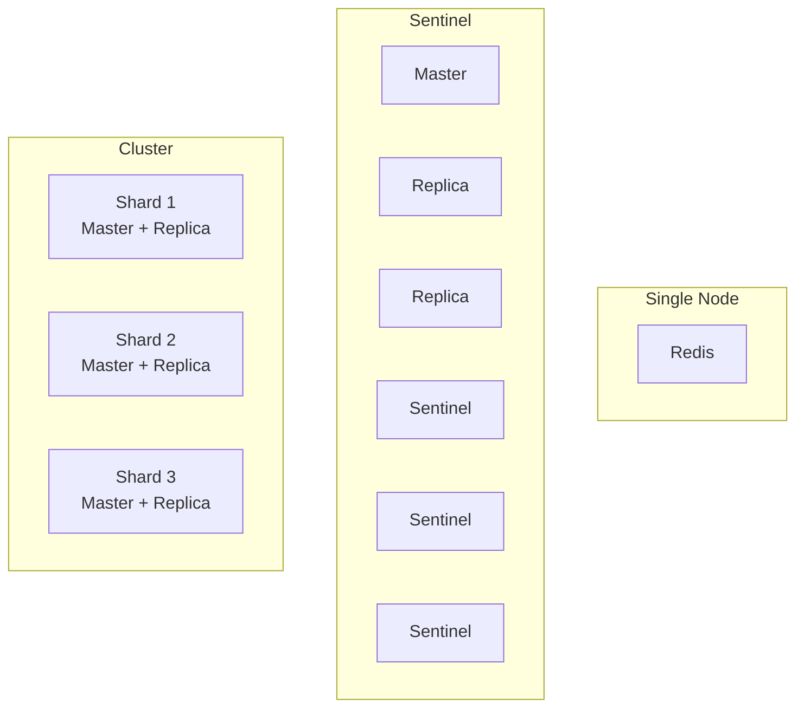
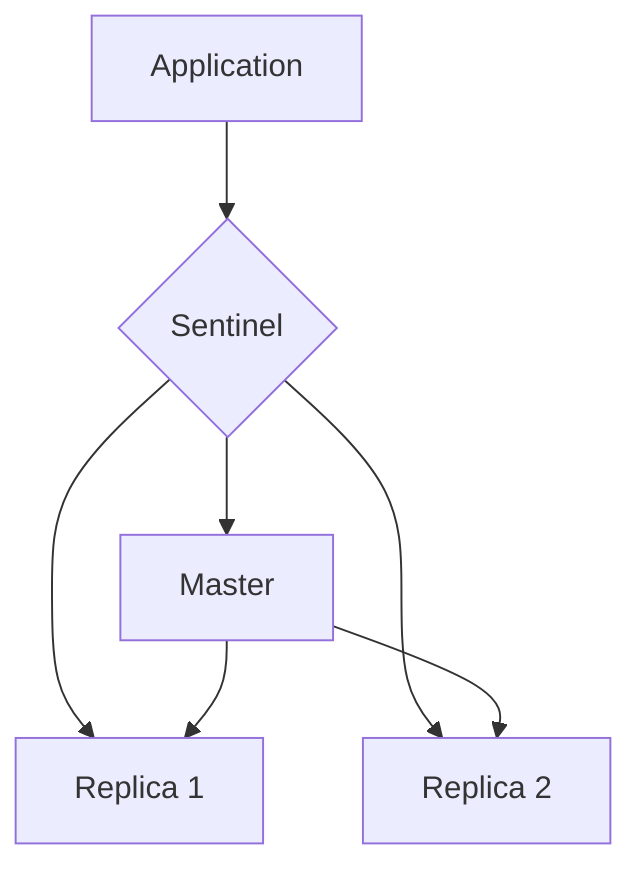
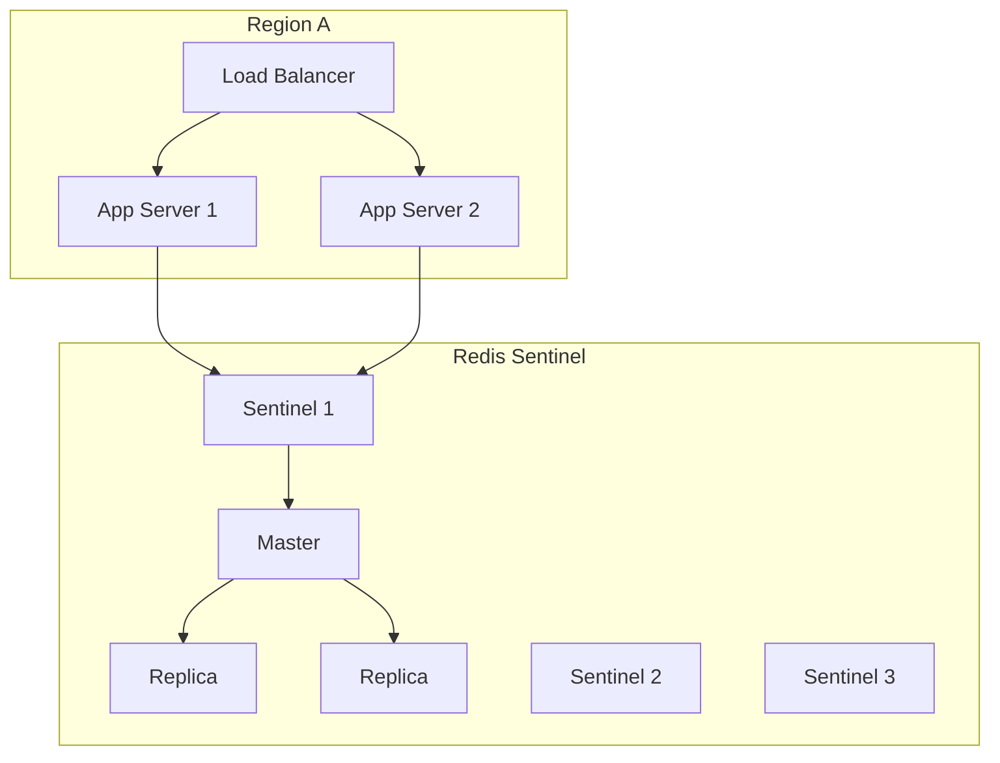

# Deployment

Choose the right Redis topology for your availability and scalability needs.

## Topology Comparison



| Topology | HA | Scalability | Complexity | Use Case |
|----------|-----|-------------|------------|----------|
| Single | No | Vertical | Low | Dev, small apps |
| Sentinel | Yes | Vertical | Medium | Production HA |
| Cluster | Yes | Horizontal | High | Large scale |

## Single Node

**Best for:** Development, small applications, non-critical workloads

```typescript
RedisModule.forRoot({
  clients: {
    host: 'redis',
    port: 6379,
  },
})
```

**Limitations:**
- No automatic failover
- Memory limited to single machine
- Single point of failure

## Sentinel (Recommended for HA)

**Best for:** Production with high availability needs



```typescript
RedisModule.forRoot({
  clients: {
    sentinels: [
      { host: 'sentinel-1', port: 26379 },
      { host: 'sentinel-2', port: 26379 },
      { host: 'sentinel-3', port: 26379 },
    ],
    name: 'mymaster',
    password: process.env.REDIS_PASSWORD,
  },
})
```

**Failover behavior:**
1. Sentinel detects master failure
2. Sentinels elect new master
3. Client redirected to new master
4. ~30 seconds failover time

## Cluster

**Best for:** Large-scale applications needing horizontal scaling

```typescript
// ioredis cluster mode
import { Cluster } from 'ioredis';

const cluster = new Cluster([
  { host: 'node-1', port: 6379 },
  { host: 'node-2', port: 6379 },
  { host: 'node-3', port: 6379 },
], {
  redisOptions: {
    password: process.env.REDIS_PASSWORD,
  },
  scaleReads: 'slave',
});
```

**Key hashing:**
- Keys distributed across 16384 slots
- Use `{hash_tag}` to co-locate related keys
- Some commands limited to single slot

```typescript
// These keys will be on same shard
'user:{123}:profile'
'user:{123}:settings'
'user:{123}:orders'
```

## Decision Matrix

| Factor | Single | Sentinel | Cluster |
|--------|--------|----------|---------|
| Data size | <10GB | <100GB | >100GB |
| Availability needs | Low | High | High |
| Operations team | Small | Medium | Large |
| Budget | Low | Medium | Higher |
| Failover time | Manual | ~30s | ~15s |

## Cloud Managed Options

| Provider | Service | Topology Support |
|----------|---------|------------------|
| AWS | ElastiCache | Single, Cluster |
| GCP | Memorystore | Single, Cluster |
| Azure | Azure Cache | Single, Cluster |
| Redis Labs | Redis Cloud | All |

**Benefits of managed:**
- Automatic patching
- Backup/restore
- Monitoring included
- Simplified operations

## High Availability Architecture



## Persistence Configuration

| Mode | Durability | Performance |
|------|------------|-------------|
| None | Lowest | Highest |
| RDB | Medium | High |
| AOF | High | Medium |
| RDB + AOF | Highest | Lower |

**For caching:** RDB or none
**For queues/locks:** AOF recommended

```
# redis.conf
appendonly yes
appendfsync everysec
```

## Next Steps

- [Tuning](./tuning) — Performance optimization
- [Connection Management](./connection-management) — Connection config
