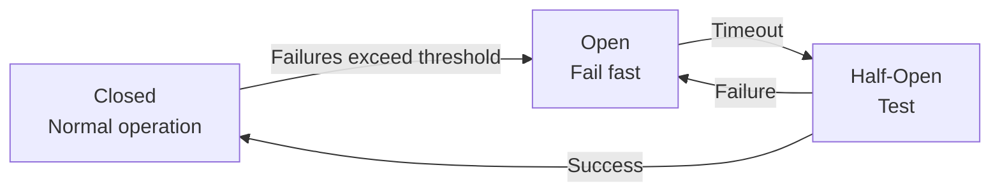

# Failure Modes

How NestJS RedisX behaves when Redis fails, and how to configure graceful degradation.

## Failure Types

| Failure | Symptom | Duration |
|---------|---------|----------|
| Network blip | Timeout errors | Seconds |
| Redis restart | Connection refused | Minutes |
| Redis crash | Connection refused | Minutes to hours |
| Network partition | Timeouts, partial failures | Varies |

## Default Behaviors

| Plugin | Default on Failure | Rationale |
|--------|-------------------|-----------|
| Cache | Bypass (hit database) | Availability over freshness |
| Locks | Throw error | Safety over availability |
| Rate Limit | Allow request | Availability over protection |
| Idempotency | Throw error | Safety over availability |
| Streams | Queue locally, retry | Durability |

## Configuring Fallback Behavior

### Cache

```typescript
new CachePlugin({
  fallback: 'bypass',  // Default: skip cache, hit DB
  // or
  fallback: 'throw',   // Fail the request
  // or
  fallback: (error) => {
    logger.error('Cache failed', error);
    return 'bypass';
  },
})
```

### Locks

```typescript
new LocksPlugin({
  fallback: 'throw',   // Default: fail if can't acquire
  // or
  fallback: 'allow',   // Proceed without lock (dangerous!)
})

// Per-operation override
@WithLock({
  key: 'resource:{0}',
  fallback: 'throw',  // Critical operation
})
```

### Rate Limit

```typescript
new RateLimitPlugin({
  fallback: 'allow',   // Default: allow if can't check
  // or
  fallback: 'deny',    // Block if can't verify
})
```

### Idempotency

```typescript
new IdempotencyPlugin({
  fallback: 'throw',   // Default: fail if can't check
  // or
  fallback: 'allow',   // Process anyway (risk of duplicates)
})
```

## Circuit Breaker Pattern

Prevent cascading failures with circuit breaker:



```typescript
new CachePlugin({
  circuitBreaker: {
    enabled: true,
    threshold: 5,        // Failures before opening
    timeout: 30000,      // Time before half-open
    resetTimeout: 5000,  // Time in half-open
  },
})
```

## Retry Configuration

```typescript
new RedisModule.forRoot({
  clients: {
    host: 'redis',
    retryStrategy: (times) => {
      if (times > 10) {
        return null; // Stop retrying
      }
      return Math.min(times * 100, 3000); // Exponential backoff
    },
  },
})
```

## Health Checks

Detect failures early:

```typescript
@Controller('health')
export class HealthController {
  constructor(private redis: RedisService) {}

  @Get('ready')
  async readiness() {
    try {
      await this.redis.ping();
      return { status: 'ok', redis: 'connected' };
    } catch (error) {
      return { status: 'degraded', redis: 'disconnected' };
    }
  }
}
```

## Graceful Degradation Strategies

### Cache: Serve Stale

```typescript
@Cached({
  ttl: 300,
  staleWhileRevalidate: true,
  staleTime: 3600,  // Serve stale for 1 hour
  onError: 'stale', // Return stale on error
})
async getProduct(id: string) {
  return this.productService.fetch(id);
}
```

### Locks: Time-bounded Operations

```typescript
@WithLock({
  key: 'resource:{0}',
  ttl: 30000,
  waitTimeout: 5000,
  onLockFailed: 'skip',  // Skip if can't acquire in 5s
})
async nonCriticalOperation(id: string) {
  // Will skip rather than block forever
}
```

### Rate Limit: Local Fallback

```typescript
@Injectable()
export class ResilientRateLimitGuard implements CanActivate {
  private localCounts = new Map<string, number>();

  async canActivate(context: ExecutionContext): Promise<boolean> {
    try {
      return await this.redisRateLimit.check(/*...*/);
    } catch (error) {
      // Fall back to local rate limiting
      return this.localRateLimit(context);
    }
  }

  private localRateLimit(context: ExecutionContext): boolean {
    const key = this.getKey(context);
    const count = this.localCounts.get(key) || 0;
    if (count >= 100) return false;
    this.localCounts.set(key, count + 1);
    setTimeout(() => this.localCounts.delete(key), 60000);
    return true;
  }
}
```

## Failure Recovery

### Automatic Reconnection

```typescript
// ioredis handles reconnection automatically
// Configure behavior:
{
  retryStrategy: (times) => Math.min(times, 10) * 1000,
  maxRetriesPerRequest: 3,
  reconnectOnError: (err) => {
    return err.message.includes('READONLY');
  },
}
```

### Cache Warming After Recovery

```typescript
@Injectable()
export class CacheRecoveryService {
  @OnEvent('redis.connected')
  async onRedisConnected() {
    // Warm critical caches
    await this.warmProductCache();
    await this.warmConfigCache();
  }

  private async warmProductCache() {
    const popular = await this.productRepo.findPopular(100);
    for (const product of popular) {
      await this.cache.set(`product:${product.id}`, product);
    }
  }
}
```

## Monitoring Failures

```yaml
# Redis connection status
redis_up

# Connection errors
rate(redis_connection_errors_total[5m])

# Circuit breaker state
redis_circuit_breaker_state{state="open"}

# Fallback activations
rate(redis_fallback_total[5m])
```

## Next Steps

- [Connection Management](./connection-management) — Pool and timeout config
- [Deployment](./deployment) — High availability topologies
