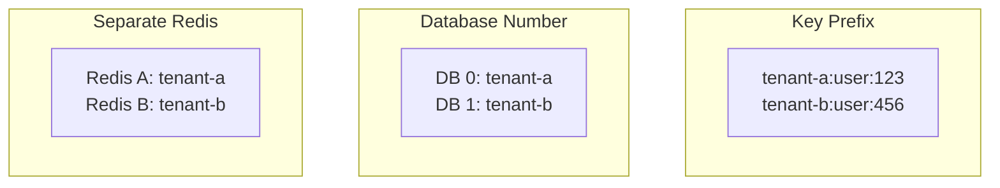

# Multi-Tenancy

Strategies for isolating tenant data in Redis.

## Isolation Strategies



| Strategy | Isolation | Complexity | Cost | Use Case |
|----------|-----------|------------|------|----------|
| Key Prefix | Logical | Low | Low | Most SaaS apps |
| Database Number | Logical | Medium | Low | Small tenant count |
| Separate Redis | Physical | High | High | Enterprise/compliance |

## Key Prefix (Recommended)

All tenant data in same Redis, distinguished by prefix:

```typescript
// Configuration
RedisModule.forRoot({
  clients: { host: 'redis', port: 6379 },
  plugins: [
    new CachePlugin({
      keyPrefix: '', // Tenant prefix added dynamically
    }),
  ],
})

// Middleware to set tenant context
@Injectable()
export class TenantMiddleware implements NestMiddleware {
  use(req: Request, res: Response, next: NextFunction) {
    const tenantId = req.headers['x-tenant-id'] as string;
    req['tenantId'] = tenantId;
    next();
  }
}

// Service with tenant-aware caching
@Injectable()
export class UserService {
  @Cached({
    key: '{0}:user:{1}',
  })
  async getUser(tenantId: string, userId: string): Promise<User> {
    return this.repository.findOne({ tenantId, userId });
  }
}
```

**Advantages:**
- Simple setup
- Efficient resource usage
- Easy monitoring

**Disadvantages:**
- No memory isolation
- Noisy neighbor possible
- Requires careful key design

## Database Number

Redis databases 0-15, one per tenant:

```typescript
// Tenant-specific connection
@Injectable()
export class TenantRedisService {
  private connections = new Map<string, Redis>();

  getClient(tenantId: string): Redis {
    if (!this.connections.has(tenantId)) {
      const dbNumber = this.getTenantDbNumber(tenantId);
      const client = new Redis({
        host: 'redis',
        port: 6379,
        db: dbNumber,
      });
      this.connections.set(tenantId, client);
    }
    return this.connections.get(tenantId);
  }

  private getTenantDbNumber(tenantId: string): number {
    // Map tenant to DB 0-15
    return this.tenantRegistry.getDbNumber(tenantId);
  }
}
```

**Advantages:**
- Separate keyspace per tenant
- Easy to flush single tenant
- Simple key names

**Disadvantages:**
- Limited to 16 databases
- No memory isolation
- Connection per tenant

## Separate Redis

Each tenant gets dedicated Redis instance:

```typescript
// Tenant connection registry
@Injectable()
export class TenantRedisRegistry {
  private configs = new Map<string, RedisConfig>();

  async getConfig(tenantId: string): Promise<RedisConfig> {
    if (!this.configs.has(tenantId)) {
      const config = await this.loadTenantConfig(tenantId);
      this.configs.set(tenantId, config);
    }
    return this.configs.get(tenantId);
  }

  private async loadTenantConfig(tenantId: string): Promise<RedisConfig> {
    // Load from database or config service
    const tenant = await this.tenantService.find(tenantId);
    return {
      host: tenant.redisHost,
      port: tenant.redisPort,
      password: tenant.redisPassword,
    };
  }
}
```

**Advantages:**
- Complete isolation
- Independent scaling
- Compliance-friendly

**Disadvantages:**
- Higher infrastructure cost
- Operational complexity
- Connection management overhead

## Rate Limiting by Tenant

```typescript
import { Injectable, CanActivate, ExecutionContext, Inject } from '@nestjs/common';
import { RATE_LIMIT_SERVICE, IRateLimitService } from '@nestjs-redisx/rate-limit';

// Per-tenant rate limits
@Injectable()
export class TenantRateLimitGuard implements CanActivate {
  constructor(
    @Inject(RATE_LIMIT_SERVICE) private readonly rateLimit: IRateLimitService,
    private readonly tenantService: TenantService,
  ) {}

  async canActivate(context: ExecutionContext): Promise<boolean> {
    const request = context.switchToHttp().getRequest();
    const tenantId = request.tenantId;

    // Get tenant-specific limits
    const limits = await this.getTenantLimits(tenantId);

    const result = await this.rateLimit.check(
      `${tenantId}:api:${request.user.id}`,
      { points: limits.requestsPerMinute, duration: 60 },
    );

    return result.allowed;
  }

  private async getTenantLimits(tenantId: string): Promise<TenantLimits> {
    // Different tiers have different limits
    const tenant = await this.tenantService.find(tenantId);
    return TIER_LIMITS[tenant.tier];
  }
}

const TIER_LIMITS = {
  free: { requestsPerMinute: 60 },
  pro: { requestsPerMinute: 600 },
  enterprise: { requestsPerMinute: 6000 },
};
```

## Cache Isolation

```typescript
// Tenant-scoped cache invalidation
@Injectable()
export class TenantCacheService {
  @CacheEvict({
    tags: ['{tenantId}:users'],
  })
  async invalidateUserCache(tenantId: string): Promise<void> {
    // Only invalidates this tenant's user cache
  }

  async invalidateAllTenantCache(tenantId: string): Promise<void> {
    // Clear all cache for a tenant
    await this.cache.invalidateTags([`${tenantId}:*`]);
  }
}
```

## Lock Isolation

```typescript
// Tenant-scoped locks prevent cross-tenant conflicts
@WithLock({
  key: '{0}:payment:{1}',
})
async processPayment(tenantId: string, orderId: string): Promise<void> {
  // Lock is tenant-specific
}
```

## Monitoring by Tenant

```yaml
# Cache hit rate per tenant
sum by (tenant) (rate(cache_hits_total{key=~"tenant-.*:.*"}[5m]))

# Rate limit rejections per tenant
sum by (tenant) (rate(ratelimit_rejected_total{key=~"tenant-.*:.*"}[5m]))

# Top tenants by Redis operations
topk(10, sum by (tenant) (rate(redis_commands_total[5m])))
```

## Decision Guide

| Factor | Key Prefix | DB Number | Separate Redis |
|--------|------------|-----------|----------------|
| Tenant count | Any | < 16 | Any |
| Isolation requirement | Low | Medium | High |
| Compliance needs | Standard | Standard | Regulated |
| Budget | Low | Low | High |
| Operations team | Small | Small | Large |

## Next Steps

- [Key Naming](./key-naming) — Naming conventions
- [Security](./security) — Data protection
