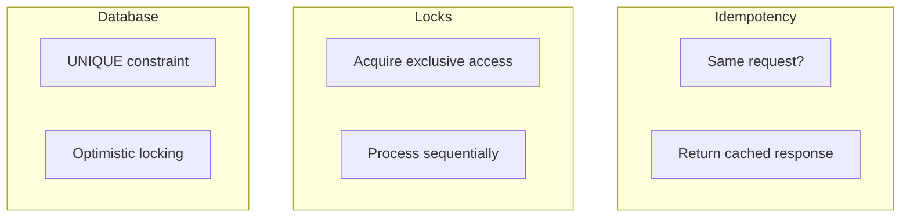
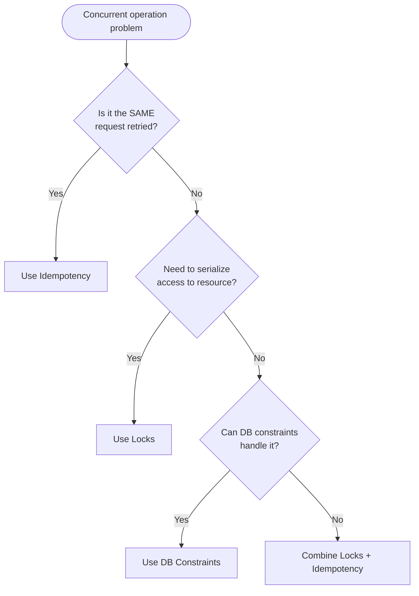
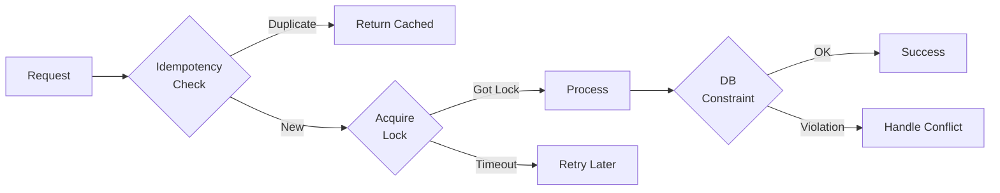

# Distributed Coordination

Choosing the right coordination mechanism is critical. This guide helps you decide between Locks, Idempotency, and Database constraints.

## The Problem

In distributed systems, concurrent operations can cause:

- **Double processing** — Same request processed twice
- **Race conditions** — Interleaved operations corrupt state
- **Lost updates** — Concurrent writes overwrite each other

## Three Solutions



| Mechanism | Prevents | Use Case |
|-----------|----------|----------|
| **Idempotency** | Duplicate requests | Client retries same operation |
| **Locks** | Concurrent execution | Multiple operations on same resource |
| **Database** | Data inconsistency | Final safety net |

## Decision Tree



## Idempotency

**Purpose:** Detect and handle duplicate requests from the same client.

**How it works:**
1. Client sends request with idempotency key
2. Server checks if key was seen before
3. If yes → return cached response
4. If no → process and cache response

```typescript
@Post('payments')
@Idempotent()
async createPayment(@Body() dto: CreatePaymentDto) {
  // Only executes once per idempotency key
  return this.paymentService.process(dto);
}
```

**Best for:**
- Payment processing
- Order creation
- Any operation where client might retry

**NOT for:**
- Preventing concurrent access from different users
- Coordinating between services

## Locks

**Purpose:** Ensure only one operation executes at a time for a resource.

**How it works:**
1. Acquire lock on resource identifier
2. Execute operation
3. Release lock

```typescript
@WithLock({ key: 'order:{0}' })
async processOrder(orderId: string) {
  // Only one execution per orderId at a time
  return this.orderService.process(orderId);
}
```

**Best for:**
- Inventory updates (prevent overselling)
- Account balance changes
- Any shared resource modification

**NOT for:**
- Detecting duplicate requests (use Idempotency)
- Long-running operations (lock timeout issues)

## Database Constraints

**Purpose:** Final line of defense for data integrity.

**How it works:**
- UNIQUE constraints prevent duplicates
- Foreign keys ensure referential integrity
- Optimistic locking detects conflicts

```sql
-- Unique constraint
CREATE UNIQUE INDEX idx_payments_idempotency 
ON payments(idempotency_key);

-- Optimistic locking
UPDATE orders 
SET status = 'shipped', version = version + 1
WHERE id = ? AND version = ?;
```

**Best for:**
- Ensuring data integrity regardless of application bugs
- Handling edge cases that slip through other mechanisms

**NOT for:**
- Primary coordination (too late in the flow)
- Performance-sensitive paths (lock contention)

## Combining Mechanisms

For critical operations like payments, use all three:



```typescript
@Post('payments')
@Idempotent()  // Layer 1: Detect retries
async createPayment(
  @Body() dto: CreatePaymentDto,
  @Headers('Idempotency-Key') key: string,
) {
  return this.lockService.withLock(
    `payment:${dto.orderId}`,  // Layer 2: Serialize
    async () => {
      // Layer 3: DB constraint on idempotency_key
      return this.paymentService.process(dto, key);
    },
  );
}
```

## Comparison Table

| Aspect | Idempotency | Locks | DB Constraints |
|--------|-------------|-------|----------------|
| Scope | Same client request | Any concurrent access | Data layer |
| Granularity | Request | Resource | Row/Table |
| Failure mode | Allow (configurable) | Timeout | Error |
| Performance | Fast (cache lookup) | Medium (Redis roundtrip) | Varies |
| Use alone? | For retries only | For coordination only | As safety net |

## Anti-Patterns

### Using locks for idempotency

```typescript
// WRONG: Lock doesn't detect retries
@WithLock({ key: 'payment:{0}' })
async createPayment(orderId: string) {
  // Retry will wait for lock, then process again!
}
```

### Using idempotency for coordination

```typescript
// WRONG: Idempotency doesn't block concurrent users
@Idempotent()
async updateInventory(productId: string, delta: number) {
  // Two users can still interleave reads/writes!
}
```

### Skipping database constraints

```typescript
// WRONG: Application bugs can still cause duplicates
@Idempotent()
@WithLock({ key: 'payment:{0}' })
async createPayment(/*...*/) {
  // No UNIQUE constraint = risk of duplicates
}
```

## Next Steps

- [Payment Processing Recipe](../recipes/payment-processing) — Complete implementation
- [Locks Reference](../../reference/locks/) — Lock API details
- [Idempotency Reference](../../reference/idempotency/) — Idempotency API details
