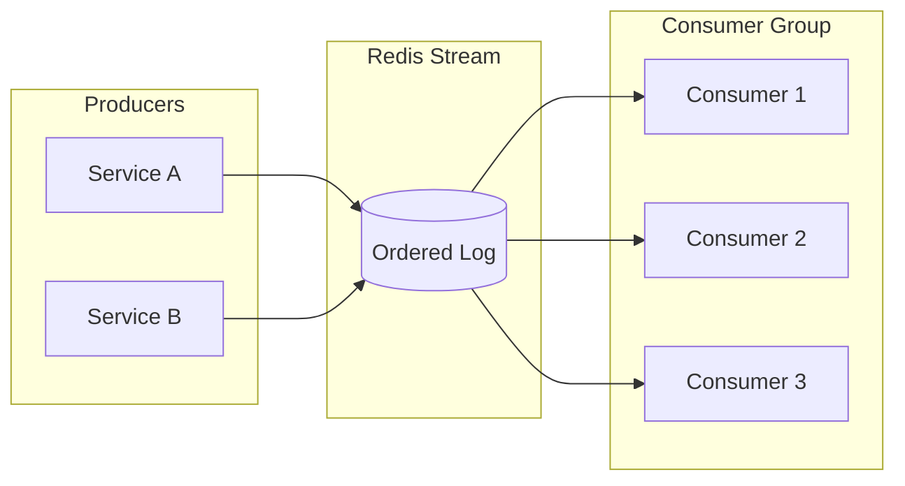
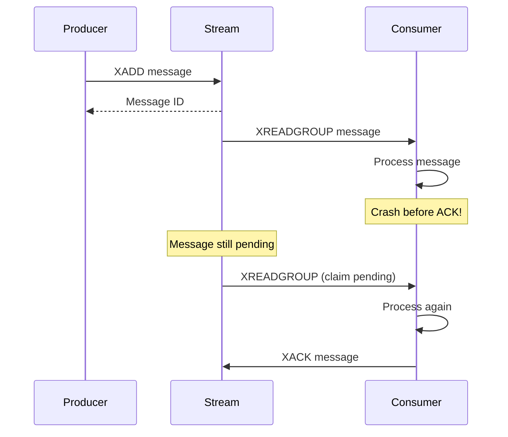
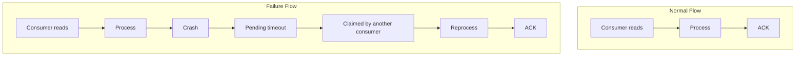
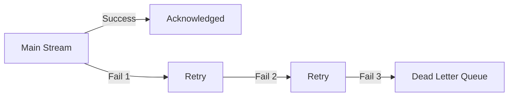

# Event Streaming

Redis Streams provide a middle ground between simple pub/sub and full message brokers. This guide helps you understand when to use them.

## What Redis Streams Provide



| Feature | Redis Streams | Redis Pub/Sub |
|---------|---------------|---------------|
| Persistence | Yes | No |
| Consumer groups | Yes | No |
| Message replay | Yes | No |
| Acknowledgment | Yes | No |
| Ordering | Per-stream | Per-channel |

## When to Use Redis Streams

**Good fit:**
- Background job processing
- Event sourcing (small scale)
- Audit logs
- Real-time notifications with durability
- Task distribution across workers

**Not ideal for:**
- High-throughput event streaming (>100k msg/sec)
- Complex routing patterns
- Multi-datacenter replication
- Long-term message retention (>days)

## Comparison with Alternatives

### vs BullMQ

| Aspect | Redis Streams | BullMQ |
|--------|---------------|--------|
| Delayed jobs | Manual implementation | Built-in |
| Job priority | Manual | Built-in |
| Rate limiting | Manual | Built-in |
| Dependencies | Core Redis | Redis + BullMQ |
| Complexity | Lower | Higher |

**Use BullMQ when:** You need delays, priorities, or complex job scheduling.

**Use Streams when:** Simple queue with consumer groups is enough.

### vs Kafka

| Aspect | Redis Streams | Kafka |
|--------|---------------|-------|
| Throughput | ~100k/sec | Millions/sec |
| Retention | Limited by memory | Disk-based, unlimited |
| Partitioning | Manual (multiple streams) | Built-in |
| Operations | Simple | Complex |
| Use case | Application-level | Infrastructure-level |

**Use Kafka when:** High throughput, long retention, or complex streaming pipelines.

**Use Streams when:** Simpler needs, already using Redis.

### vs RabbitMQ

| Aspect | Redis Streams | RabbitMQ |
|--------|---------------|----------|
| Routing | Simple (stream per topic) | Complex (exchanges, bindings) |
| Protocol | Redis protocol | AMQP |
| Ordering | Guaranteed | Per-queue |
| Operations | Simple | Medium |

**Use RabbitMQ when:** Complex routing, multiple consumers per message.

**Use Streams when:** Simple fan-out or work distribution.

## Delivery Semantics

Redis Streams provide **at-least-once** delivery:



::: warning At-Least-Once Semantics
Messages may be delivered multiple times. **Make consumers idempotent.**
:::

## Consumer Groups

Consumer groups enable parallel processing:

```
Stream: orders
Group: order-processors

Consumer 1: processes message 1, 4, 7...
Consumer 2: processes message 2, 5, 8...
Consumer 3: processes message 3, 6, 9...
```

Each message is delivered to **one consumer** in the group.

### Failure Handling



## Dead Letter Queue Pattern

After N failures, move to DLQ:

```typescript
new StreamsPlugin({
  consumer: {
    maxRetries: 3,
  },
  dlq: {
    enabled: true,
    streamSuffix: ':dlq',
  },
})
```



## Memory Considerations

Streams are memory-bound. Configure limits:

```typescript
// Limit by count
await redis.xtrim('orders', 'MAXLEN', '~', 10000);

// Limit by age (Redis 7+)
await redis.xtrim('orders', 'MINID', '~', minId);
```

| Strategy | Use When |
|----------|----------|
| MAXLEN | Fixed memory budget |
| MINID | Time-based retention |
| No trimming | Audit logs (with monitoring) |

## Ordering Guarantees

| Scenario | Ordering |
|----------|----------|
| Single producer, single consumer | Guaranteed |
| Single producer, consumer group | Guaranteed per message |
| Multiple producers | Arrival order (not send order) |

For strict ordering across producers, use a single stream with sequence numbers.

## Next Steps

- [Background Jobs Recipe](../recipes/background-jobs) — Practical implementation
- [Streams Reference](../../reference/streams/) — Full API documentation
