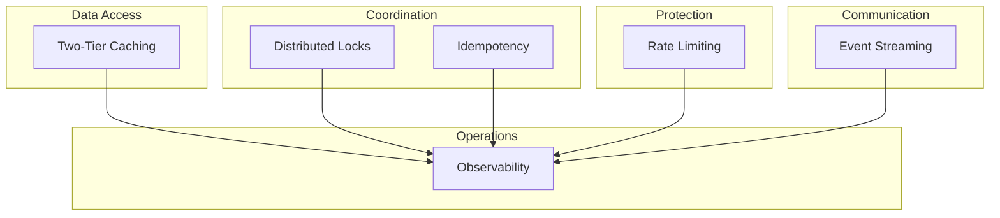

# Concepts

This section explains the **why** behind each feature. Understanding these concepts helps you make better architectural decisions.

## Mental Models

| Concept | Question It Answers |
|---------|---------------------|
| [Two-Tier Caching](./two-tier-caching) | When should I use L1 vs L2 cache? |
| [Distributed Coordination](./distributed-coordination) | When do I need locks vs idempotency? |
| [Rate Limiting Strategies](./rate-limiting-strategies) | Which algorithm fits my use case? |
| [Event Streaming](./event-streaming) | When should I use Streams vs alternatives? |
| [Observability Strategy](./observability-strategy) | What should I monitor and why? |

## Core Principles

### 1. Defense in Depth

Never rely on a single mechanism. Combine multiple protections:

```
Payment Flow:
  Idempotency (detect duplicates)
    → Locks (serialize processing)
      → Database constraints (final safety net)
```

### 2. Fail Open vs Fail Closed

Choose based on business impact:

| Failure Mode | Behavior | Use When |
|--------------|----------|----------|
| Fail Open | Allow operation if Redis down | Cache, non-critical rate limits |
| Fail Closed | Block operation if Redis down | Payments, security-critical |

### 3. Eventual Consistency

Redis-based systems are eventually consistent. Design for:

- Stale reads (cache may be outdated)
- Lost updates (write may not persist)
- Duplicate processing (exactly-once is impossible)

## Concept Map



## Next Steps

Start with the concept most relevant to your use case:

- Building a cache layer? → [Two-Tier Caching](./two-tier-caching)
- Preventing duplicates? → [Distributed Coordination](./distributed-coordination)
- Protecting APIs? → [Rate Limiting Strategies](./rate-limiting-strategies)
- Processing events? → [Event Streaming](./event-streaming)
- Setting up monitoring? → [Observability Strategy](./observability-strategy)
