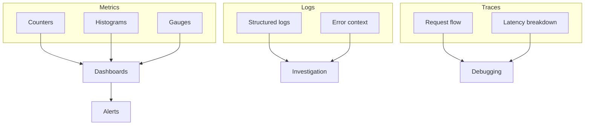

# Observability Strategy

Effective observability requires knowing **what** to measure and **why**. This guide explains the key metrics and their significance.

## Three Pillars



| Pillar | Answers | Use For |
|--------|---------|---------|
| Metrics | How much? How fast? | Dashboards, alerts |
| Logs | What happened? | Post-incident analysis |
| Traces | Where's the time spent? | Performance debugging |

## Golden Signals

For any service, monitor these four:

| Signal | Metric | RedisX Example |
|--------|--------|----------------|
| **Latency** | Response time distribution | `cache_operation_duration_seconds` |
| **Traffic** | Request rate | `cache_operations_total` |
| **Errors** | Error rate | `cache_errors_total` |
| **Saturation** | Resource utilization | `redis_pool_active_connections` |

## Per-Plugin Metrics

### Cache Metrics

| Metric | Type | What It Tells You |
|--------|------|-------------------|
| `cache_hits_total` | Counter | Cache effectiveness |
| `cache_misses_total` | Counter | Database load |
| `cache_hit_rate` | Gauge | Overall efficiency |
| `cache_latency_seconds` | Histogram | User-facing impact |
| `cache_evictions_total` | Counter | Memory pressure |

**Key indicator:** Hit rate

```
Hit Rate = hits / (hits + misses)

> 90% = Healthy
80-90% = Acceptable
< 80% = Investigate
```

### Lock Metrics

| Metric | Type | What It Tells You |
|--------|------|-------------------|
| `lock_acquisitions_total` | Counter | Lock usage |
| `lock_timeouts_total` | Counter | Contention issues |
| `lock_wait_seconds` | Histogram | Wait time impact |
| `lock_held_seconds` | Histogram | Operation duration |

**Key indicator:** Timeout rate

```
Timeout Rate = timeouts / acquisitions

< 1% = Healthy
1-5% = Monitor
> 5% = Action needed
```

### Rate Limit Metrics

| Metric | Type | What It Tells You |
|--------|------|-------------------|
| `ratelimit_allowed_total` | Counter | Normal traffic |
| `ratelimit_rejected_total` | Counter | Throttled requests |
| `ratelimit_remaining` | Gauge | Headroom |

**Key indicator:** Rejection rate

```
Rejection Rate = rejected / (allowed + rejected)

< 5% = Normal operation
5-20% = High load or attack
> 20% = Possible attack or limit too low
```

### Stream Metrics

| Metric | Type | What It Tells You |
|--------|------|-------------------|
| `stream_messages_total` | Counter | Throughput |
| `stream_consumer_lag` | Gauge | Processing backlog |
| `stream_dlq_size` | Gauge | Failure rate |
| `stream_processing_seconds` | Histogram | Handler performance |

**Key indicator:** Consumer lag

```
Lag = pending messages waiting

< 100 = Healthy
100-1000 = Monitor
> 1000 = Scale consumers
```

## Alert Strategy

### What to Alert On

| Alert | Severity | Condition |
|-------|----------|-----------|
| Redis down | Critical | `redis_up == 0` |
| Cache hit rate low | Warning | `hit_rate < 0.8` for 5m |
| Lock timeout spike | Warning | `timeout_rate > 0.05` for 5m |
| Consumer lag high | Warning | `lag > 1000` for 5m |
| DLQ not empty | Warning | `dlq_size > 0` for 1m |

### What NOT to Alert On

| Metric | Why Not |
|--------|---------|
| Individual request errors | Too noisy, use error rate |
| Brief latency spikes | Normal variance, use percentiles |
| Single cache miss | Expected behavior |

## Dashboard Design

### Overview Dashboard

```
┌─────────────────┬─────────────────┬─────────────────┐
│  Cache Hit Rate │  Lock Timeouts  │  Stream Lag     │
│     92.5%       │     0.3%        │     45          │
├─────────────────┴─────────────────┴─────────────────┤
│                 Operations / Second                  │
│  ████████████████████████████████  2.5k ops/sec    │
├─────────────────┬─────────────────┬─────────────────┤
│ Latency (p99)   │ Error Rate      │ Redis Memory    │
│    2.3ms        │    0.01%        │   1.2GB / 4GB   │
└─────────────────┴─────────────────┴─────────────────┘
```

### Investigation Dashboard

- Time-series of all metrics
- Breakdown by operation type
- Breakdown by key pattern
- Correlation with deployments

## Tracing Strategy

### What to Trace

| Operation | Trace? | Why |
|-----------|--------|-----|
| Cache get/set | Yes | See L1 vs L2 latency |
| Lock acquire/release | Yes | Identify contention |
| Stream publish/consume | Yes | Follow message flow |
| Rate limit check | Optional | Usually fast |

### Span Attributes

```typescript
// Useful span attributes
span.setAttribute('cache.key', key);
span.setAttribute('cache.hit', hit);
span.setAttribute('cache.layer', 'L1' | 'L2');
span.setAttribute('lock.key', key);
span.setAttribute('lock.acquired', acquired);
span.setAttribute('stream.name', stream);
span.setAttribute('stream.message_id', id);
```

## Sampling Strategy

| Environment | Sample Rate | Reasoning |
|-------------|-------------|-----------|
| Development | 100% | Debug everything |
| Staging | 100% | Catch issues early |
| Production | 1-10% | Cost/storage balance |
| Production (errors) | 100% | Always capture errors |

## Next Steps

- [Prometheus & Grafana Setup](../integration/prometheus-grafana) — Implementation guide
- [OpenTelemetry Setup](../integration/opentelemetry) — Tracing setup
- [Operations: Monitoring](../operations/monitoring) — Production monitoring
