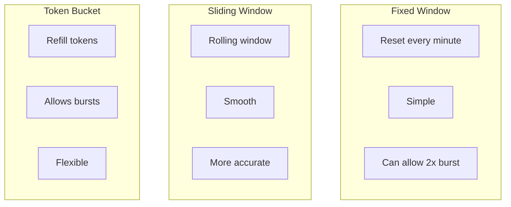
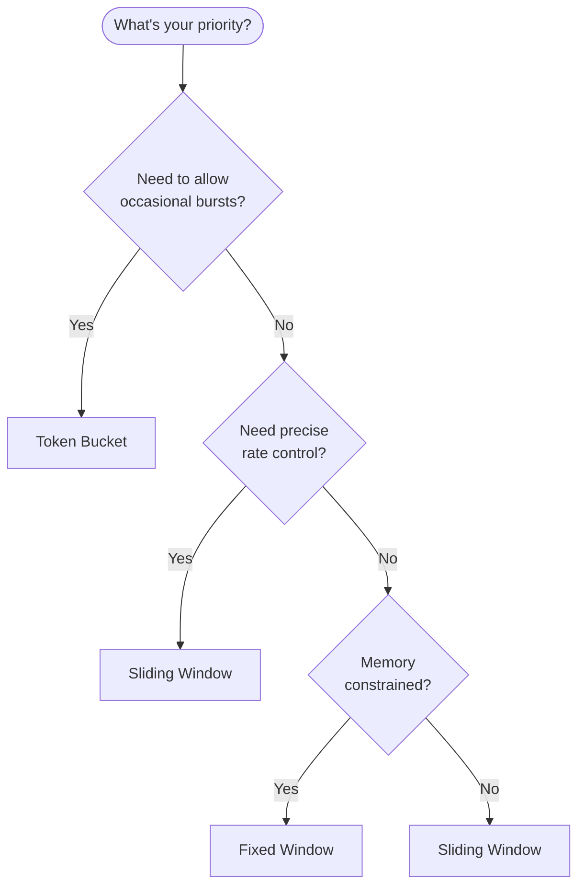

# Rate Limiting Strategies

Different rate limiting algorithms have different characteristics. This guide helps you choose the right one.

## Algorithms Overview



## Algorithm Comparison

| Algorithm | Burst Handling | Accuracy | Memory | Complexity |
|-----------|----------------|----------|--------|------------|
| Fixed Window | 2x burst at boundary | Low | Very Low | Simple |
| Sliding Window | Smooth | High | Low | Medium |
| Token Bucket | Controlled bursts | High | Low | Medium |

## Fixed Window

Counts requests in fixed time intervals (e.g., per minute).

```
Limit: 100 requests/minute

|-------- Minute 1 --------|-------- Minute 2 --------|
[##########]               [##########]
   100 requests               100 requests
```

**Problem:** Boundary burst

```
                    Window boundary
                          |
|-------- Minute 1 --------|-------- Minute 2 --------|
              [##########][##########]
              100 requests  100 requests
              
              = 200 requests in 60 seconds!
```

**Use when:**
- Simple quotas (API calls per day)
- Exact counting matters more than smoothness
- Memory is extremely constrained

```typescript
@RateLimit({
  algorithm: 'fixed-window',
  points: 100,
  duration: 60,
})
```

## Sliding Window

Uses weighted average of current and previous windows.

```
Limit: 100 requests/minute

Time: 30 seconds into current window
Previous window: 80 requests
Current window: 40 requests

Effective count = 40 + (80 × 0.5) = 80
Remaining: 20 requests
```

**Advantages:**
- No boundary burst problem
- Smooth rate enforcement
- Good balance of accuracy and simplicity

**Use when:**
- General-purpose rate limiting
- API protection
- Fair usage enforcement

```typescript
@RateLimit({
  algorithm: 'sliding-window', // Default
  points: 100,
  duration: 60,
})
```

## Token Bucket

Bucket fills with tokens at constant rate. Each request consumes tokens.

```
Bucket capacity: 100 tokens
Refill rate: 10 tokens/second

[████████████████████] 100/100 tokens
        ↓ Burst of 50 requests
[██████████          ] 50/100 tokens
        ↓ 5 seconds pass (+50 tokens)
[████████████████████] 100/100 tokens
```

**Advantages:**
- Allows controlled bursts
- Smooth average rate
- Natural behavior for APIs

**Use when:**
- Allowing occasional bursts
- API with bursty legitimate traffic
- CDN/media serving

```typescript
@RateLimit({
  algorithm: 'token-bucket',
  points: 100,       // Bucket capacity
  duration: 60,      // Refill to full in 60s
  refillRate: 2,     // Tokens per second
})
```

## Decision Guide



## Use Case Recommendations

| Use Case | Algorithm | Why |
|----------|-----------|-----|
| Login throttling | Sliding Window | Prevent boundary gaming |
| API quotas | Sliding Window | Fair, predictable |
| CDN/Downloads | Token Bucket | Allow burst, cap average |
| Simple counters | Fixed Window | Exact daily/monthly counts |
| WebSocket connections | Token Bucket | Allow reconnect bursts |

## Multi-Tier Rate Limiting

Combine multiple limits for comprehensive protection:

```typescript
// Tier 1: Per-IP (catch distributed attacks)
@RateLimit({
  key: 'ip',
  points: 1000,
  duration: 3600,
})

// Tier 2: Per-User (fair usage)
@RateLimit({
  key: 'user',
  points: 100,
  duration: 60,
})

// Tier 3: Per-Endpoint (protect expensive operations)
@RateLimit({
  key: (ctx) => `search:${ctx.switchToHttp().getRequest().user?.id}`,
  points: 10,
  duration: 60,
})
```

## Accuracy Expectations

::: warning Rate Limits Are Approximate
All distributed rate limiters have accuracy trade-offs:

- Network latency between app and Redis
- Clock drift between instances
- Race conditions during high load

**Design for 5-10% variance** in enforced limits.
:::

## Response Headers

Standard rate limit headers:

```http
HTTP/1.1 200 OK
X-RateLimit-Limit: 100
X-RateLimit-Remaining: 85
X-RateLimit-Reset: 1706123456
```

On limit exceeded:

```http
HTTP/1.1 429 Too Many Requests
Retry-After: 30
X-RateLimit-Limit: 100
X-RateLimit-Remaining: 0
X-RateLimit-Reset: 1706123456
```

## Next Steps

- [Login Throttling Recipe](../recipes/login-throttling) — Practical implementation
- [API Protection Recipe](../recipes/api-protection) — Multi-tier protection
- [Rate Limit Reference](../../reference/rate-limit/) — Full API documentation
