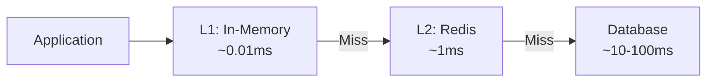
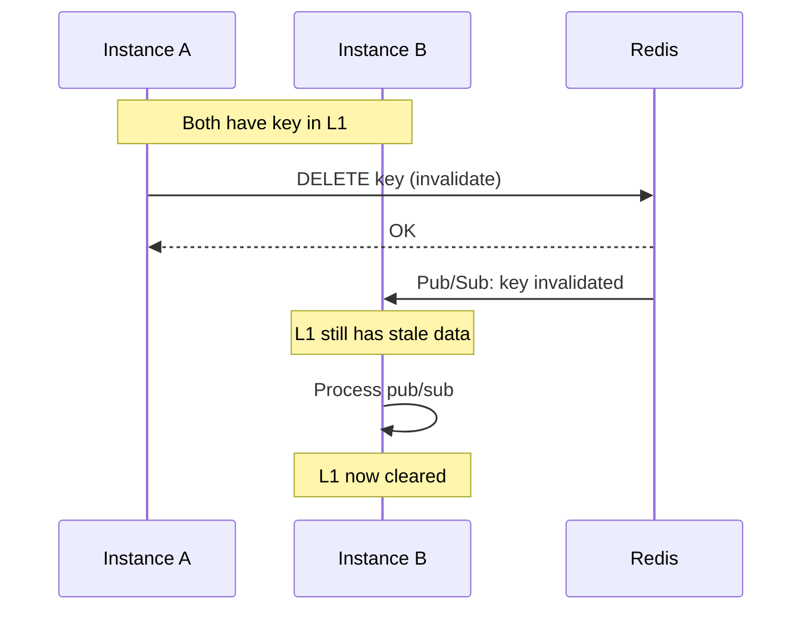

# Two-Tier Caching

NestJS RedisX implements a two-tier cache architecture that balances speed, consistency, and memory usage.

## Architecture Overview



| Layer | Location | Latency | Capacity | Consistency |
|-------|----------|---------|----------|-------------|
| L1 | Process memory | ~0.01ms | Limited (MB) | Per-instance |
| L2 | Redis | ~1ms | Large (GB) | Shared |

## When to Use Each Layer

### L1 Only (In-Memory)

Best for:
- Extremely hot data (>100 reads/sec per key)
- Small, stable datasets (config, feature flags)
- Data where slight staleness is acceptable

```typescript
new CachePlugin({
  l1: { maxSize: 1000, ttl: 60000 },
  l2: { enabled: false },
})
```

### L2 Only (Redis)

Best for:
- Large datasets that don't fit in memory
- Data requiring cross-instance consistency
- Session data, user profiles

```typescript
new CachePlugin({
  l1: { enabled: false },
  l2: { defaultTtl: 3600 },
})
```

### Both Layers (Recommended Default)

Best for:
- General-purpose caching
- Balancing speed and consistency
- Most production workloads

```typescript
new CachePlugin({
  l1: { maxSize: 1000, ttl: 30000 },
  l2: { defaultTtl: 3600 },
})
```

## Decision Matrix

| Factor | Use L1 | Use L2 | Use Both |
|--------|--------|--------|----------|
| Read frequency | Very high | Low-medium | Medium-high |
| Data size | Small | Large | Any |
| Staleness tolerance | High | Low | Medium |
| Cross-instance consistency | Not needed | Required | Eventually consistent |
| Memory constraints | Plenty | Limited | Balanced |

## Consistency Model

With two-tier caching, consistency is eventual:



**Time window for stale reads:** Pub/sub propagation delay (~1-10ms)

## L1 Invalidation Strategies

### Pub/Sub (Recommended)

Cross-instance invalidation via Redis pub/sub:

```typescript
new CachePlugin({
  l1: {
    maxSize: 1000,
    ttl: 30000,
    invalidation: 'pubsub', // Default
  },
})
```

### TTL Only

No cross-instance invalidation. L1 expires naturally:

```typescript
new CachePlugin({
  l1: {
    maxSize: 1000,
    ttl: 5000, // Short TTL for freshness
    invalidation: 'none',
  },
})
```

### Disable L1

When consistency is critical:

```typescript
new CachePlugin({
  l1: { enabled: false },
})
```

## Memory Management

### L1 Eviction

When L1 reaches `maxSize`, oldest entries are evicted (LRU):

```typescript
l1: {
  maxSize: 1000,    // Max entries
  maxMemory: '50mb', // Or max memory
}
```

### Sizing Guidelines

| Application Size | L1 maxSize | L1 TTL |
|------------------|------------|--------|
| Small (<10 instances) | 1000-5000 | 30-60s |
| Medium (10-50 instances) | 500-2000 | 15-30s |
| Large (>50 instances) | 100-500 | 5-15s |

::: tip Memory Calculation
Estimate: `entries × avg_value_size × 1.5 (overhead)`

Example: 1000 entries × 1KB × 1.5 = ~1.5MB per instance
:::

## When NOT to Cache

| Scenario | Reason |
|----------|--------|
| User-specific data with high cardinality | L1 thrashing |
| Real-time data (stock prices) | Staleness unacceptable |
| Write-heavy workloads | Invalidation overhead |
| Security-sensitive data | Cache timing attacks |

## Monitoring

Key metrics to watch:

| Metric | Healthy | Investigate |
|--------|---------|-------------|
| L1 hit rate | >80% | <50% |
| L2 hit rate | >70% | <40% |
| L1 eviction rate | Low | Increasing |
| Invalidation lag | <10ms | >100ms |

## Next Steps

- [Cache Configuration](../../reference/cache/configuration) — Full configuration options
- [Tag Invalidation](../../reference/cache/tags) — Invalidate related entries
- [Stampede Protection](../../reference/cache/stampede) — Prevent thundering herd
