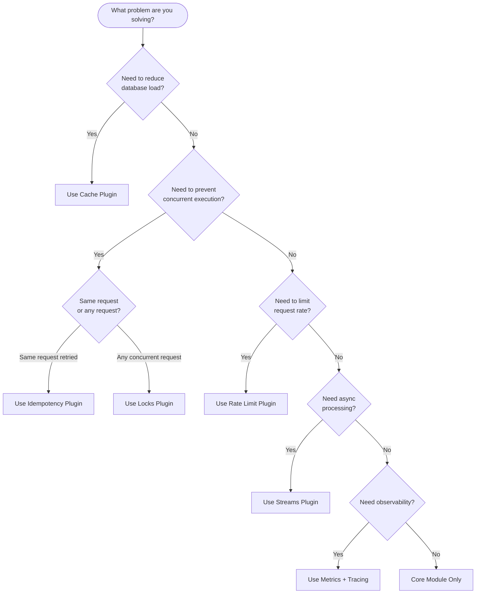
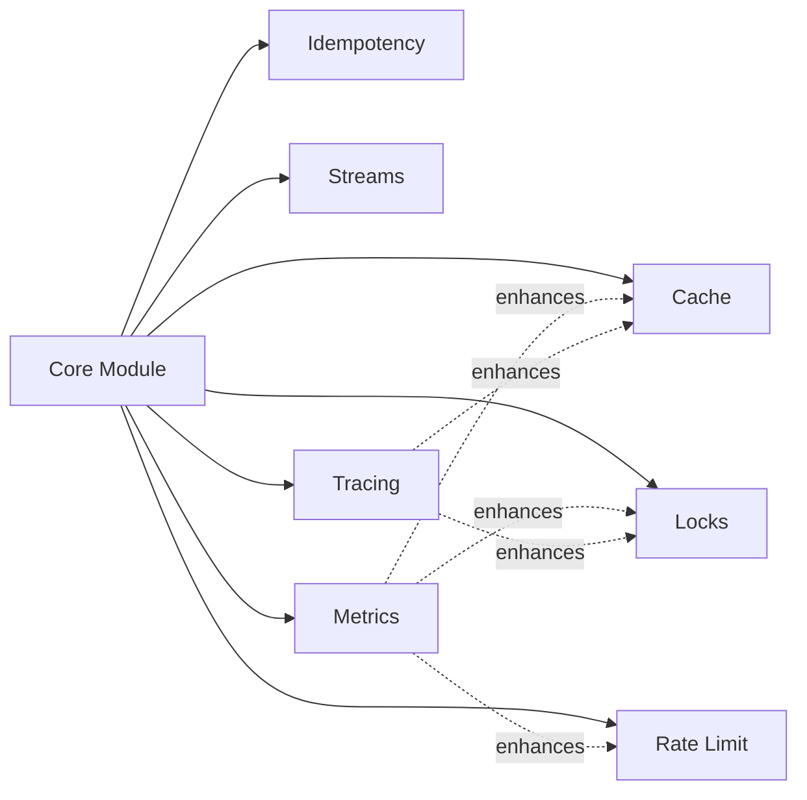

# Decision Guide

Not sure which plugin you need? This guide helps you decide in under 2 minutes.

## Quick Decision Flowchart



## Decision Matrix

| Scenario | Plugin | Why |
|----------|--------|-----|
| Slow database queries | Cache | Store results, serve from memory |
| Duplicate form submissions | Idempotency | Detect and replay responses |
| Payment processing | Idempotency + Locks | Prevent double charges |
| Cron job on multiple instances | Locks | Only one instance executes |
| API abuse protection | Rate Limit | Throttle excessive requests |
| Login brute force | Rate Limit | Progressive delays |
| Background job processing | Streams | Reliable async with retries |
| Event-driven architecture | Streams | Pub/sub with persistence |
| Production monitoring | Metrics | Prometheus integration |
| Request tracing | Tracing | OpenTelemetry spans |

## Common Combinations

### E-commerce / Payments

```
Idempotency + Locks + Cache + Metrics
```

- **Idempotency**: Prevent duplicate orders/charges
- **Locks**: Serialize payment processing per order
- **Cache**: Product catalog, user sessions
- **Metrics**: Monitor transaction rates

### Public API

```
Rate Limit + Cache + Metrics + Tracing
```

- **Rate Limit**: Protect from abuse, implement tiers
- **Cache**: Reduce backend load
- **Metrics**: Track usage per client
- **Tracing**: Debug slow requests

### Event-Driven Microservices

```
Streams + Idempotency + Locks + Tracing
```

- **Streams**: Event bus between services
- **Idempotency**: Handle duplicate events
- **Locks**: Coordinate distributed operations
- **Tracing**: Follow requests across services

### Background Processing

```
Streams + Locks + Metrics
```

- **Streams**: Job queue with consumer groups
- **Locks**: Prevent duplicate cron execution
- **Metrics**: Monitor queue depth and processing time

## What RedisX Does NOT Solve

| Need | Use Instead |
|------|-------------|
| Job scheduling with delays | BullMQ |
| Complex workflows/sagas | Temporal |
| Full-text search | Elasticsearch |
| Graph queries | Neo4j |
| Time-series data | TimescaleDB |
| Message broker with routing | RabbitMQ |

## Plugin Dependencies



All plugins depend on Core. Metrics and Tracing enhance other plugins with observability.

## Next Steps

Once you've identified your plugins:

1. [Installation](./installation) — Install required packages
2. [Quick Start](./quick-start) — Basic configuration
3. Choose your concept guide:
   - [Two-Tier Caching](./concepts/two-tier-caching)
   - [Distributed Coordination](./concepts/distributed-coordination)
   - [Rate Limiting Strategies](./concepts/rate-limiting-strategies)
   - [Event Streaming](./concepts/event-streaming)
