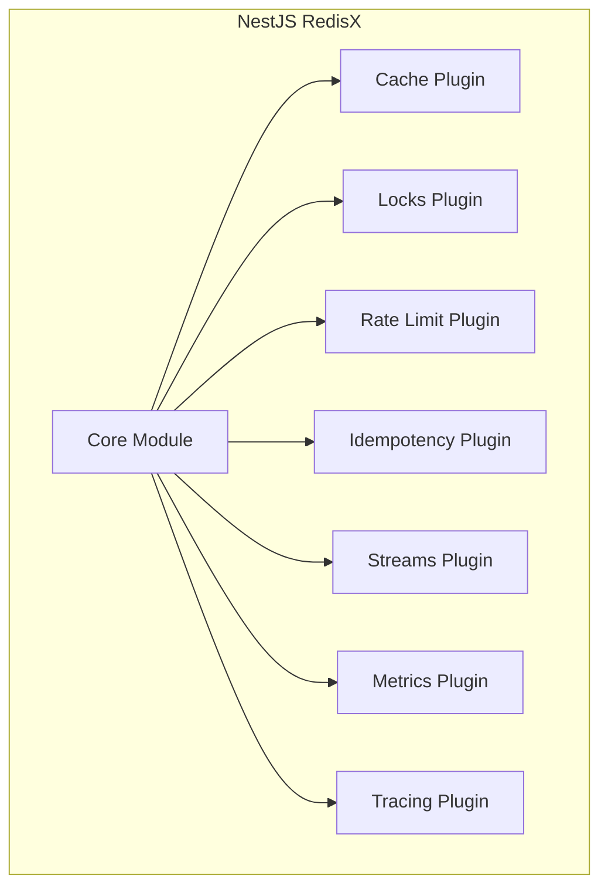

# NestJS RedisX Guide

Welcome to the NestJS RedisX Guide. This section explains **why** and **when** to use each feature, helping you make informed architectural decisions.

## Philosophy

NestJS RedisX is built on three principles:

1. **Declarative over Imperative** — Use decorators instead of boilerplate
2. **Sensible Defaults** — Works out of the box, customizable when needed
3. **Observable by Design** — Built-in metrics and tracing

## What RedisX Provides

| Plugin | Purpose | Use When |
|--------|---------|----------|
| **Cache** | Two-tier caching (L1 + L2) | Reducing database load |
| **Locks** | Distributed mutual exclusion | Preventing race conditions |
| **Rate Limit** | Request throttling | Protecting APIs from abuse |
| **Idempotency** | Duplicate request handling | Payment/order processing |
| **Streams** | Event streaming with consumer groups | Background job processing |
| **Metrics** | Prometheus metrics | Production monitoring |
| **Tracing** | OpenTelemetry integration | Distributed tracing |

## Guide Structure

### For Quick Decisions

- [Decision Guide](./decision-guide) — Which plugin do I need?

### For Understanding (Concepts)

- [Two-Tier Caching](./concepts/two-tier-caching) — L1/L2 architecture
- [Distributed Coordination](./concepts/distributed-coordination) — Locks vs Idempotency
- [Rate Limiting Strategies](./concepts/rate-limiting-strategies) — Algorithm selection
- [Event Streaming](./concepts/event-streaming) — Streams vs alternatives
- [Observability Strategy](./concepts/observability-strategy) — What to monitor

### For Designing (Architecture)

- [Key Naming](./architecture/key-naming) — Naming conventions
- [Multi-Tenancy](./architecture/multi-tenancy) — Tenant isolation
- [Guarantees](./architecture/guarantees) — What is and isn't guaranteed
- [Failure Modes](./architecture/failure-modes) — Graceful degradation
- [Deployment](./architecture/deployment) — Topology selection
- [Security](./architecture/security) — TLS, ACL, data classification

### For Building (Recipes)

- [Payment Processing](./recipes/payment-processing) — Prevent double charges
- [Webhook Delivery](./recipes/webhook-delivery) — Reliable webhook handling
- [Login Throttling](./recipes/login-throttling) — Brute force protection
- [Background Jobs](./recipes/background-jobs) — Async processing
- [Session Management](./recipes/session-management) — Distributed sessions

### For Integrating

- [Migration from cache-manager](./integration/migration-cache-manager)
- [Migration from ioredis](./integration/migration-ioredis)
- [Testing Strategy](./integration/testing-strategy)

### For Operating

- [Monitoring](./operations/monitoring) — Dashboards and SLOs
- [Alerting](./operations/alerting) — Alert configuration
- [Runbooks](./operations/runbooks) — Incident response

### For Troubleshooting

- [Cache Issues](./troubleshooting/cache-issues)
- [Lock Issues](./troubleshooting/lock-issues)
- [Performance Issues](./troubleshooting/performance-issues)

## Next Steps

New to RedisX? Start here:

1. [Installation](./installation) — Add packages to your project
2. [Quick Start](./quick-start) — Basic usage in 5 minutes
3. [Decision Guide](./decision-guide) — Choose the right plugins
