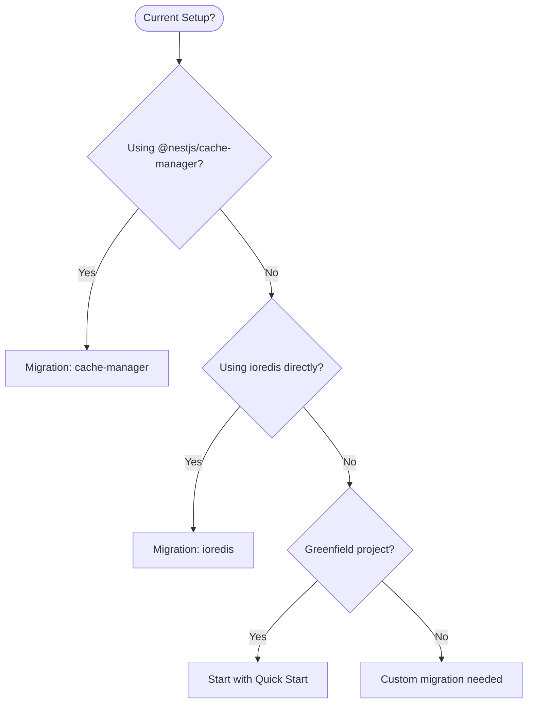

# Integration Guide

How to integrate NestJS RedisX with your existing codebase and infrastructure.

## For Developers

| Guide | Description |
|-------|-------------|
| [Migration from cache-manager](./migration-cache-manager) | Move from @nestjs/cache-manager |
| [Migration from ioredis](./migration-ioredis) | Move from raw ioredis usage |
| [NestJS Patterns](./nestjs-patterns) | Guards, interceptors, and filters |
| [Testing Strategy](./testing-strategy) | Unit and integration testing |

## For DevOps

| Guide | Description |
|-------|-------------|
| [Prometheus & Grafana](./prometheus-grafana) | Metrics and dashboards setup |
| [OpenTelemetry](./opentelemetry) | Distributed tracing setup |

## Quick Migration Assessment

## Migration Complexity

| From | Complexity | Time Estimate |
|------|------------|---------------|
| @nestjs/cache-manager | Low | 1-2 hours |
| Raw ioredis | Medium | 2-4 hours |
| Custom Redis wrapper | Medium-High | 4-8 hours |
| Other cache libraries | Varies | Depends on abstraction |

## Next Steps

Choose your integration path:

- **New project:** [Installation](../installation) → [Quick Start](../quick-start)
- **Existing cache-manager:** [Migration Guide](./migration-cache-manager)
- **Existing ioredis:** [Migration Guide](./migration-ioredis)
- **Setting up observability:** [Prometheus & Grafana](./prometheus-grafana)
