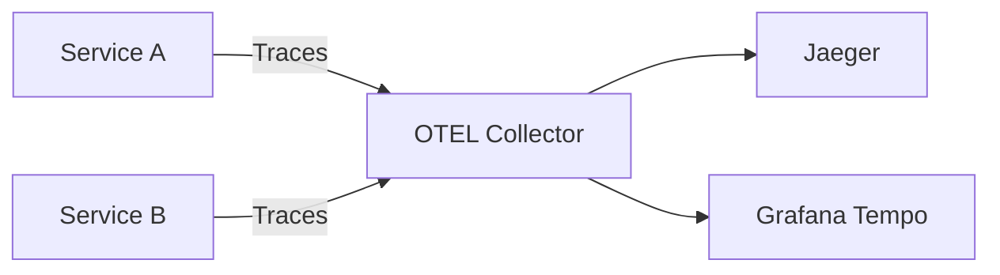

# OpenTelemetry Setup

Set up distributed tracing to debug request flows across services.

## Architecture



## Quick Setup

### Docker Compose

```yaml
# docker-compose.yml
services:
  jaeger:
    image: jaegertracing/all-in-one:latest
    ports:
      - "16686:16686"  # UI
      - "4318:4318"    # OTLP HTTP
    environment:
      - COLLECTOR_OTLP_ENABLED=true
```

### Configure Tracing Plugin

```typescript
// app.module.ts
import { TracingPlugin } from '@nestjs-redisx/tracing';

RedisModule.forRoot({
  clients: { host: 'localhost', port: 6379 },
  plugins: [
    new TracingPlugin({
      serviceName: 'my-service',
      exporter: {
        type: 'otlp',
        endpoint: process.env.OTEL_ENDPOINT || 'http://jaeger:4318',
      },
      sampling: {
        strategy: 'ratio',
        ratio: process.env.NODE_ENV === 'production' ? 0.01 : 1,
      },
    }),
  ],
})
```

## What Gets Traced

| Operation | Span Name | Attributes |
|-----------|-----------|------------|
| Cache get | `cache.get` | key, hit, ttl |
| Cache set | `cache.set` | key, ttl |
| Lock acquire | `lock.acquire` | key, acquired |
| Rate limit | `ratelimit.check` | key, allowed |
| Stream publish | `stream.publish` | stream, id |

## Example Trace

```
POST /api/orders (152ms)
├── middleware (2ms)
├── guard.auth (5ms)
├── idempotency.check (3ms) [status: new]
├── lock.acquire (8ms) [key: order:123, acquired: true]
├── cache.get (1ms) [key: user:456, hit: true]
├── db.query (80ms)
├── stream.publish (5ms) [stream: orders]
├── cache.set (2ms) [key: order:123]
└── lock.release (1ms)
```

## Custom Spans

```typescript
import { Inject, Injectable } from '@nestjs/common';
import { TRACING_SERVICE, ITracingService } from '@nestjs-redisx/tracing';

@Injectable()
export class OrderService {
  constructor(
    @Inject(TRACING_SERVICE) private tracing: ITracingService,
  ) {}

  async processOrder(orderId: string): Promise<void> {
    return this.tracing.withSpan('order.process', async () => {
      this.tracing.setAttribute('order.id', orderId);

      await this.validateOrder(orderId);
      this.tracing.addEvent('validation.complete');

      await this.chargePayment(orderId);
      this.tracing.addEvent('payment.complete');
    });
  }
}
```

## Sampling Strategies

```typescript
// Always sample (development)
sampling: { strategy: 'always' }

// Never sample
sampling: { strategy: 'never' }

// Ratio sampling (1% in production)
sampling: { strategy: 'ratio', ratio: 0.01 }

// Parent-based (inherit from incoming request)
sampling: { strategy: 'parent', ratio: 0.01 }
```

## Context Propagation

Traces propagate across services via headers:

```typescript
// Automatic propagation with HTTP client
@Injectable()
export class ExternalApiService {
  constructor(private httpService: HttpService) {}

  async callExternalApi(): Promise<any> {
    // Trace context automatically injected in headers
    return this.httpService.get('http://service-b/api').toPromise();
  }
}
```

## Viewing Traces

1. Open Jaeger UI: http://localhost:16686
2. Select service: `my-service`
3. Find operation: `POST /api/orders`
4. View trace timeline and spans

## Production Configuration

```typescript
new TracingPlugin({
  serviceName: process.env.SERVICE_NAME,
  exporter: {
    type: 'otlp',
    endpoint: process.env.OTEL_EXPORTER_OTLP_ENDPOINT,
    headers: {
      'Authorization': `Bearer ${process.env.OTEL_AUTH_TOKEN}`,
    },
  },
  sampling: {
    strategy: 'parent',
    ratio: 0.01,
  },
  resourceAttributes: {
    'service.version': process.env.SERVICE_VERSION,
    'deployment.environment': process.env.NODE_ENV,
    'k8s.pod.name': process.env.HOSTNAME,
  },
})
```

## Next Steps

- [Prometheus & Grafana](./prometheus-grafana) — Metrics setup
- [Operations: Monitoring](../operations/monitoring) — Production monitoring
