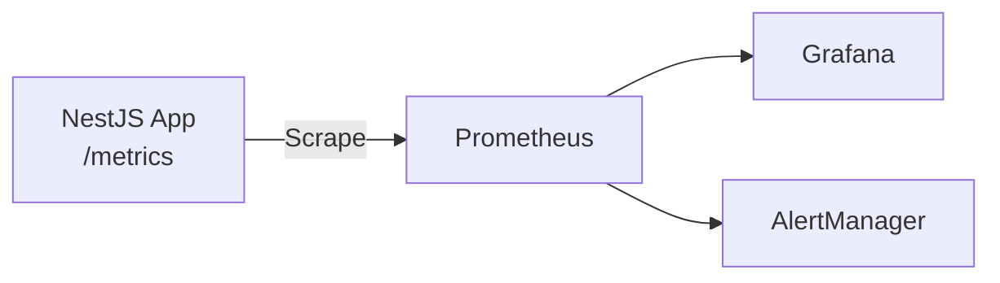

# Prometheus & Grafana Setup

Set up comprehensive monitoring for NestJS RedisX with Prometheus and Grafana.

## Architecture



## Quick Setup with Docker Compose

```yaml
# docker-compose.yml
version: '3.8'
services:
  app:
    build: .
    ports:
      - "3000:3000"
    environment:
      - REDIS_HOST=redis

  redis:
    image: redis:7-alpine
    ports:
      - "6379:6379"

  prometheus:
    image: prom/prometheus:latest
    ports:
      - "9090:9090"
    volumes:
      - ./prometheus.yml:/etc/prometheus/prometheus.yml

  grafana:
    image: grafana/grafana:latest
    ports:
      - "3001:3000"
    environment:
      - GF_SECURITY_ADMIN_PASSWORD=admin
    volumes:
      - ./grafana/provisioning:/etc/grafana/provisioning
```

## Configure Metrics Plugin

```typescript
// app.module.ts
import { MetricsPlugin } from '@nestjs-redisx/metrics';

RedisModule.forRoot({
  clients: { host: process.env.REDIS_HOST, port: 6379 },
  plugins: [
    new MetricsPlugin({
      prefix: 'redisx_',
      endpoint: '/metrics',
      defaultLabels: {
        service: 'my-service',
        env: process.env.NODE_ENV,
      },
    }),
  ],
})
```

## Prometheus Configuration

```yaml
# prometheus.yml
global:
  scrape_interval: 15s

scrape_configs:
  - job_name: 'nestjs-app'
    static_configs:
      - targets: ['app:3000']
    metrics_path: '/metrics'
```

## Key Metrics

### Cache Metrics

| Metric | Type | Description |
|--------|------|-------------|
| `redisx_cache_hits_total` | Counter | Cache hits |
| `redisx_cache_misses_total` | Counter | Cache misses |
| `redisx_cache_operation_duration_seconds` | Histogram | Operation latency |

### Lock Metrics

| Metric | Type | Description |
|--------|------|-------------|
| `redisx_lock_acquisitions_total` | Counter | Locks acquired |
| `redisx_lock_timeouts_total` | Counter | Lock timeouts |
| `redisx_lock_wait_duration_seconds` | Histogram | Wait time |

### Rate Limit Metrics

| Metric | Type | Description |
|--------|------|-------------|
| `redisx_ratelimit_allowed_total` | Counter | Allowed requests |
| `redisx_ratelimit_rejected_total` | Counter | Rejected requests |

## Grafana Dashboard

Import this dashboard JSON:

```json
{
  "title": "NestJS RedisX",
  "panels": [
    {
      "title": "Cache Hit Rate",
      "type": "gauge",
      "targets": [{
        "expr": "sum(rate(redisx_cache_hits_total[5m])) / sum(rate(redisx_cache_hits_total[5m]) + rate(redisx_cache_misses_total[5m]))"
      }]
    },
    {
      "title": "Operations/sec",
      "type": "graph",
      "targets": [{
        "expr": "sum(rate(redisx_cache_hits_total[5m])) + sum(rate(redisx_cache_misses_total[5m]))"
      }]
    }
  ]
}
```

## Alerting Rules

```yaml
# alerts.yml
groups:
  - name: redisx
    rules:
      - alert: LowCacheHitRate
        expr: |
          sum(rate(redisx_cache_hits_total[5m])) / 
          (sum(rate(redisx_cache_hits_total[5m])) + sum(rate(redisx_cache_misses_total[5m]))) < 0.8
        for: 5m
        labels:
          severity: warning
        annotations:
          summary: "Cache hit rate below 80%"

      - alert: HighLockContention
        expr: rate(redisx_lock_timeouts_total[5m]) > 0.1
        for: 5m
        labels:
          severity: warning
        annotations:
          summary: "High lock timeout rate"
```

## Useful PromQL Queries

```yaml
# Cache hit rate
sum(rate(redisx_cache_hits_total[5m])) / 
(sum(rate(redisx_cache_hits_total[5m])) + sum(rate(redisx_cache_misses_total[5m])))

# p99 latency
histogram_quantile(0.99, sum(rate(redisx_cache_operation_duration_seconds_bucket[5m])) by (le))

# Rate limit rejection rate
sum(rate(redisx_ratelimit_rejected_total[5m])) / 
sum(rate(redisx_ratelimit_allowed_total[5m]) + rate(redisx_ratelimit_rejected_total[5m]))
```

## Next Steps

- [OpenTelemetry](./opentelemetry) — Distributed tracing
- [Operations: Monitoring](../operations/monitoring) — Production monitoring
