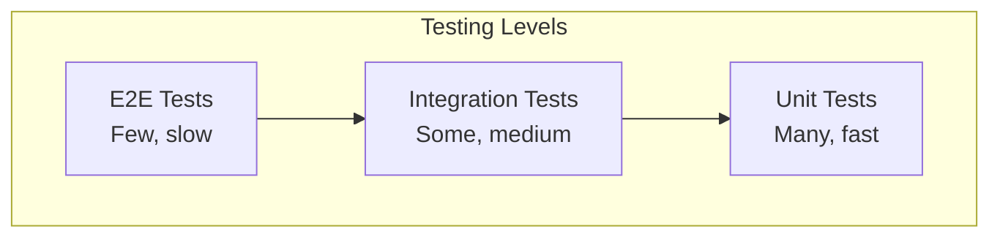

# Testing Strategy

Comprehensive testing approach for applications using NestJS RedisX.

## Testing Pyramid



| Level | Redis | Purpose | Speed |
|-------|-------|---------|-------|
| Unit | Mocked | Logic correctness | Fast |
| Integration | Real (Docker) | Redis interaction | Medium |
| E2E | Real | Full system | Slow |

## Unit Testing

### Mocking Cache Service

```typescript
import { describe, it, expect, beforeEach, afterEach, vi, type MockedObject } from 'vitest';

// __mocks__/cache.service.ts
export const mockCacheService = {
  get: vi.fn(),
  set: vi.fn(),
  delete: vi.fn(),
  invalidateTags: vi.fn(),
};

// user.service.spec.ts
describe('UserService', () => {
  let service: UserService;
  let cacheService: MockedObject<ICacheService>;

  beforeEach(async () => {
    const module = await Test.createTestingModule({
      providers: [
        UserService,
        {
          provide: CACHE_SERVICE,
          useValue: mockCacheService,
        },
      ],
    }).compile();

    service = module.get(UserService);
    cacheService = module.get(CACHE_SERVICE);
  });

  afterEach(() => {
    vi.clearAllMocks();
  });

  describe('getUser', () => {
    it('should return cached user', async () => {
      const cachedUser = { id: '123', name: 'John' };
      cacheService.get.mockResolvedValue(cachedUser);

      const result = await service.getUser('123');

      expect(result).toEqual(cachedUser);
      expect(cacheService.get).toHaveBeenCalledWith('user:123');
    });

    it('should fetch and cache on miss', async () => {
      cacheService.get.mockResolvedValue(null);
      const dbUser = { id: '123', name: 'John' };
      userRepository.findById.mockResolvedValue(dbUser);

      const result = await service.getUser('123');

      expect(result).toEqual(dbUser);
      expect(cacheService.set).toHaveBeenCalledWith(
        'user:123',
        dbUser,
        expect.any(Object),
      );
    });
  });
});
```

### Mocking Lock Service

```typescript
import { describe, it, expect, beforeEach, vi, type MockedObject } from 'vitest';

// __mocks__/lock.service.ts
export const mockLockService = {
  acquire: vi.fn(),
  release: vi.fn(),
  withLock: vi.fn((key, fn) => fn()), // Execute function directly
};

// payment.service.spec.ts
describe('PaymentService', () => {
  let service: PaymentService;
  let lockService: MockedObject<ILockService>;

  beforeEach(async () => {
    const module = await Test.createTestingModule({
      providers: [
        PaymentService,
        {
          provide: LOCK_SERVICE,
          useValue: mockLockService,
        },
      ],
    }).compile();

    service = module.get(PaymentService);
    lockService = module.get(LOCK_SERVICE);
  });

  it('should process payment with lock', async () => {
    const mockLock = { release: vi.fn() };
    lockService.acquire.mockResolvedValue(mockLock);

    await service.processPayment('order-123');

    expect(lockService.acquire).toHaveBeenCalledWith(
      'payment:order-123',
      expect.any(Object),
    );
  });

  it('should throw when lock not acquired', async () => {
    lockService.acquire.mockResolvedValue(null);

    await expect(service.processPayment('order-123')).rejects.toThrow();
  });
});
```

### Mocking Rate Limit Service

```typescript
import { describe, it, expect, beforeEach, vi, type MockedObject } from 'vitest';

// rate-limit.service.spec.ts
describe('RateLimitGuard', () => {
  let guard: RateLimitGuard;
  let rateLimitService: MockedObject<IRateLimitService>;

  beforeEach(async () => {
    const module = await Test.createTestingModule({
      providers: [
        RateLimitGuard,
        {
          provide: RATE_LIMIT_SERVICE,
          useValue: {
            check: vi.fn(),
          },
        },
      ],
    }).compile();

    guard = module.get(RateLimitGuard);
    rateLimitService = module.get(RATE_LIMIT_SERVICE);
  });

  it('should allow when under limit', async () => {
    rateLimitService.check.mockResolvedValue({
      allowed: true,
      remaining: 99,
      resetIn: 60,
    });

    const result = await guard.canActivate(mockExecutionContext);

    expect(result).toBe(true);
  });

  it('should block when over limit', async () => {
    rateLimitService.check.mockResolvedValue({
      allowed: false,
      remaining: 0,
      resetIn: 30,
    });

    await expect(guard.canActivate(mockExecutionContext)).rejects.toThrow(
      TooManyRequestsException,
    );
  });
});
```

## Integration Testing

### Setup with Docker Redis

```typescript
// test/setup.ts
import { GenericContainer, StartedTestContainer } from 'testcontainers';

let redisContainer: StartedTestContainer;

beforeAll(async () => {
  redisContainer = await new GenericContainer('redis:7-alpine')
    .withExposedPorts(6379)
    .start();

  process.env.REDIS_HOST = redisContainer.getHost();
  process.env.REDIS_PORT = redisContainer.getMappedPort(6379).toString();
}, 60000);

afterAll(async () => {
  await redisContainer.stop();
});
```

### Integration Test Example

```typescript
// user.integration.spec.ts
describe('UserService (Integration)', () => {
  let app: INestApplication;
  let service: UserService;
  let redis: Redis;

  beforeAll(async () => {
    const module = await Test.createTestingModule({
      imports: [
        RedisModule.forRoot({
          clients: {
            host: process.env.REDIS_HOST,
            port: parseInt(process.env.REDIS_PORT),
          },
          plugins: [new CachePlugin()],
        }),
        UserModule,
      ],
    }).compile();

    app = module.createNestApplication();
    await app.init();

    service = module.get(UserService);
    redis = module.get(getRedisToken());
  });

  beforeEach(async () => {
    // Clear Redis between tests
    await redis.flushall();
  });

  afterAll(async () => {
    await app.close();
  });

  it('should cache user in Redis', async () => {
    const user = await service.getUser('123');

    // Verify it's in Redis
    const cached = await redis.get('cache:user:123');
    expect(JSON.parse(cached)).toEqual(user);
  });

  it('should invalidate cache on update', async () => {
    // Populate cache
    await service.getUser('123');
    expect(await redis.exists('cache:user:123')).toBe(1);

    // Update user
    await service.updateUser('123', { name: 'New Name' });

    // Cache should be invalidated
    expect(await redis.exists('cache:user:123')).toBe(0);
  });
});
```

### Testing Locks

```typescript
// lock.integration.spec.ts
describe('Lock Integration', () => {
  it('should prevent concurrent execution', async () => {
    const results: string[] = [];

    // Start two concurrent operations
    const op1 = service.processWithLock('resource-1', async () => {
      results.push('op1-start');
      await sleep(100);
      results.push('op1-end');
    });

    const op2 = service.processWithLock('resource-1', async () => {
      results.push('op2-start');
      await sleep(100);
      results.push('op2-end');
    });

    await Promise.all([op1, op2]);

    // Operations should be serialized
    expect(results).toEqual([
      'op1-start',
      'op1-end',
      'op2-start',
      'op2-end',
    ]);
  });
});
```

### Testing Rate Limits

```typescript
// rate-limit.integration.spec.ts
describe('Rate Limit Integration', () => {
  it('should enforce rate limit', async () => {
    const limit = 5;
    const results: boolean[] = [];

    for (let i = 0; i < limit + 3; i++) {
      const result = await rateLimitService.check({
        key: 'test:rate',
        limit,
        window: 60,
      });
      results.push(result.allowed);
    }

    // First 5 allowed, next 3 blocked
    expect(results).toEqual([
      true, true, true, true, true,
      false, false, false,
    ]);
  });
});
```

## Simulating Redis Failures

### Test Redis Down Scenario

```typescript
describe('Redis Failure Handling', () => {
  it('should handle Redis disconnect gracefully', async () => {
    // Stop Redis
    await redisContainer.stop();

    // Service should handle gracefully
    const result = await service.getUserWithFallback('123');

    expect(result).toBeDefined(); // Falls back to DB
  });

  it('should recover when Redis comes back', async () => {
    // Restart Redis
    redisContainer = await new GenericContainer('redis:7-alpine')
      .withExposedPorts(6379)
      .start();

    // Wait for reconnection
    await sleep(1000);

    const result = await service.getUser('123');
    expect(result).toBeDefined();
  });
});
```

## E2E Testing

```typescript
// app.e2e-spec.ts
describe('API (e2e)', () => {
  let app: INestApplication;

  beforeAll(async () => {
    const moduleFixture = await Test.createTestingModule({
      imports: [AppModule],
    }).compile();

    app = moduleFixture.createNestApplication();
    await app.init();
  });

  it('/users/:id (GET) - should cache response', async () => {
    // First request
    const res1 = await request(app.getHttpServer())
      .get('/users/123')
      .expect(200);

    // Second request (should be cached)
    const res2 = await request(app.getHttpServer())
      .get('/users/123')
      .expect(200);

    expect(res1.body).toEqual(res2.body);
    expect(res2.headers['x-cache']).toBe('HIT');
  });

  it('/payments (POST) - should be idempotent', async () => {
    const idempotencyKey = 'test-key-123';

    // First request
    const res1 = await request(app.getHttpServer())
      .post('/payments')
      .set('Idempotency-Key', idempotencyKey)
      .send({ amount: 100 })
      .expect(201);

    // Retry with same key
    const res2 = await request(app.getHttpServer())
      .post('/payments')
      .set('Idempotency-Key', idempotencyKey)
      .send({ amount: 100 })
      .expect(201);

    expect(res1.body.id).toBe(res2.body.id);
  });
});
```

## Test Utilities

### Redis Test Helper

```typescript
// test/redis-helper.ts
export class RedisTestHelper {
  constructor(private redis: Redis) {}

  async clearAll(): Promise<void> {
    await this.redis.flushall();
  }

  async clearPattern(pattern: string): Promise<void> {
    const keys = await this.redis.keys(pattern);
    if (keys.length > 0) {
      await this.redis.del(...keys);
    }
  }

  async getJson<T>(key: string): Promise<T | null> {
    const value = await this.redis.get(key);
    return value ? JSON.parse(value) : null;
  }

  async setJson<T>(key: string, value: T, ttl?: number): Promise<void> {
    if (ttl) {
      await this.redis.setex(key, ttl, JSON.stringify(value));
    } else {
      await this.redis.set(key, JSON.stringify(value));
    }
  }
}
```

## Summary

| Test Type | What to Test | Redis |
|-----------|--------------|-------|
| Unit | Business logic | Mocked |
| Integration | Redis interactions | Docker |
| E2E | Full flow | Docker |

## Next Steps

- [NestJS Patterns](./nestjs-patterns) — Guards and interceptors
- [Troubleshooting](../troubleshooting/) — Debug test failures
