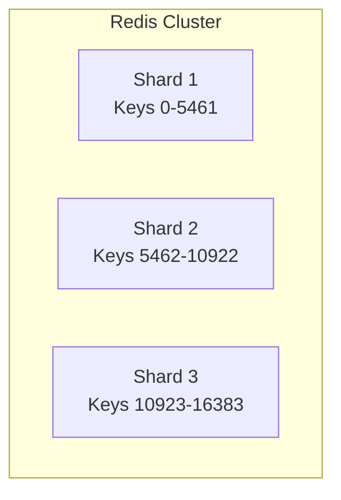
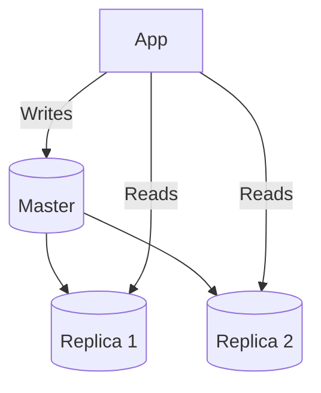

# Capacity Planning

Plan Redis capacity for your workload.

## Memory Estimation

### Cache Memory

```
Memory per key ≈ key_size + value_size + overhead (~100 bytes)

Example:
- Key: "user:123" = 8 bytes
- Value: JSON user object = 500 bytes
- Overhead: 100 bytes
- Total: ~608 bytes per user

For 1 million users: 1M × 608 = ~580 MB
```

### Lock Memory

```
Memory per lock ≈ key_size + token_size + overhead (~150 bytes)

Example:
- Key: "lock:payment:order-12345" = 25 bytes
- Token: UUID = 36 bytes
- Overhead: 100 bytes
- Total: ~161 bytes per active lock

For 1000 concurrent locks: 1000 × 161 = ~157 KB (negligible)
```

### Stream Memory

```
Memory per message ≈ id_size + fields_size + overhead (~200 bytes)

Example:
- ID: "1706123456789-0" = 16 bytes
- Fields: {"orderId": "123", "action": "created"} = 50 bytes
- Overhead: 200 bytes
- Total: ~266 bytes per message

For 1 million messages: 1M × 266 = ~254 MB
```

## Key Cardinality

### Estimating Key Count

```yaml
# Current key count
redis_db_keys{db="0"}

# Growth rate
increase(redis_db_keys{db="0"}[24h])
```

### Key Expiration

```
Active keys = (keys_created/hour × TTL_hours) + persistent_keys

Example:
- Cache keys: 10000/hour × 1 hour TTL = 10,000 active
- Session keys: 100/hour × 24 hour TTL = 2,400 active
- Persistent keys: 1,000
- Total: ~13,400 keys
```

## Sizing Guidelines

### By Workload

| Workload | Redis Memory | Instances |
|----------|--------------|-----------|
| Small (<1000 RPS) | 1-2 GB | 1 |
| Medium (1000-10000 RPS) | 4-8 GB | 1-3 |
| Large (10000-100000 RPS) | 16-32 GB | Cluster |
| Very Large (>100000 RPS) | 64+ GB | Cluster |

### By Feature

| Feature | Memory Impact | Notes |
|---------|--------------|-------|
| Cache | High | Depends on data size |
| Locks | Low | ~150 bytes per lock |
| Rate Limit | Medium | Counter per key |
| Streams | High | Message history |
| Idempotency | Medium | Response storage |

## Scaling Strategies

### Vertical (Scale Up)

```
Before: 4 GB Redis
After: 16 GB Redis
```

**When:** Memory is the bottleneck

### Horizontal (Scale Out)



**When:** Throughput or memory exceeds single node

### Read Replicas



**When:** Read-heavy workload

## Monitoring Growth

```yaml
# Memory usage trend
predict_linear(redis_memory_used_bytes[7d], 30*24*3600)

# Key count trend
predict_linear(redis_db_keys[7d], 30*24*3600)

# Operations trend
predict_linear(rate(redis_commands_total[1h])[7d:1h], 30*24*3600)
```

## Capacity Alerts

```yaml
# Alert when approaching limits
- alert: RedisMemoryHigh
  expr: redis_memory_used_bytes / redis_memory_max_bytes > 0.8
  for: 10m
  annotations:
    summary: "Redis memory usage above 80%"

- alert: RedisKeyCountHigh
  expr: redis_db_keys > 10000000
  for: 10m
  annotations:
    summary: "Redis key count above 10 million"
```

## Next Steps

- [Deployment](../architecture/deployment) — Topology options
- [Tuning](../architecture/tuning) — Performance optimization
