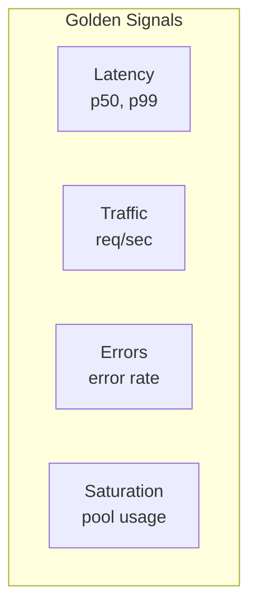

# Operations Guide

This section is for **SRE, DevOps, and on-call engineers** managing NestJS RedisX in production.

## Quick Navigation

| I need to... | Go to |
|--------------|-------|
| Set up monitoring | [Monitoring](./monitoring) |
| Configure alerts | [Alerting](./alerting) |
| Plan capacity | [Capacity Planning](./capacity-planning) |
| Handle incidents | [Runbooks](./runbooks) |

## For Developers vs Ops

This guide focuses on **operational concerns**:

| Developers | Operations |
|------------|------------|
| How to use @Cached | How to monitor cache hit rate |
| How to configure locks | How to alert on lock contention |
| How to process streams | How to scale consumers |

## Key Operational Metrics



### Quick Health Check

```yaml
# Is Redis healthy?
redis_up == 1

# Is cache working?
rate(redisx_cache_hits_total[5m]) > 0

# Are locks releasing?
rate(redisx_lock_releases_total[5m]) > 0

# Any rate limit issues?
rate(redisx_ratelimit_rejected_total[5m]) < 0.1 * rate(redisx_ratelimit_allowed_total[5m])
```

## Common Operational Tasks

### Scale Workers

```bash
# Kubernetes
kubectl scale deployment job-workers --replicas=10

# Docker Compose
docker-compose up -d --scale worker=10
```

### Clear Cache

```bash
# All cache keys
redis-cli KEYS "cache:*" | xargs redis-cli DEL

# Specific pattern
redis-cli KEYS "cache:user:*" | xargs redis-cli DEL
```

### Check Queue Depth

```bash
redis-cli XLEN jobs
redis-cli XLEN jobs:dlq
```

## On-Call Checklist

When paged:

1. **Check Redis connectivity**
   ```bash
   redis-cli ping
   ```

2. **Check key metrics**
   - Cache hit rate
   - Lock timeout rate
   - Stream consumer lag

3. **Check application logs**
   ```bash
   kubectl logs -l app=my-service --tail=100
   ```

4. **Check Grafana dashboard**
   - Look for spikes/dips at incident time

5. **Follow runbook** for specific alert

## Next Steps

- [Monitoring](./monitoring) — Detailed metrics setup
- [Alerting](./alerting) — Alert configuration
- [Runbooks](./runbooks) — Incident response procedures
