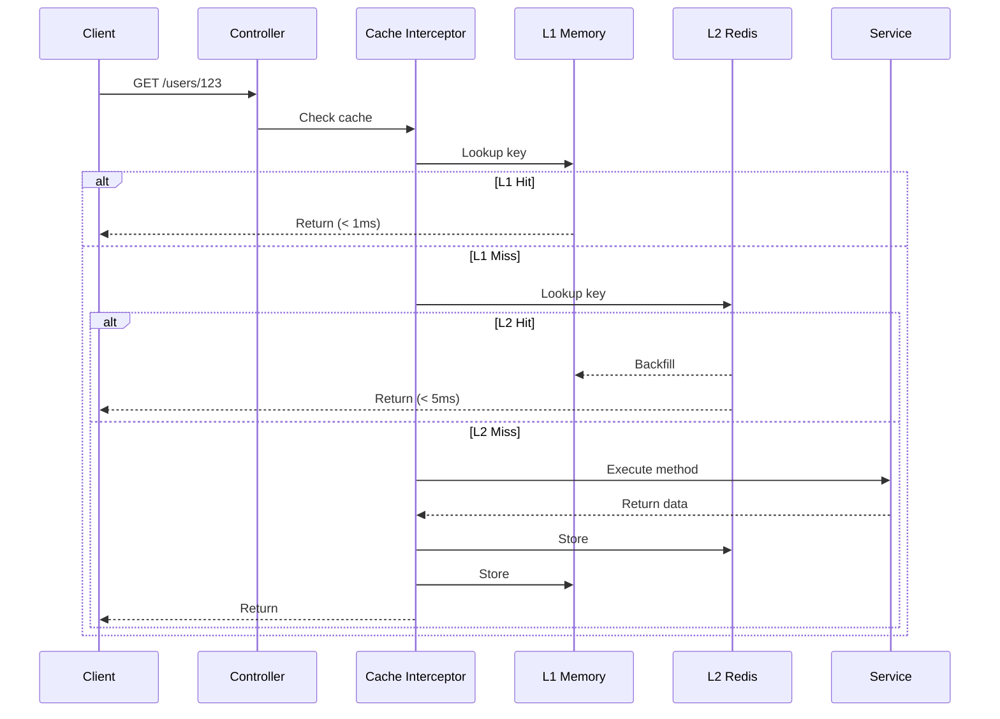

# Quick Start

This guide demonstrates how to integrate NestJS RedisX into your application and implement your first cached endpoint.

## Prerequisites

Ensure you have completed the [Installation](/en/guide/installation) steps and have Redis running.

## Step 1: Create a NestJS Project

If you don't have an existing NestJS project:

```bash
npm i -g @nestjs/cli
nest new my-app
cd my-app
```

## Step 2: Install Dependencies

::: code-group

```bash [ioredis]
npm install @nestjs-redisx/core @nestjs-redisx/cache ioredis
```

```bash [node-redis]
npm install @nestjs-redisx/core @nestjs-redisx/cache redis
```

:::

## Step 3: Configure the Redis Module

Update `app.module.ts` with the RedisX configuration:

```typescript
import { Module } from '@nestjs/common';
import { RedisModule } from '@nestjs-redisx/core';
import { CachePlugin } from '@nestjs-redisx/cache';
import { ConfigModule, ConfigService } from '@nestjs/config';

@Module({
  imports: [
    RedisModule.forRootAsync({
      imports: [ConfigModule],
      inject: [ConfigService],
      plugins: [
        CachePlugin.registerAsync({
          imports: [ConfigModule],
          inject: [ConfigService],
          useFactory: (config: ConfigService) => ({
            l1: {
              enabled: true,
              maxSize: config.get('CACHE_L1_MAX_SIZE', 1000),
            },
            l2: {
              enabled: true,
              defaultTtl: config.get('CACHE_L2_TTL', 3600),
            },
          }),
        }),
      ],
      useFactory: (config: ConfigService) => ({
        clients: {
          host: config.get('REDIS_HOST', 'localhost'),
          port: config.get('REDIS_PORT', 6379),
          password: config.get('REDIS_PASSWORD'),
        },
      }),
    }),
  ],
})
export class AppModule {}
```

::: tip Quick Prototyping
For local development or quick prototyping, you can use static configuration with `forRoot`:
```typescript
RedisModule.forRoot({
  clients: { host: 'localhost', port: 6379 },
  plugins: [
    new CachePlugin({
      l1: { enabled: true, maxSize: 1000 },
      l2: { enabled: true, defaultTtl: 3600 },
    }),
  ],
});
```
:::

## Step 4: Create a Cached Service

Create `user.service.ts`:

```typescript
import { Injectable } from '@nestjs/common';
import { Cached } from '@nestjs-redisx/cache';

export interface User {
  id: string;
  name: string;
  email: string;
}

@Injectable()
export class UserService {
  @Cached({
    key: 'user:{0}',
    ttl: 300,
    tags: (id) => [`user:${id}`, 'users'],
  })
  async findById(id: string): Promise<User> {
    // Database query - only executed on cache miss
    return this.userRepository.findById(id);
  }

  @Cached({
    key: 'users:list',
    ttl: 60,
    tags: ['users'],
  })
  async findAll(): Promise<User[]> {
    return this.userRepository.findAll();
  }
}
```

## Step 5: Create a Controller

Create `user.controller.ts`:

```typescript
import { Controller, Get, Param } from '@nestjs/common';
import { UserService, User } from './user.service';

@Controller('users')
export class UserController {
  constructor(private readonly userService: UserService) {}

  @Get(':id')
  async findById(@Param('id') id: string): Promise<User> {
    return this.userService.findById(id);
  }

  @Get()
  async findAll(): Promise<User[]> {
    return this.userService.findAll();
  }
}
```

## Step 6: Register Components

Update `app.module.ts`:

```typescript
@Module({
  imports: [RedisModule.forRoot({ /* ... */ })],
  controllers: [UserController],
  providers: [UserService],
})
export class AppModule {}
```

## Step 7: Run the Application

```bash
npm run start:dev
```

## Step 8: Verify Caching

Test the caching behavior:

```bash
# First request - cache miss, executes database query
curl http://localhost:3000/users/123

# Second request - cache hit, returns instantly
curl http://localhost:3000/users/123
```

## Cache Flow Diagram



## Cache Invalidation

When data changes, invalidate the relevant cache entries:

```typescript
import { Injectable, Inject } from '@nestjs/common';
import { CACHE_SERVICE, ICacheService, InvalidateTags } from '@nestjs-redisx/cache';

@Injectable()
export class UserService {
  constructor(
    @Inject(CACHE_SERVICE) private readonly cache: ICacheService,
  ) {}

  // Option 1: Declarative with decorator (proxy-based, works on services)
  @InvalidateTags({
    tags: (id: string) => [`user:${id}`, 'users'],
  })
  async update(id: string, data: UpdateUserDto): Promise<User> {
    return this.userRepository.update(id, data);
  }

  // Option 2: Programmatic invalidation
  async delete(id: string): Promise<void> {
    await this.userRepository.delete(id);
    await this.cache.invalidateTags([`user:${id}`, 'users']);
  }
}
```

## Common Patterns

### Multi-Tenant Caching

```typescript
@Cached({
  key: 'products:{0}',
  varyBy: ['tenantId'],  // Resolved from contextProvider (CLS/AsyncLocalStorage), not HTTP headers
})
async findByCategory(category: string): Promise<Product[]> {
  // Cache is automatically isolated per tenant
  return this.productRepository.findByCategory(category);
}
```

### Conditional Caching

```typescript
@Cached({
  key: 'user:{0}',
  condition: (id) => id !== 'system',
  unless: (result) => result === null,
})
async findById(id: string): Promise<User | null> {
  return this.userRepository.findById(id);
}
```

### Stale-While-Revalidate

```typescript
@Cached({
  key: 'stats:dashboard',
  ttl: 60,
  swr: { enabled: true, staleTime: 300 }, // Serve stale for up to 5 minutes while refreshing
})
async getDashboardStats(): Promise<DashboardStats> {
  return this.analyticsService.computeStats();
}
```

## Next Steps

- [Core Module](/en/reference/core/) — RedisModule, RedisService, and connection management
- [Cache Plugin](/en/reference/cache/) — Complete caching guide
- [Locks Plugin](/en/reference/locks/) — Distributed locking
- [Rate Limit Plugin](/en/reference/rate-limit/) — API protection
- [Plugins Overview](/en/reference/plugins/) — All available plugins
