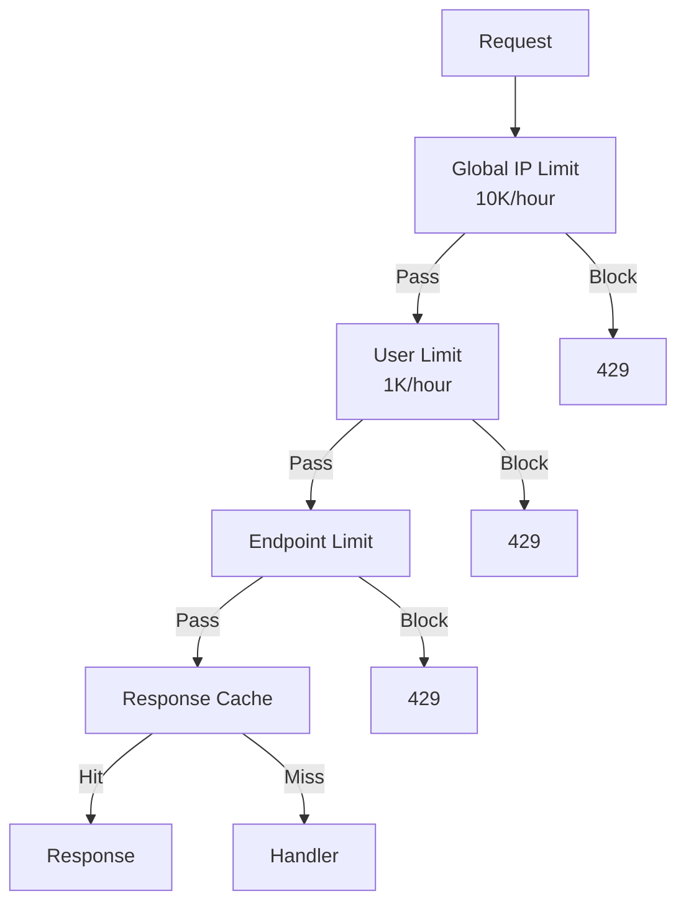

# API Protection

Layered rate limiting with caching for public APIs.

## Solution Overview



## Implementation

```typescript
import { RateLimit, RateLimitGuard } from '@nestjs-redisx/rate-limit';
import { Cached } from '@nestjs-redisx/cache';

@Controller('api/v1')
@UseGuards(RateLimitGuard)
export class ApiController {
  // Public endpoint: stricter limits
  @Get('products')
  @RateLimit({ points: 30, duration: 60, key: 'ip' })
  @Cached({ key: 'products:list:{0}', ttl: 60 })
  async listProducts(@Query('page') page = 1) {
    return this.productService.list(page);
  }

  // Authenticated: higher limits
  @Get('orders')
  @UseGuards(AuthGuard)
  @RateLimit({ points: 100, duration: 60, key: 'user' })
  async listOrders(@Req() req: Request & { user: { id: string } }) {
    return this.orderService.listForUser(req.user.id);
  }

  // Resource-intensive: lower limit
  @Get('search')
  @RateLimit({ points: 10, duration: 60, key: 'ip' })
  @Cached({ key: 'search:{0}:{1}', ttl: 30 })
  async search(@Query('q') query: string) {
    return this.searchService.search(query);
  }
}
```

## Tiered Limits by Plan

```typescript
import { Injectable, CanActivate, ExecutionContext, Inject } from '@nestjs/common';
import { RATE_LIMIT_SERVICE, IRateLimitService } from '@nestjs-redisx/rate-limit';

const TIER_LIMITS = {
  anonymous: { global: 1000, default: 30 },
  free: { global: 5000, default: 100 },
  pro: { global: 50000, default: 500 },
  enterprise: { global: 500000, default: 5000 },
};

@Injectable()
export class TieredRateLimitGuard implements CanActivate {
  constructor(
    @Inject(RATE_LIMIT_SERVICE) private readonly rateLimit: IRateLimitService,
  ) {}

  async canActivate(context: ExecutionContext): Promise<boolean> {
    const request = context.switchToHttp().getRequest();
    const tier = request.user?.tier || 'anonymous';
    const config = TIER_LIMITS[tier];

    const result = await this.rateLimit.check(
      `${tier}:${request.user?.id || request.ip}`,
      { points: config.default, duration: 60 },
    );

    return result.allowed;
  }
}
```

## Response Headers

```http
HTTP/1.1 200 OK
X-RateLimit-Limit: 100
X-RateLimit-Remaining: 85
X-RateLimit-Reset: 1706123456
```

## Next Steps

- [Login Throttling](./login-throttling) — Auth endpoint protection
- [Rate Limit Reference](../../reference/rate-limit/) — Full API
