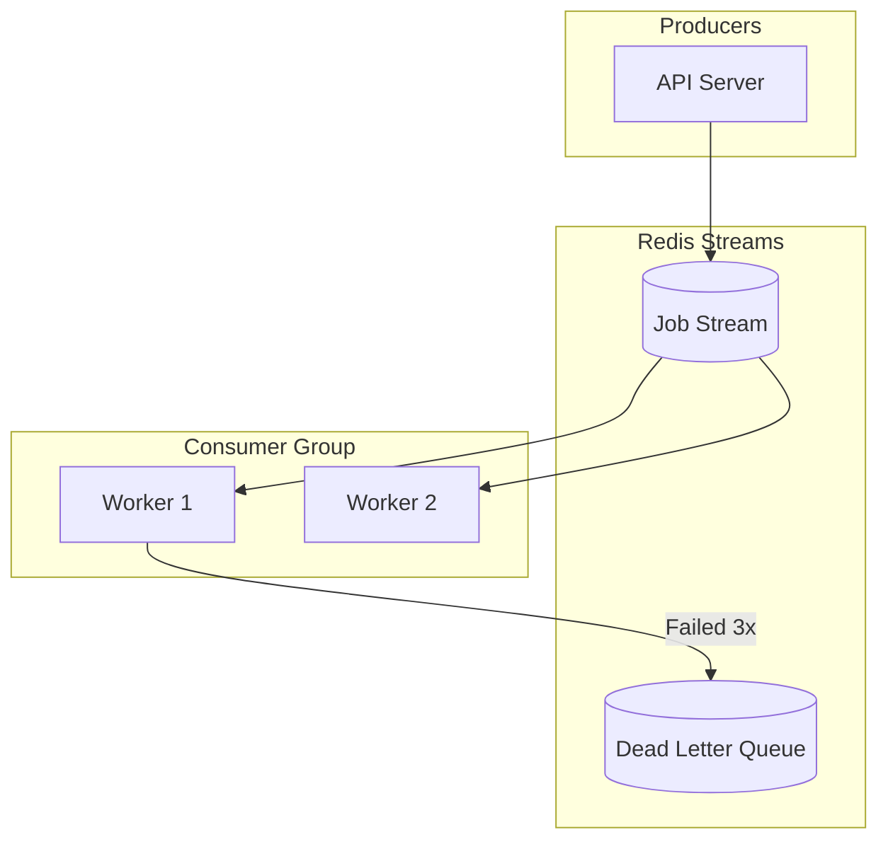

# Background Jobs

Process background tasks with consumer groups and automatic retry.

## Solution Overview



## Implementation

### Job Producer

```typescript
import { STREAM_PRODUCER, IStreamProducer } from '@nestjs-redisx/streams';

@Injectable()
export class JobProducerService {
  constructor(
    @Inject(STREAM_PRODUCER) private readonly producer: IStreamProducer,
  ) {}

  async sendEmail(to: string, template: string, data: Record<string, any>) {
    return this.producer.publish('jobs', {
      type: 'send_email',
      id: uuid(),
      payload: { to, template, data },
    });
  }
}
```

### Job Consumer

```typescript
import { StreamConsumer, IStreamMessage } from '@nestjs-redisx/streams';

@Injectable()
export class JobConsumerService {
  @StreamConsumer({ stream: 'jobs', group: 'workers', batchSize: 10 })
  async handleJob(message: IStreamMessage<Job>): Promise<void> {
    const job = message.data;

    try {
      switch (job.type) {
        case 'send_email':
          await this.handleSendEmail(job);
          break;
      }
      await message.ack();
    } catch (error) {
      await message.reject(error);
    }
  }

  private async handleSendEmail(job: SendEmailJob): Promise<void> {
    // Idempotent: check if already sent
    if (await this.emailService.checkSent(job.id)) return;
    await this.emailService.send(job.payload);
    await this.emailService.markSent(job.id);
  }
}
```

## Idempotent Handlers

::: warning At-Least-Once Delivery
Handlers must be idempotent - messages may be delivered multiple times.
:::

```typescript
// Check before processing
if (await this.isProcessed(job.id)) return;

// Process
await this.doWork(job);

// Mark processed
await this.markProcessed(job.id);
```

## Scaling Workers

```yaml
# Kubernetes
apiVersion: apps/v1
kind: Deployment
spec:
  replicas: 5  # Scale workers independently
```

## Next Steps

- [Scheduled Tasks](./scheduled-tasks) — Prevent duplicate cron
- [Streams Reference](../../reference/streams/) — Full API
