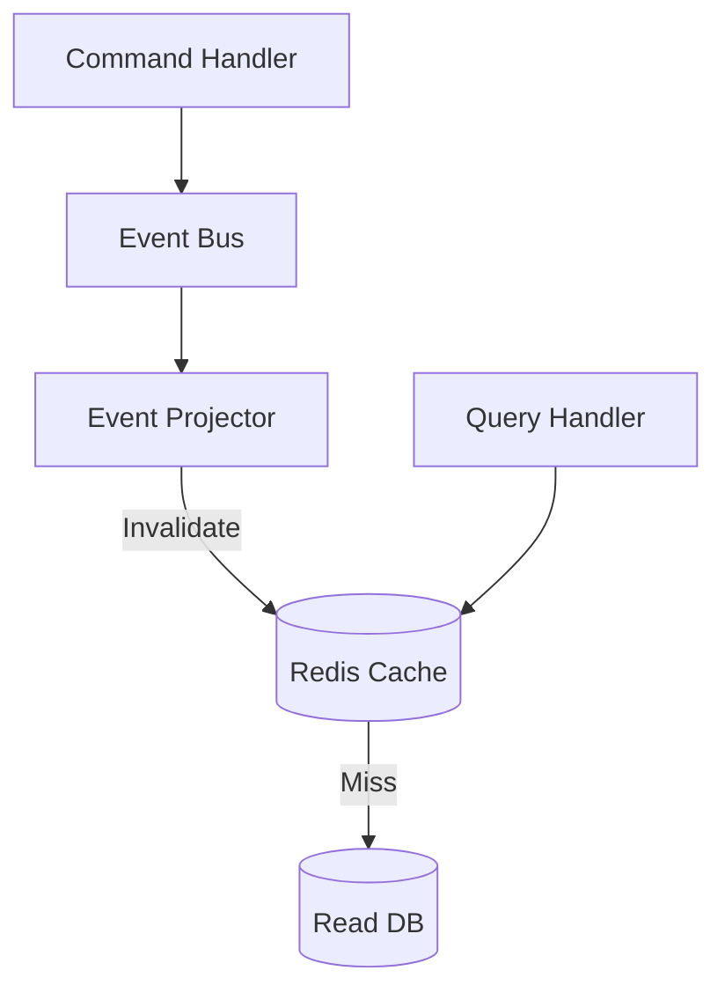

# CQRS Invalidation

Maintain cache consistency using event-driven invalidation.

## Solution Overview



## Tag-Based Caching

```typescript
import { Injectable } from '@nestjs/common';
import { Cached } from '@nestjs-redisx/cache';

@Injectable()
export class UserQueryService {
  @Cached({
    key: 'user:{0}',
    ttl: 3600,
    tags: (id: string, tenantId: string) => ['users', `user:${id}`, `tenant:${tenantId}`],
  })
  async getUser(id: string, tenantId: string): Promise<User> {
    return this.userRepository.findById(id);
  }

  @Cached({
    key: 'users:list:{0}:{1}',
    ttl: 3600,
    tags: (tenantId: string) => ['users', 'users:list', `tenant:${tenantId}`],
  })
  async listUsers(tenantId: string, page: number): Promise<User[]> {
    return this.userRepository.findByTenant(tenantId, page);
  }
}
```

## Event-Driven Invalidation

```typescript
import { Injectable, Inject } from '@nestjs/common';
import { OnEvent } from '@nestjs/event-emitter';
import { CACHE_SERVICE, ICacheService } from '@nestjs-redisx/cache';

@Injectable()
export class UserProjector {
  constructor(@Inject(CACHE_SERVICE) private readonly cache: ICacheService) {}

  @OnEvent('user.created')
  async onUserCreated(event: UserCreatedEvent): Promise<void> {
    await this.cache.invalidateTags(['users:list', `tenant:${event.data.tenantId}`]);
  }

  @OnEvent('user.updated')
  async onUserUpdated(event: UserUpdatedEvent): Promise<void> {
    await this.cache.invalidateTags([`user:${event.userId}`]);
  }

  @OnEvent('user.deleted')
  async onUserDeleted(event: UserDeletedEvent): Promise<void> {
    await this.cache.invalidateTags([`user:${event.userId}`, 'users:list']);
  }
}
```

## Tag Hierarchy

```
users               → All user caches
├── user:{id}       → Specific user
│   └── user:{id}:orders → User's orders
├── users:list      → List views
└── tenant:{id}     → Tenant scope
```

## Next Steps

- [Two-Tier Caching](../concepts/two-tier-caching) — Cache architecture
- [Cache Reference](../../reference/cache/tags) — Tag API
