# Example Application

A complete e-commerce API demonstrating all NestJS RedisX patterns working together.

## Application Overview

```mermaid
graph TB
    subgraph "API Layer"
        Auth[Auth API]
        Products[Products API]
        Orders[Orders API]
        Webhooks[Webhooks API]
    end
    
    subgraph "NestJS RedisX"
        Cache[Cache]
        Locks[Locks]
        RateLimit[Rate Limit]
        Idempotency[Idempotency]
        Streams[Streams]
        Metrics[Metrics]
        Tracing[Tracing]
    end
    
    subgraph "Background"
        Workers[Job Workers]
        Cron[Scheduled Tasks]
    end
    
    Auth --> RateLimit
    Auth --> Cache
    Products --> Cache
    Products --> RateLimit
    Orders --> Idempotency
    Orders --> Locks
    Orders --> Streams
    Webhooks --> Idempotency
    
    Workers --> Streams
    Cron --> Locks
    
    Metrics --> Prometheus[Prometheus]
    Tracing --> Jaeger[Jaeger]
```



## Features Demonstrated

| Feature | Pattern | Location |
|---------|---------|----------|
| Login throttling | Rate Limit | `src/auth/` |
| Session management | Cache | `src/session/` |
| Product catalog caching | Cache + Tags | `src/products/` |
| Payment processing | Idempotency + Locks | `src/orders/` |
| Order event processing | Streams | `src/jobs/` |
| Webhook handling | Idempotency | `src/webhooks/` |
| Daily reports | Locks (cron) | `src/tasks/` |
| CQRS invalidation | Cache + Events | `src/projectors/` |
| Multi-tenancy | Key prefixing | `src/tenant/` |
| Observability | Metrics + Tracing | `src/observability/` |

## Project Structure

```
example-app/
├── src/
│   ├── app.module.ts           # Main module with RedisX config
│   ├── auth/
│   │   ├── auth.controller.ts  # Login/logout with throttling
│   │   ├── auth.service.ts
│   │   └── guards/
│   ├── session/
│   │   ├── session.service.ts  # Redis session management
│   │   └── session.guard.ts
│   ├── products/
│   │   ├── products.controller.ts
│   │   ├── products.service.ts # Cached queries with tags
│   │   └── products.projector.ts
│   ├── orders/
│   │   ├── orders.controller.ts # Idempotent order creation
│   │   ├── orders.service.ts    # Lock-protected payment
│   │   └── orders.events.ts
│   ├── webhooks/
│   │   ├── webhooks.controller.ts # Idempotent webhook handling
│   │   └── stripe.service.ts
│   ├── jobs/
│   │   ├── job.producer.ts
│   │   ├── job.consumer.ts     # Stream consumer
│   │   └── dlq.handler.ts
│   ├── tasks/
│   │   └── scheduled.service.ts # Lock-protected cron
│   ├── tenant/
│   │   ├── tenant.middleware.ts
│   │   └── tenant.service.ts
│   └── observability/
│       ├── metrics.controller.ts
│       └── health.controller.ts
├── docker-compose.yml          # Redis + Prometheus + Jaeger
├── prometheus.yml
└── grafana/
    └── dashboards/
```

## Quick Start

### 1. Clone the Repository

```bash
git clone https://github.com/example/nestjs-redisx-examples
cd nestjs-redisx-examples/complete-app
```

### 2. Start Infrastructure

```bash
docker-compose up -d
```

This starts:
- Redis (port 6379)
- PostgreSQL (port 5432)
- Prometheus (port 9090)
- Grafana (port 3001)
- Jaeger (port 16686)

### 3. Install and Run

```bash
npm install
npm run start:dev
```

### 4. Explore

- **API:** http://localhost:3000
- **Swagger:** http://localhost:3000/api
- **Metrics:** http://localhost:3000/metrics
- **Grafana:** http://localhost:3001 (admin/admin)
- **Jaeger:** http://localhost:16686

## Key Code Examples

### App Module Configuration

```typescript
// src/app.module.ts
import { Module } from '@nestjs/common';
import { ConfigModule, ConfigService } from '@nestjs/config';
import { RedisModule } from '@nestjs-redisx/core';
import { CachePlugin } from '@nestjs-redisx/cache';
import { LocksPlugin } from '@nestjs-redisx/locks';
import { RateLimitPlugin } from '@nestjs-redisx/rate-limit';
import { IdempotencyPlugin } from '@nestjs-redisx/idempotency';
import { StreamsPlugin } from '@nestjs-redisx/streams';
import { MetricsPlugin } from '@nestjs-redisx/metrics';
import { TracingPlugin } from '@nestjs-redisx/tracing';

@Module({
  imports: [
    RedisModule.forRootAsync({
      imports: [ConfigModule],
      inject: [ConfigService],
      plugins: [
        new CachePlugin({
          l1: { maxSize: 1000, ttl: 30 },
          l2: { defaultTtl: 3600 },
        }),
        new LocksPlugin({
          defaultTtl: 30000,
          autoRenew: { enabled: true },
        }),
        new RateLimitPlugin({
          defaultAlgorithm: 'sliding-window',
          includeHeaders: true,
        }),
        new IdempotencyPlugin({
          defaultTtl: 86400,
          headerName: 'Idempotency-Key',
        }),
        new StreamsPlugin({
          consumer: { batchSize: 10 },
          dlq: { enabled: true },
        }),
        new MetricsPlugin({
          endpoint: '/metrics',
          prefix: 'redisx_',
        }),
        new TracingPlugin({
          serviceName: 'example-app',
          exporter: { type: 'otlp', endpoint: 'http://jaeger:4318' },
        }),
      ],
      useFactory: (config: ConfigService) => ({
        clients: {
          host: config.get('REDIS_HOST'),
          port: config.get('REDIS_PORT'),
        },
      }),
    }),
    // ... other modules
  ],
})
export class AppModule {}
```

### Order Creation (Idempotency + Locks)

```typescript
// src/orders/orders.controller.ts
import { Idempotent } from '@nestjs-redisx/idempotency';

@Post()
@Idempotent()
async createOrder(@Body() dto: CreateOrderDto) {
  return this.orderService.create(dto);
}

// src/orders/orders.service.ts
import { Inject, Injectable } from '@nestjs/common';
import { LOCK_SERVICE, ILockService } from '@nestjs-redisx/locks';

async create(dto: CreateOrderDto): Promise<Order> {
  return this.lockService.withLock(
    `order:${dto.customerId}`,
    async () => {
      // Check inventory
      await this.inventoryService.reserve(dto.items);
      
      // Create order
      const order = await this.orderRepository.create(dto);
      
      // Publish event for async processing
      await this.jobProducer.enqueue('order.created', order);
      
      return order;
    },
  );
}
```

### Product Caching with CQRS

```typescript
// src/products/products.service.ts
import { Cached } from '@nestjs-redisx/cache';

@Cached({
  key: 'product:{0}',
  ttl: 3600,
  tags: (id) => ['products', `product:${id}`],
})
async findById(id: string): Promise<Product> {
  return this.productRepository.findById(id);
}

// src/products/products.projector.ts
import { Inject } from '@nestjs/common';
import { OnEvent } from '@nestjs/event-emitter';
import { CACHE_SERVICE, ICacheService } from '@nestjs-redisx/cache';

@OnEvent('product.updated')
async onProductUpdated(event: ProductUpdatedEvent) {
  await this.cache.invalidateTags([`product:${event.productId}`]);
}
```

## Testing the Patterns

### Test Idempotency

```bash
# First request
curl -X POST http://localhost:3000/orders \
  -H "Idempotency-Key: order-123" \
  -H "Content-Type: application/json" \
  -d '{"customerId": "cust-1", "items": [...]}'

# Retry with same key - returns cached response
curl -X POST http://localhost:3000/orders \
  -H "Idempotency-Key: order-123" \
  -H "Content-Type: application/json" \
  -d '{"customerId": "cust-1", "items": [...]}'
```

### Test Rate Limiting

```bash
# Exceed rate limit
for i in {1..50}; do
  curl -s http://localhost:3000/api/products | head -1
done

# Check headers
curl -I http://localhost:3000/api/products
# X-RateLimit-Remaining: 0
# Retry-After: 45
```

### Test Cache Invalidation

```bash
# Get product (cached)
curl http://localhost:3000/api/products/123

# Update product
curl -X PUT http://localhost:3000/api/products/123 \
  -d '{"name": "Updated Name"}'

# Get again (cache invalidated, fresh data)
curl http://localhost:3000/api/products/123
```

## Observability

### Grafana Dashboard

Import the provided dashboard from `grafana/dashboards/redisx.json`:

- Cache hit rate by endpoint
- Lock contention heatmap
- Rate limit rejection rate
- Stream consumer lag
- Request latency percentiles

### Jaeger Traces

View distributed traces showing:

```
POST /orders (150ms)
├── idempotency.check (2ms)
├── lock.acquire (5ms)
├── cache.get inventory (1ms)
├── db.query (50ms)
├── stream.publish (3ms)
└── lock.release (1ms)
```

## Running Tests

```bash
# Unit tests
npm run test

# Integration tests (requires Docker)
npm run test:e2e

# Load tests
npm run test:load
```

## Deployment

### Kubernetes

```yaml
# See k8s/ directory for:
# - Deployment with HPA
# - Redis StatefulSet or use managed Redis
# - Prometheus ServiceMonitor
# - Grafana dashboards ConfigMap
```

### Environment Variables

```bash
REDIS_HOST=redis
REDIS_PORT=6379
DATABASE_URL=postgresql://...
STRIPE_WEBHOOK_SECRET=whsec_...
OTEL_ENDPOINT=http://jaeger:4318
```

## Source Code

Full source code available at:

→ **[GitHub: nestjs-redisx-examples/complete-app](https://github.com/example/nestjs-redisx-examples/tree/main/complete-app)**

## Next Steps

- Explore individual [Recipes](./index) for specific patterns
- Read [Architecture Guide](../architecture/) for design decisions
- Check [Operations](../operations/) for production deployment
