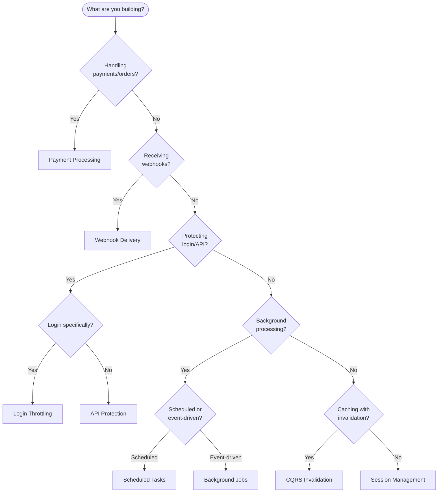

# Recipes

Production-ready implementations for common use cases. Each recipe includes complete code, failure handling, and monitoring setup.

## Recipe Categories

### Payment and Financial

| Recipe | Plugins Used | Key Challenge |
|--------|--------------|---------------|
| [Payment Processing](./payment-processing) | Idempotency + Locks | Prevent double charges |
| [Webhook Delivery](./webhook-delivery) | Idempotency + Streams | Reliable delivery with retry |

### API Protection

| Recipe | Plugins Used | Key Challenge |
|--------|--------------|---------------|
| [Login Throttling](./login-throttling) | Rate Limit | Brute force protection |
| [API Protection](./api-protection) | Rate Limit + Cache | Multi-tier defense |

### Background Processing

| Recipe | Plugins Used | Key Challenge |
|--------|--------------|---------------|
| [Background Jobs](./background-jobs) | Streams + Locks | Reliable async processing |
| [Scheduled Tasks](./scheduled-tasks) | Locks | Prevent duplicate cron |

### Caching Patterns

| Recipe | Plugins Used | Key Challenge |
|--------|--------------|---------------|
| [CQRS Invalidation](./cqrs-invalidation) | Cache + Tags | Event-driven cache updates |
| [Session Management](./session-management) | Cache | Sliding expiration sessions |

### Complete Example

| Recipe | Description |
|--------|-------------|
| [Example Application](./example-app) | Full working application with all patterns |

## Choosing a Recipe



## Common Combinations

### E-commerce Platform

```
Payment Processing + CQRS Invalidation + API Protection
```

### SaaS API

```
API Protection + Login Throttling + Session Management
```

### Event-Driven System

```
Background Jobs + Webhook Delivery + Scheduled Tasks
```

## Recipe Template

Each recipe follows this structure:

1. **Problem Statement** — What challenge does this solve?
2. **Solution Overview** — Architecture diagram
3. **Non-Goals** — What this does NOT solve
4. **Implementation** — Step-by-step code
5. **Failure Scenarios** — What happens when things go wrong
6. **Monitoring** — Key metrics and alerts

## Next Steps

Choose a recipe that matches your use case, or explore the [Example Application](./example-app) to see all patterns working together.
