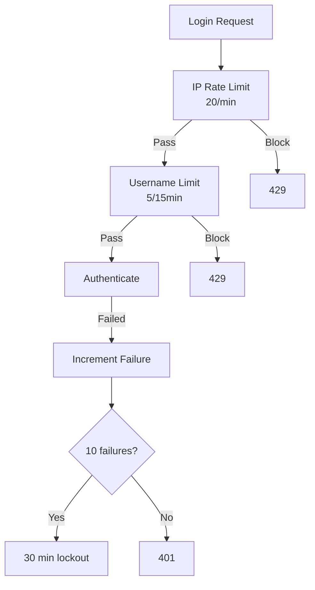

# Login Throttling

Progressive rate limiting to protect login endpoints.

## Solution Overview



## Implementation

```typescript
import { CACHE_SERVICE, ICacheService } from '@nestjs-redisx/cache';
import { RATE_LIMIT_SERVICE, IRateLimitService } from '@nestjs-redisx/rate-limit';

@Injectable()
export class LoginThrottleService {
  private readonly MAX_FAILURES = 10;
  private readonly BAN_DURATION = 30 * 60 * 1000;

  constructor(
    @Inject(CACHE_SERVICE) private readonly cache: ICacheService,
    @Inject(RATE_LIMIT_SERVICE) private readonly rateLimit: IRateLimitService,
  ) {}

  async checkAllowed(ip: string, username: string): Promise<{
    allowed: boolean;
    reason?: string;
    retryAfter?: number;
  }> {
    // Tier 1: IP rate limit
    const ipResult = await this.rateLimit.check(
      `login:ip:${ip}`,
      { points: 20, duration: 60 },
    );
    if (!ipResult.allowed) {
      return { allowed: false, reason: 'Too many requests', retryAfter: ipResult.retryAfter };
    }

    // Tier 2: Username rate limit
    const userResult = await this.rateLimit.check(
      `login:user:${username.toLowerCase()}`,
      { points: 5, duration: 900 },
    );
    if (!userResult.allowed) {
      return { allowed: false, reason: 'Too many attempts', retryAfter: userResult.retryAfter };
    }

    // Tier 3: Check ban
    const attempt = await this.cache.get<{ failures: number; bannedUntil?: number }>(
      `login:failures:${username.toLowerCase()}`
    );
    if (attempt?.bannedUntil && attempt.bannedUntil > Date.now()) {
      return { allowed: false, reason: 'Account locked', retryAfter: Math.ceil((attempt.bannedUntil - Date.now()) / 1000) };
    }

    return { allowed: true };
  }

  async recordFailure(username: string): Promise<{ banned: boolean }> {
    const key = `login:failures:${username.toLowerCase()}`;
    const attempt = await this.cache.get<{ failures: number }>(key) || { failures: 0 };

    attempt.failures++;

    if (attempt.failures >= this.MAX_FAILURES) {
      await this.cache.set(key, { ...attempt, bannedUntil: Date.now() + this.BAN_DURATION }, { ttl: this.BAN_DURATION / 1000 });
      return { banned: true };
    }

    await this.cache.set(key, attempt, { ttl: 900 });
    return { banned: false };
  }

  async recordSuccess(username: string): Promise<void> {
    await this.cache.delete(`login:failures:${username.toLowerCase()}`);
  }
}
```

## Controller Usage

```typescript
@Post('login')
async login(@Body() dto: LoginDto, @Ip() ip: string) {
  const throttle = await this.throttle.checkAllowed(ip, dto.username);
  if (!throttle.allowed) {
    throw new HttpException({ message: throttle.reason, retryAfter: throttle.retryAfter }, 429);
  }

  const user = await this.authService.validateUser(dto.username, dto.password);
  if (!user) {
    await this.throttle.recordFailure(dto.username);
    throw new UnauthorizedException('Invalid credentials');
  }

  await this.throttle.recordSuccess(dto.username);
  return this.authService.generateTokens(user);
}
```

## Next Steps

- [API Protection](./api-protection) — General API rate limiting
- [Rate Limit Reference](../../reference/rate-limit/) — Full API
