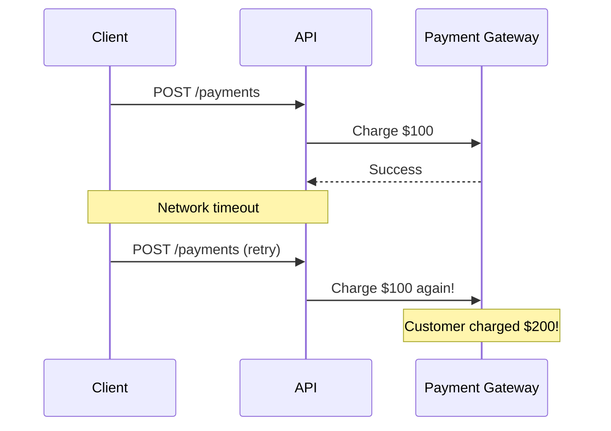
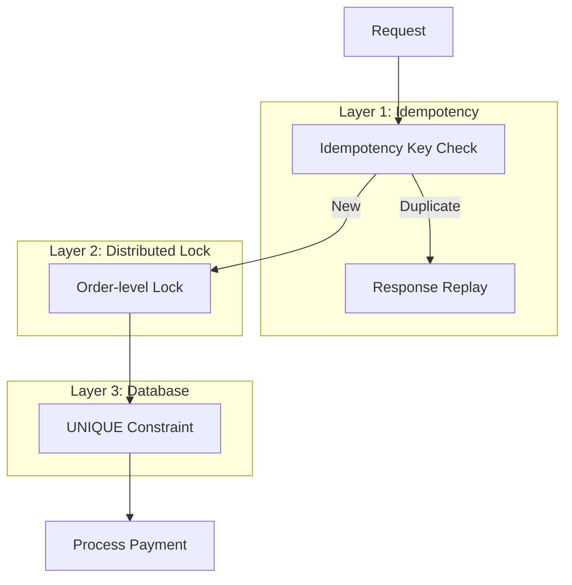

# Payment Processing

Prevent duplicate payments when clients retry requests.

## Problem Statement



## Solution Overview

Three-layer defense:



## Non-Goals

| This recipe does NOT... | Use instead |
|-------------------------|-------------|
| Handle partial failures in distributed transactions | Saga pattern |
| Provide exactly-once semantics | Impossible; this approximates it |
| Replace database constraints | Layer 3 is still needed |

## Implementation

### Step 1: Database Schema

```sql
CREATE TABLE payments (
  id UUID PRIMARY KEY DEFAULT gen_random_uuid(),
  order_id UUID NOT NULL,
  idempotency_key VARCHAR(255) NOT NULL,
  amount DECIMAL(10, 2) NOT NULL,
  status VARCHAR(20) NOT NULL DEFAULT 'pending',
  
  CONSTRAINT unique_idempotency_key UNIQUE (idempotency_key)
);
```

### Step 2: Configure Plugins

```typescript
import { RedisModule } from '@nestjs-redisx/core';
import { IdempotencyPlugin } from '@nestjs-redisx/idempotency';
import { LocksPlugin } from '@nestjs-redisx/locks';

RedisModule.forRoot({
  clients: { host: process.env.REDIS_HOST, port: 6379 },
  plugins: [
    new IdempotencyPlugin({
      headerName: 'Idempotency-Key',
      defaultTtl: 86400, // 24 hours (seconds)
    }),
    new LocksPlugin({
      defaultTtl: 30000,
      autoRenew: { enabled: true },
    }),
  ],
})
```

### Step 3: Payment Controller

```typescript
import { Idempotent } from '@nestjs-redisx/idempotency';

@Controller('payments')
export class PaymentsController {
  @Post()
  @Idempotent({ ttl: 86400, validateFingerprint: true })
  async createPayment(
    @Body() dto: CreatePaymentDto,
    @Headers('Idempotency-Key') idempotencyKey: string,
  ): Promise<PaymentResponseDto> {
    return this.paymentService.processPayment(dto, idempotencyKey);
  }
}
```

### Step 4: Payment Service

```typescript
import { LOCK_SERVICE, ILockService } from '@nestjs-redisx/locks';

@Injectable()
export class PaymentService {
  constructor(
    @Inject(LOCK_SERVICE) private readonly lockService: ILockService,
  ) {}

  async processPayment(dto: CreatePaymentDto, idempotencyKey: string) {
    return this.lockService.withLock(
      `order:${dto.orderId}`,
      async () => {
        // Check if already processed
        const existing = await this.paymentRepository.findByIdempotencyKey(
          idempotencyKey,
        );
        if (existing?.status === 'completed') {
          return this.toResponse(existing);
        }

        // Process payment
        const payment = await this.paymentRepository.create({
          orderId: dto.orderId,
          idempotencyKey,
          amount: dto.amount,
          status: 'pending',
        });

        try {
          const result = await this.paymentGateway.charge(dto);
          await this.paymentRepository.update(payment.id, {
            status: 'completed',
            transactionId: result.transactionId,
          });
          return this.toResponse(payment);
        } catch (error) {
          await this.paymentRepository.update(payment.id, { status: 'failed' });
          throw error;
        }
      },
      { ttl: 30000, waitTimeout: 10000 },
    );
  }
}
```

## Idempotency Key Contract

| Requirement | Specification |
|-------------|---------------|
| Header name | `Idempotency-Key` |
| Format | UUID v4 or unique string |
| Length | 36-128 characters |
| Uniqueness | Globally unique per operation |

### Client Example

```typescript
const idempotencyKey = `pay_${orderId}_${Date.now()}_${uuid()}`;

await fetch('/api/payments', {
  method: 'POST',
  headers: {
    'Idempotency-Key': idempotencyKey,
  },
  body: JSON.stringify({ orderId, amount }),
});
```

## Failure Scenarios

| Scenario | Behavior | Recovery |
|----------|----------|----------|
| Redis down | Request rejected (503) | Retry with backoff |
| Process crash after charge | Idempotency returns partial | Reconciliation job |
| Concurrent requests | Second waits for lock | Returns same result |

## Monitoring

```yaml
# Key alerts
- alert: PaymentDuplicateRate
  expr: |
    rate(redisx_idempotency_requests_total{status="replay"}[5m]) /
    rate(redisx_idempotency_requests_total[5m]) > 0.3
  annotations:
    summary: "High payment duplicate rate (>30%)"

- alert: PaymentLockTimeout
  expr: rate(redisx_lock_acquisitions_total{status="failed"}[5m]) > 0.1
  annotations:
    summary: "Payment lock timeouts increasing"
```

## Next Steps

- [Webhook Delivery](./webhook-delivery) — Receiving webhooks
- [Idempotency Reference](../../reference/idempotency/) — Full API
