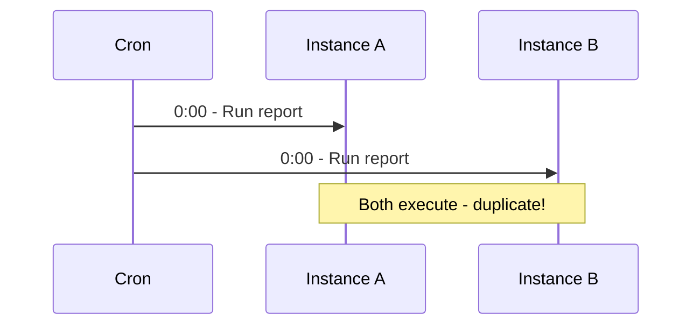

# Scheduled Tasks

Ensure scheduled tasks run once across multiple instances.

## Problem



## Solution

```typescript
import { WithLock } from '@nestjs-redisx/locks';

@Injectable()
export class ScheduledTasksService {
  @Cron(CronExpression.EVERY_DAY_AT_MIDNIGHT)
  @WithLock({
    key: 'daily-report',
    ttl: 3600000,
    waitTimeout: 0,
    onLockFailed: 'skip',
  })
  async generateDailyReport(): Promise<void> {
    this.logger.log('Starting daily report');
    await this.reportService.generateDaily();
    this.logger.log('Daily report completed');
  }

  @Cron(CronExpression.EVERY_WEEK)
  @WithLock({ key: 'weekly-cleanup', ttl: 7200000, waitTimeout: 0, onLockFailed: 'skip' })
  async weeklyCleanup(): Promise<void> {
    await this.cleanupService.deleteOldRecords();
  }
}
```

## TTL Guidelines

| Task Duration | Recommended TTL |
|---------------|-----------------|
| < 1 minute | 2 minutes |
| 1-5 minutes | 10 minutes |
| 5-30 minutes | 1 hour |
| 30+ minutes | 2x expected duration |

## Failure Recovery

If a task crashes, the lock auto-releases after TTL:

```
T0: Instance A acquires lock
T1: Instance A crashes
T2: Lock TTL expires
T3: Next trigger, Instance B acquires lock
```

## Next Steps

- [Background Jobs](./background-jobs) — Event-driven processing
- [Locks Reference](../../reference/locks/) — Full API
