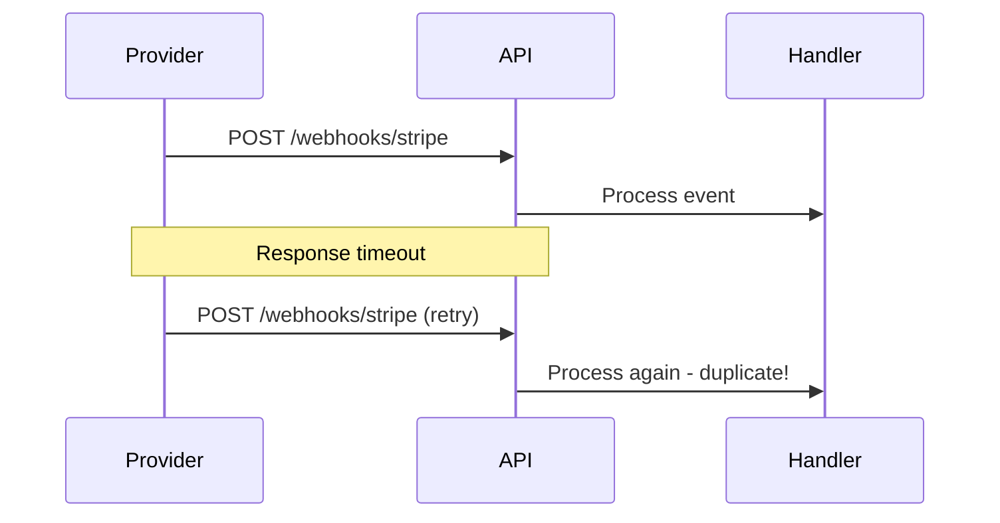

# Webhook Delivery

Process incoming webhooks exactly once, even when senders retry.

## Problem Statement



## Solution

```typescript
import { IDEMPOTENCY_SERVICE, IIdempotencyService } from '@nestjs-redisx/idempotency';

@Controller('webhooks')
export class WebhooksController {
  @Post('stripe')
  @HttpCode(200)
  async handleStripeWebhook(
    @Req() req: RawBodyRequest<Request>,
    @Headers('stripe-signature') signature: string,
  ) {
    const event = this.verifySignature(req.rawBody, signature);
    await this.webhookService.processStripeEvent(event);
    return { received: true };
  }
}

@Injectable()
export class WebhookService {
  constructor(
    @Inject(IDEMPOTENCY_SERVICE) private readonly idempotency: IIdempotencyService,
  ) {}

  async processStripeEvent(event: Stripe.Event): Promise<void> {
    const key = `stripe:${event.id}`;
    const result = await this.idempotency.checkAndLock(key, event.type);

    if (!result.isNew) {
      // Already processed or in progress
      return;
    }

    try {
      switch (event.type) {
        case 'payment_intent.succeeded':
          await this.handlePaymentSucceeded(event.data.object);
          break;
        // ... more handlers
      }
      await this.idempotency.complete(key, { statusCode: 200, body: { processed: true } });
    } catch (error) {
      await this.idempotency.fail(key, error.message);
      throw error;
    }
  }
}
```

## Idempotency Keys by Provider

| Provider | Key Source | Example |
|----------|------------|---------|
| Stripe | `event.id` | `evt_123abc` |
| GitHub | `X-GitHub-Delivery` header | `abc-123-def` |
| PayPal | `webhook-id` header | `WH-123` |

## Make Handlers Idempotent

```typescript
async handlePaymentSucceeded(payment: PaymentIntent): Promise<void> {
  // Idempotent update
  const result = await this.orderRepository.update(
    { id: payment.metadata.orderId, status: 'pending' },
    { status: 'paid' },
  );

  if (result.affected === 0) {
    // Already paid - safe to ignore
    return;
  }

  await this.sendConfirmation(payment.metadata.orderId);
}
```

## Next Steps

- [Payment Processing](./payment-processing) — Outbound payments
- [Background Jobs](./background-jobs) — Async processing
