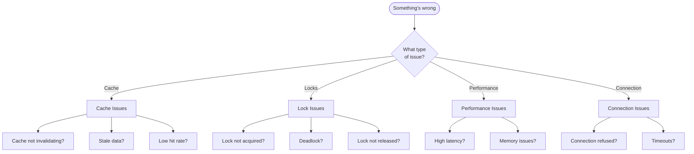

# Troubleshooting Guide

Quick solutions for common problems.

## Decision Tree



## Quick Links

| Issue Type | Go to |
|------------|-------|
| Cache not working | [Cache Issues](./cache-issues) |
| Locks not working | [Lock Issues](./lock-issues) |
| Slow performance | [Performance Issues](./performance-issues) |
| Need to debug | [Debugging](./debugging) |

## Common Quick Fixes

### "Cache not invalidating"

```typescript
// Check tag names match
@Cached({ tags: ['users'] })  // Producer
await cache.invalidateTags(['users']);  // Consumer - same tag!
```

### "Lock timeout"

```typescript
// Increase timeout
@WithLock({
  key: 'mykey',
  waitTimeout: 10000,  // Increase from default
})
```

### "Connection refused"

```bash
# Check Redis is running
redis-cli ping

# Check host/port
echo $REDIS_HOST $REDIS_PORT
```

### "High latency"

```bash
# Check Redis latency
redis-cli --latency

# Check slow log
redis-cli SLOWLOG GET 10
```

## Getting Help

1. Check this troubleshooting guide
2. Search [GitHub Issues](https://github.com/example/nestjs-redisx/issues)
3. Ask in [Discord](https://discord.gg/example)
4. Open a new issue with reproduction

## Next Steps

- [Cache Issues](./cache-issues) — Detailed cache troubleshooting
- [Lock Issues](./lock-issues) — Lock and contention issues
- [Performance Issues](./performance-issues) — Latency and throughput
- [Debugging](./debugging) — Tools and techniques
