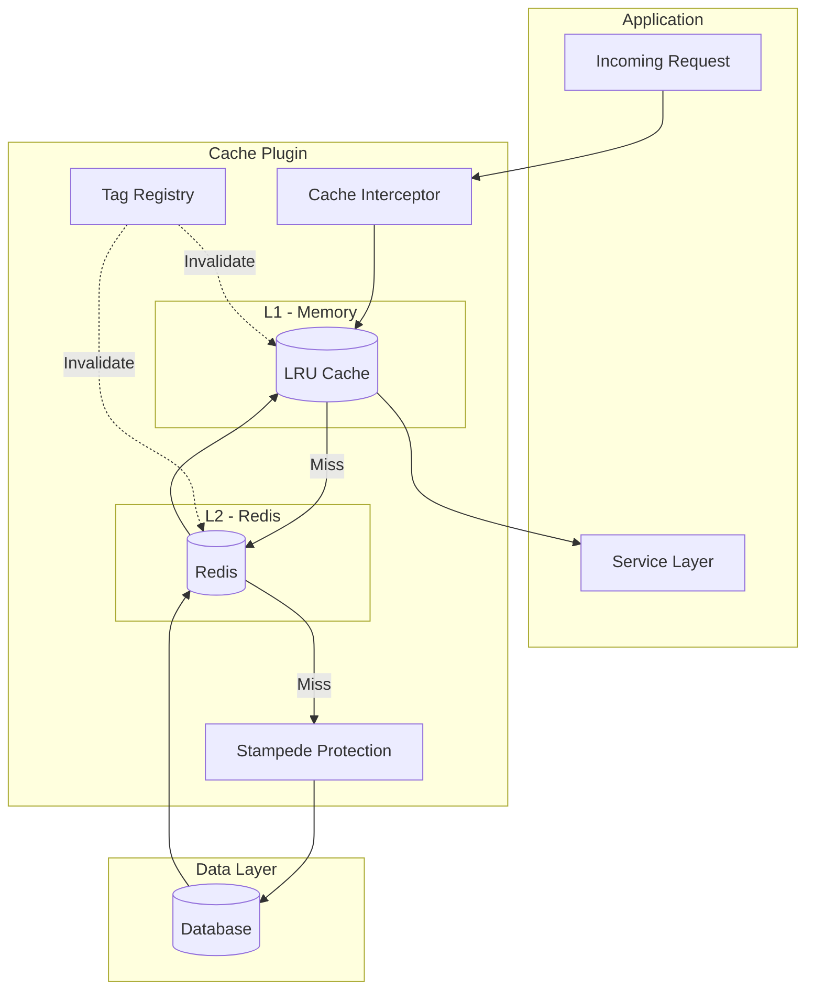

# Cache Plugin

Caching solution with L1 (Memory) + L2 (Redis) architecture, anti-stampede protection, and tag-based invalidation.

## Overview

The Cache Plugin provides a two-tier caching solution for NestJS applications.

| Challenge | Traditional Approach | With Cache Plugin |
|-----------|---------------------|-------------------|
| Slow API responses | 50-500ms database queries | < 1ms from cache |
| Database overload | Every request queries DB | High cache hit rate |
| Cache stampede | Parallel DB calls on expiry | Single call with lock coordination |
| Stale data issues | Manual invalidation tracking | Automatic tag-based invalidation |
| Cold start latency | Slow initial requests | Pre-warming support |

## Key Features

- **Two-Tier Architecture** — In-memory L1 cache with Redis L2 backend
- **Stampede Protection** — Prevents cache avalanche on expiry
- **Stale-While-Revalidate** — Serve stale data while refreshing in background
- **Tag-Based Invalidation** — Invalidate groups of related cache entries
- **Decorator API** — `@Cached`, `@Cacheable`, `@CacheEvict`, `@CachePut`
- **Observability** — Prometheus metrics and OpenTelemetry tracing

## Why Proxy-Based Decorators

Unlike most NestJS caching libraries that rely on interceptors, RedisX `@Cached` uses **descriptor replacement on the prototype** — not a proxy object wrapping the instance. This gives you capabilities that interceptor-based solutions fundamentally cannot provide:

- **Works on any Injectable** — services, repositories, workers, cron jobs, RMQ consumers
- **Self-invocation works** — `this.getUser()` inside the same class goes through cache. No "self-invocation limitation" like Spring or NestJS interceptors
- **No ExecutionContext dependency** — caching is not tied to the HTTP request pipeline
- **No interceptor registration** — no `UseInterceptors()`, no controller-only restrictions

::: tip How it works
`@Cached` replaces the method on the class prototype at decoration time. When NestJS creates an instance, the prototype already contains the wrapped version. Every call — including `this.method()` from the same class — goes through the cache layer automatically.
:::

The Spring-style decorators (`@Cacheable`, `@CacheEvict`, `@CachePut`) are also available for developers who prefer that pattern, but they require `DeclarativeCacheInterceptor` and only work in controller context.

## Installation

::: code-group

```bash [ioredis]
npm install @nestjs-redisx/core @nestjs-redisx/cache ioredis
```

```bash [node-redis]
npm install @nestjs-redisx/core @nestjs-redisx/cache redis
```

:::

## Basic Configuration

<<< @/apps/demo/src/plugins/cache/basic-config.setup.ts{typescript}

## Usage Example

<<< @/apps/demo/src/plugins/cache/service-basic.usage.ts{typescript}

## Architecture



## Performance Characteristics

| Scenario | Without Cache | L2 Only | L1 + L2 |
|----------|---------------|---------|---------|
| Initial request | 50ms | 50ms | 50ms |
| Same instance | 50ms | ~3ms | **< 1ms** |
| Different instance | 50ms | ~3ms | ~3ms |
| Post-invalidation | 50ms | 50ms | 50ms |

## Documentation

| Getting Started | Reference | Operations |
|-----------------|-----------|------------|
| [Core Concepts](./concepts) | [Decorators](./decorators) | [Monitoring](./monitoring) |
| [Configuration](./configuration) | [Service API](./service-api) | [Testing](./testing) |
| [Tag Invalidation](./tags) | [Recipes](./recipes) | [Troubleshooting](./troubleshooting) |
