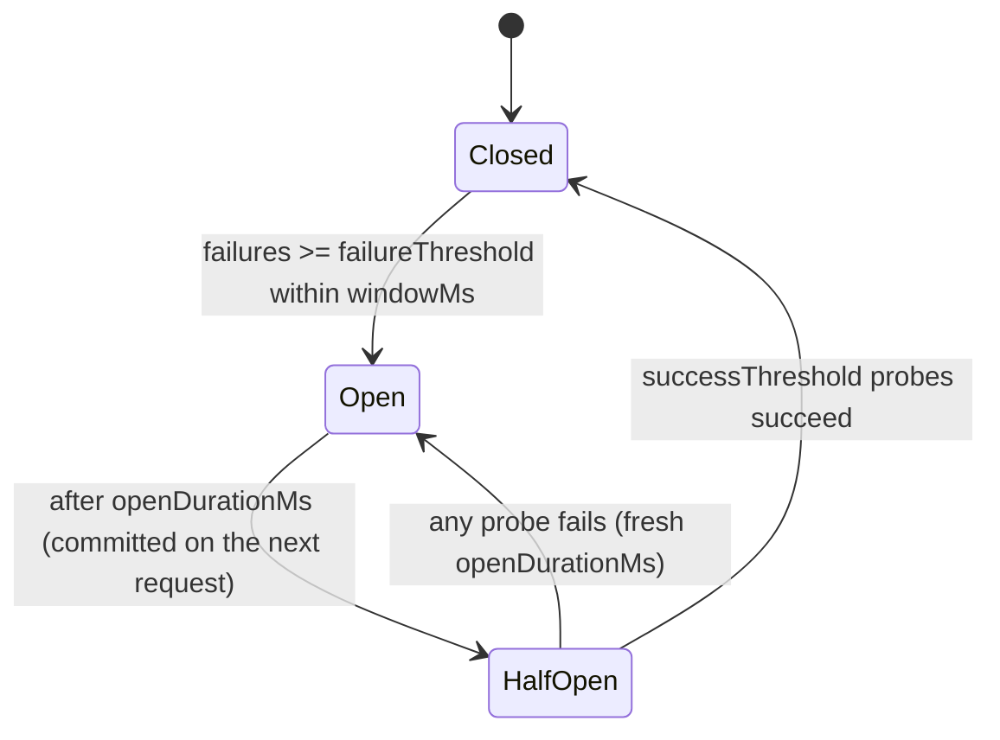

# Algorithm

The breaker is a finite state machine with three states. The core (`CircuitBreakerState`) is pure and time-injected — every time-dependent method takes an explicit `now` (epoch ms) — and the distributed layer applies the exact same rules atomically in Redis via Lua.

## CLOSED

- Requests are permitted.
- Each failure timestamp is recorded; failures with timestamp `<= now - windowMs` age out (a **rolling** window, not a fixed reset).
- When the number of failures still inside the window reaches `failureThreshold`, the breaker trips to **OPEN**.
- Successes are a no-op in CLOSED — the window ages out on its own; a success does not reset it.

## OPEN

- Requests are rejected immediately (fail-fast); the guarded function does not run.
- After `openDurationMs` has elapsed since the breaker opened, the **next request** commits the transition to **HALF_OPEN** (this flip happens on `canRequest`, never on a passive `getState`).

## HALF_OPEN

- Up to `halfOpenMaxCalls` probe calls are permitted concurrently; further calls are rejected.
- Each permitted probe records its start time. A probe that stays unresolved longer than `probeTimeoutMs` is presumed dead (e.g. the caller crashed before recording an outcome): its slot is **reclaimed** so recovery is never blocked by a zombie probe. If such a probe eventually resolves, its outcome still counts.
- Each successful probe increments a counter; once `successThreshold` probes succeed, the breaker **closes** and all counters clear.
- A single probe failure re-opens the breaker with a fresh `openDurationMs`.

## Time and determinism

The state machine never reads the clock itself. In the distributed store, the adapter obtains `now` via `Date.now()` and passes it into the Lua scripts as an argument — the Lua never reads time. This mirrors the rate-limit sliding-window design and keeps behaviour deterministic and testable.

## Distributed storage

Per circuit, three Redis keys share a hash tag so they land on the same cluster slot:

- a **hash** holding `state`, `opened_at`, `ho_succ`;
- a **sorted set** of failure timestamps (pruned by the rolling window);
- a **sorted set** of in-flight probe start times (pruned by `probeTimeoutMs`).

All transitions (`canRequest`, `recordSuccess`, `recordFailure`) are single atomic Lua scripts, so concurrent instances never observe a torn state.
