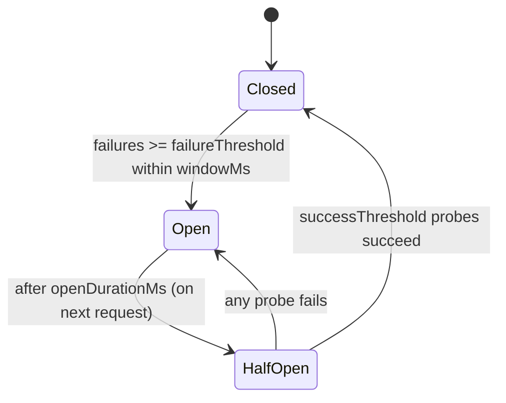

# Core Concepts

## The problem

When a downstream dependency degrades, every call that waits on a timeout ties up a request thread, a connection, and memory. Under load this cascades: the caller runs out of resources and fails too. Retries make it worse by piling more load onto the struggling dependency.

A **circuit breaker** watches the failure rate and, once it crosses a threshold, **trips** — subsequent calls fail immediately (fail-fast) instead of waiting. After a cooldown it carefully probes the dependency and, if it has recovered, resumes normal traffic.

## The three states

- **CLOSED** — normal operation. Calls run; failures are counted over a rolling window. When failures reach `failureThreshold` within `windowMs`, the breaker trips to OPEN.
- **OPEN** — fail-fast. Calls are rejected immediately without touching the dependency. After `openDurationMs`, the breaker becomes eligible to probe.
- **HALF_OPEN** — cautious recovery. A limited number of probe calls (`halfOpenMaxCalls`) are allowed through. After `successThreshold` successes the breaker CLOSES; a single failure sends it back to OPEN.

## Distributed by default

In a multi-instance deployment, each instance seeing the dependency fail independently would trip its own breaker at a different time — and each would probe on recovery, causing a thundering herd. NestJS RedisX keeps the breaker state in Redis, so **all instances share one circuit**: they trip together, and only `halfOpenMaxCalls` probes total are admitted during recovery.

## Pure, time-injected core

The decision logic lives in a pure finite state machine (`CircuitBreakerState`) that takes an explicit `now` — it never reads the clock itself. The distributed layer applies the exact same rules atomically in Redis (Lua), passing `now` in from the adapter. This makes behaviour deterministic and fully unit-testable. See the [Algorithm](./algorithm) page for the precise rules.

## When to use it

- Calls to third-party APIs, payment gateways, or other services that can fail or slow down.
- Any dependency where fail-fast + a fallback (cached/default value) is better than blocking.

Combine it with a per-call **fallback** to degrade gracefully instead of erroring. See [Recipes](./recipes).
