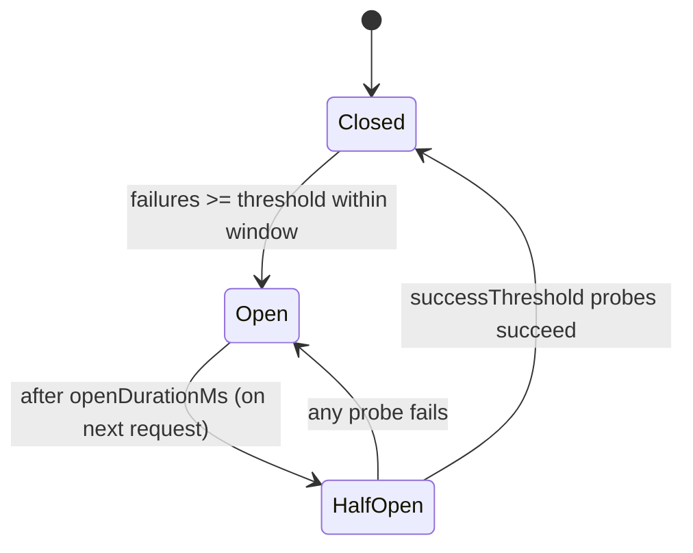

# Circuit Breaker Plugin

A distributed circuit breaker (`closed` / `open` / `half-open`) that stops calls to a failing dependency, gives it time to recover, and probes before restoring traffic — consistently across all application instances via Redis.

## Overview

When a downstream dependency (payment gateway, third-party API, another service) starts failing, hammering it makes things worse and ties up your own resources. The circuit breaker counts failures and, once a threshold is crossed, **opens** — rejecting calls immediately instead of waiting on timeouts. After a cooldown it moves to **half-open**, letting a limited number of probe calls through; if they succeed it **closes** again.

| Challenge | Without a breaker | With the Circuit Breaker Plugin |
|-----------|-------------------|---------------------------------|
| Failing dependency | Every call waits for a timeout | Calls fail fast while OPEN |
| Recovery | Thundering herd on recovery | Controlled probes (HALF_OPEN) |
| Multi-instance | Each instance decides alone | Shared state across instances via Redis |

## Key Features

- **Distributed state** — the breaker state lives in Redis, so all instances agree.
- **Pure, time-injected core** — the state machine (`CircuitBreakerState`) takes an explicit `now`; no hidden `Date.now()`, fully deterministic and unit-testable.
- **Atomic transitions** — state changes run in Lua for correctness under concurrency.
- **Works anywhere** — the `@WithCircuitBreaker` decorator wraps any Injectable method (proxy-based, not a controller guard).
- **Fallbacks** — return a cached/default value instead of throwing while OPEN.
- **fail-open / fail-closed** — choose availability or strictness when the state store itself is unavailable.

## Installation

::: code-group

```bash [ioredis]
npm install @nestjs-redisx/core @nestjs-redisx/circuit-breaker ioredis
```

```bash [node-redis]
npm install @nestjs-redisx/core @nestjs-redisx/circuit-breaker redis
```

:::

## Basic Configuration

<<< @/apps/demo/src/plugins/circuit-breaker/basic-config.setup.ts{typescript}

## Usage with the Decorator

<<< @/apps/demo/src/plugins/circuit-breaker/decorator-basic.usage.ts{typescript}

## States



## Documentation

| Topic | Description |
|-------|-------------|
| [Core Concepts](./concepts) | States and when to use a breaker |
| [Configuration](./configuration) | Options and defaults |
| [@WithCircuitBreaker Decorator](./decorator) | Method-level breaking |
| [Service API](./service-api) | Programmatic `execute` / manual recording |
| [Algorithm](./algorithm) | States, window, cooldown, probes |
| [Monitoring](./monitoring) | Observing circuit state |
| [Recipes](./recipes) | Fallbacks and patterns |
| [Testing](./testing) | Testing breaker-guarded code |
| [Troubleshooting](./troubleshooting) | Debugging common issues |
