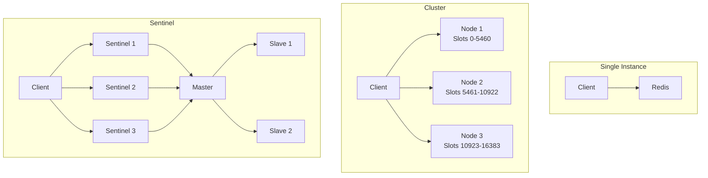

# Connection Types

Configure Redis for different deployment topologies.

## Overview

| Type | Use Case | High Availability | Scaling |
|------|----------|-------------------|---------|
| Single | Development, small apps | No | Vertical only |
| Cluster | Large scale, sharding | Yes | Horizontal |
| Sentinel | HA without sharding | Yes | Vertical |

## Single Instance

Standard Redis connection for development and small-scale deployments.

### Basic Configuration

```typescript
RedisModule.forRoot({
  clients: {
    host: 'localhost',
    port: 6379,
  },
})
```

### Full Configuration

```typescript
RedisModule.forRoot({
  clients: {
    type: 'single',  // Optional, default
    host: 'redis.example.com',
    port: 6379,
    password: 'secret',
    db: 0,
    keyPrefix: 'myapp:',
    connectTimeout: 10000,
    commandTimeout: 5000,
    keepAlive: 30000,
    enableOfflineQueue: true,
    enableAutoReconnect: true,
    maxRetriesPerRequest: 3,
  },
})
```

### With TLS

```typescript
RedisModule.forRoot({
  clients: {
    host: 'redis.example.com',
    port: 6380,
    tls: {
      enabled: true,
      rejectUnauthorized: true,
      ca: fs.readFileSync('/path/to/ca.crt'),
      cert: fs.readFileSync('/path/to/client.crt'),
      key: fs.readFileSync('/path/to/client.key'),
    },
  },
})
```

### Connection URL

For cloud services that provide connection URLs:

```typescript
// Parse URL manually or use environment variables
const redisUrl = new URL(process.env.REDIS_URL);

RedisModule.forRoot({
  clients: {
    host: redisUrl.hostname,
    port: parseInt(redisUrl.port),
    password: redisUrl.password,
    tls: redisUrl.protocol === 'rediss:' ? { enabled: true } : undefined,
  },
})
```

## Redis Cluster

Distributed Redis for horizontal scaling and high availability.

### Basic Configuration

```typescript
RedisModule.forRoot({
  clients: {
    type: 'cluster',
    nodes: [
      { host: 'redis-1', port: 6379 },
      { host: 'redis-2', port: 6379 },
      { host: 'redis-3', port: 6379 },
    ],
  },
})
```

### Full Configuration

```typescript
RedisModule.forRoot({
  clients: {
    type: 'cluster',
    nodes: [
      { host: 'redis-1', port: 6379 },
      { host: 'redis-2', port: 6379 },
      { host: 'redis-3', port: 6379 },
      { host: 'redis-4', port: 6379 },
      { host: 'redis-5', port: 6379 },
      { host: 'redis-6', port: 6379 },
    ],
    password: 'secret',
    db: 0,
    keyPrefix: 'myapp:',
    connectTimeout: 10000,
    commandTimeout: 5000,
    maxRetriesPerRequest: 3,
    retryStrategy: (times) => Math.min(times * 50, 2000),
    clusterOptions: {
      maxRedirections: 16,
      retryDelayOnClusterDown: 100,
      retryDelayOnFailover: 100,
      scaleReads: 'slave',
      enableReadyCheck: true,
      natMap: {
        '172.17.0.2:6379': { host: 'localhost', port: 7000 },
      },
    },
  },
})
```

### Cluster Options

| Option | Default | Description |
|--------|---------|-------------|
| `maxRedirections` | 16 | Maximum MOVED/ASK redirections |
| `retryDelayOnClusterDown` | 100 | Delay (ms) when cluster is down |
| `retryDelayOnFailover` | 100 | Delay (ms) during failover |
| `scaleReads` | `'master'` | Read from: `'master'`, `'slave'`, `'all'` |
| `enableReadyCheck` | false | Wait for cluster ready |
| `natMap` | - | NAT mapping for Docker/firewall scenarios |

### Scale Reads

```typescript
// Read from master only (default)
clusterOptions: {
  scaleReads: 'master',
}

// Read from slaves (replicas)
clusterOptions: {
  scaleReads: 'slave',
}

// Read from any node
clusterOptions: {
  scaleReads: 'all',
}
```

### NAT Mapping (Docker/Kubernetes)

When cluster nodes report internal IPs that aren't accessible, use `natMap` to map internal addresses to external ones. This works with both drivers — ioredis uses `natMap` natively, node-redis translates it to `nodeAddressMap` automatically:

```typescript
RedisModule.forRoot({
  clients: {
    type: 'cluster',
    nodes: [
      { host: 'localhost', port: 7000 },
      { host: 'localhost', port: 7001 },
      { host: 'localhost', port: 7002 },
    ],
    clusterOptions: {
      natMap: {
        '172.17.0.2:6379': { host: 'localhost', port: 7000 },
        '172.17.0.3:6379': { host: 'localhost', port: 7001 },
        '172.17.0.4:6379': { host: 'localhost', port: 7002 },
      },
    },
  },
})
```

### Cluster Commands

<<< @/apps/demo/src/core/cluster-service.usage.ts{typescript}

## Redis Sentinel

High availability with automatic failover (without sharding).

### Basic Configuration

```typescript
RedisModule.forRoot({
  clients: {
    type: 'sentinel',
    sentinels: [
      { host: 'sentinel-1', port: 26379 },
      { host: 'sentinel-2', port: 26379 },
      { host: 'sentinel-3', port: 26379 },
    ],
    name: 'mymaster',
  },
})
```

### Full Configuration

::: code-group

```typescript [ioredis]
RedisModule.forRoot({
  clients: {
    type: 'sentinel',
    sentinels: [
      { host: 'sentinel-1', port: 26379 },
      { host: 'sentinel-2', port: 26379 },
      { host: 'sentinel-3', port: 26379 },
    ],
    name: 'mymaster',
    password: 'redis-password',
    db: 0,
    keyPrefix: 'myapp:',
    connectTimeout: 10000,
    commandTimeout: 5000,
    maxRetriesPerRequest: 3,
    tls: {
      enabled: true,
      rejectUnauthorized: true,
    },
    sentinelOptions: {
      sentinelPassword: 'sentinel-password',
      enableTLSForSentinelMode: true,
      sentinelRetryStrategy: (times) => Math.min(times * 50, 2000),
      preferredSlaves: false,          // ioredis only
      natMap: {                        // ioredis only
        'redis-master:6379': { host: 'localhost', port: 6379 },
      },
    },
  },
})
```

```typescript [node-redis]
RedisModule.forRoot({
  clients: {
    type: 'sentinel',
    sentinels: [
      { host: 'sentinel-1', port: 26379 },
      { host: 'sentinel-2', port: 26379 },
      { host: 'sentinel-3', port: 26379 },
    ],
    name: 'mymaster',
    password: 'redis-password',
    db: 0,
    keyPrefix: 'myapp:',
    connectTimeout: 10000,
    commandTimeout: 5000,
    maxRetriesPerRequest: 3,
    tls: {
      enabled: true,
      rejectUnauthorized: true,
    },
    sentinelOptions: {
      sentinelPassword: 'sentinel-password',
      enableTLSForSentinelMode: true,
      sentinelRetryStrategy: (times) => Math.min(times * 50, 2000),
      masterPoolSize: 1,               // node-redis only
      replicaPoolSize: 0,              // node-redis only
      scanInterval: 10000,             // node-redis only
      maxCommandRediscovers: 16,       // node-redis only
    },
  },
})
```

:::

### Sentinel Options

Options inside `sentinelOptions` vary by driver. Common options work with both:

#### Common Options

| Option | Default | Description |
|--------|---------|-------------|
| `sentinelPassword` | - | Password for Sentinel authentication |
| `enableTLSForSentinelMode` | false | Use TLS for Sentinel connections |
| `sentinelRetryStrategy` | - | Custom retry strategy for sentinel reconnection |

#### ioredis-Specific Options

| Option | Default | Description |
|--------|---------|-------------|
| `preferredSlaves` | false | Prefer slave nodes for reads |
| `natMap` | - | NAT mapping for Docker/firewall scenarios |

#### node-redis-Specific Options

| Option | Default | Description |
|--------|---------|-------------|
| `masterPoolSize` | 1 | Number of connections to master |
| `replicaPoolSize` | 0 | Number of connections per replica (0 = disabled) |
| `scanInterval` | 10000 | Topology scan interval (ms) |
| `maxCommandRediscovers` | 16 | Max rediscovers on topology change |

**Example: driver-specific sentinel options**

::: code-group

```typescript [ioredis]
sentinelOptions: {
  sentinelPassword: 'secret',
  preferredSlaves: false,
  natMap: {
    'redis-master:6379': { host: 'localhost', port: 6379 },
  },
}
```

```typescript [node-redis]
sentinelOptions: {
  sentinelPassword: 'secret',
  masterPoolSize: 2,
  replicaPoolSize: 1,
  scanInterval: 5000,
}
```

:::

::: tip TLS for Sentinel
Use the top-level `tls` config for node connections. Use `sentinelOptions.enableTLSForSentinelMode` to also apply TLS to sentinel connections. Both drivers support this.
:::

### NAT Mapping for Sentinel

::: warning ioredis Only
NAT mapping for Sentinel is only supported with the **ioredis** driver. The node-redis sentinel adapter (`createSentinel()`) does not support `natMap`.
:::

```typescript
RedisModule.forRoot({
  clients: {
    type: 'sentinel',
    sentinels: [
      { host: 'localhost', port: 26379 },
    ],
    name: 'mymaster',
    sentinelOptions: {
      natMap: {
        'redis-master:6379': { host: 'localhost', port: 6379 },
        'redis-slave-1:6379': { host: 'localhost', port: 6380 },
        'redis-slave-2:6379': { host: 'localhost', port: 6381 },
      },
    },
  },
})
```

### Sentinel Commands

<<< @/apps/demo/src/core/sentinel-service.usage.ts{typescript}

## Connection Comparison



## Choosing Connection Type

### Use Single Instance When

- Development environment
- Small applications with low traffic
- Data fits in single instance memory
- No HA requirements

### Use Cluster When

- Large datasets requiring sharding
- High throughput requirements
- Horizontal scaling needed
- Multi-key operations are limited

### Use Sentinel When

- High availability required
- Data fits in single instance
- Automatic failover needed
- No sharding requirements

## Environment-Based Type Selection

<<< @/apps/demo/src/core/env-type-selection.setup.ts{typescript}

## Next Steps

- [Health Monitoring](./health-monitoring) — Monitor connection health
- [Multiple Clients](./multiple-clients) — Named client management
- [Troubleshooting](./troubleshooting) — Connection issues
