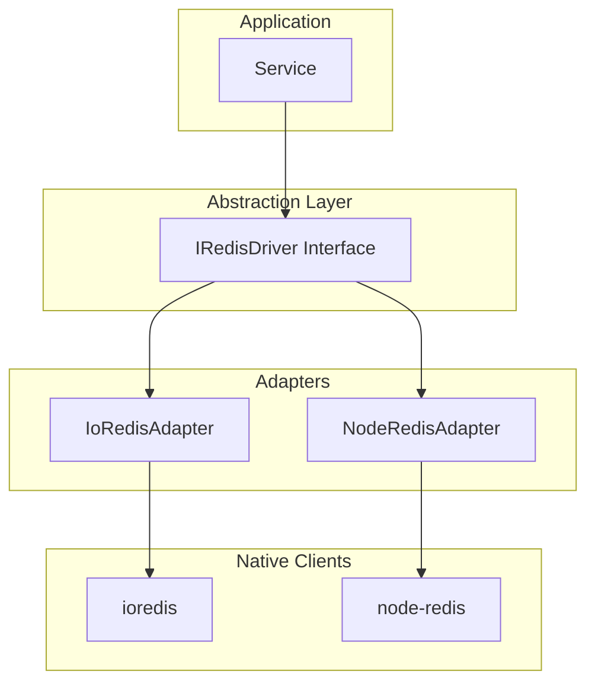

# Driver Abstraction

Use different Redis clients without changing application code.

## Overview

NestJS RedisX abstracts the underlying Redis client library, allowing you to:

- Switch between drivers without code changes
- Use a consistent API regardless of driver
- Benefit from driver-specific optimizations
- Test with different implementations

## Supported Drivers

| Driver | Package | Status | Features |
|--------|---------|--------|----------|
| ioredis | `ioredis` | Default | Cluster, Sentinel, Lua scripts |
| node-redis | `redis` | Supported | Official client, modern API |

## Installation

### ioredis (Default)

```bash
npm install @nestjs-redisx/core ioredis
npm install -D @types/ioredis  # Optional: types included in ioredis 5+
```

### node-redis

```bash
npm install @nestjs-redisx/core redis
```

## Driver Selection

The driver is selected via `global.driver` in module configuration. Defaults to `'ioredis'`.

```typescript
// Uses ioredis (default)
RedisModule.forRoot({
  clients: {
    host: 'localhost',
    port: 6379,
  },
})

// Explicitly use node-redis
RedisModule.forRoot({
  clients: {
    host: 'localhost',
    port: 6379,
  },
  global: {
    driver: 'node-redis',
  },
})
```

## IRedisDriver Interface

All drivers implement the same interface:

```typescript
interface IRedisDriver {
  // Connection
  connect(): Promise<void>;
  disconnect(): Promise<void>;
  isConnected(): boolean;
  ping(message?: string): Promise<string>;
  select(db: number): Promise<void>;

  // String commands
  get(key: string): Promise<string | null>;
  set(key: string, value: string, options?: ISetOptions): Promise<'OK' | null>;
  mget(...keys: string[]): Promise<Array<string | null>>;
  mset(data: Record<string, string>): Promise<'OK'>;
  incr(key: string): Promise<number>;
  decr(key: string): Promise<number>;

  // Key commands
  del(...keys: string[]): Promise<number>;
  exists(...keys: string[]): Promise<number>;
  expire(key: string, seconds: number): Promise<number>;
  ttl(key: string): Promise<number>;

  // Hash commands
  hget(key: string, field: string): Promise<string | null>;
  hset(key: string, field: string, value: string): Promise<number>;
  hgetall(key: string): Promise<Record<string, string>>;

  // List commands
  lpush(key: string, ...values: string[]): Promise<number>;
  rpush(key: string, ...values: string[]): Promise<number>;
  lpop(key: string): Promise<string | null>;
  rpop(key: string): Promise<string | null>;

  // Set commands
  sadd(key: string, ...members: string[]): Promise<number>;
  smembers(key: string): Promise<string[]>;

  // Sorted set commands
  zadd(key: string, ...args: Array<number | string>): Promise<number>;
  zrange(key: string, start: number, stop: number): Promise<string[]>;

  // Pub/Sub
  publish(channel: string, message: string): Promise<number>;
  subscribe(...channels: string[]): Promise<void>;

  // Transactions
  pipeline(): IPipeline;
  multi(): IMulti;

  // Lua scripts
  eval(script: string, keys: string[], args: Array<string | number>): Promise<unknown>;
  evalsha(sha: string, keys: string[], args: Array<string | number>): Promise<unknown>;
  scriptLoad(script: string): Promise<string>;

  // Events
  on(event: DriverEvent, handler: DriverEventHandler): void;
  once(event: DriverEvent, handler: DriverEventHandler): void;
  off(event: DriverEvent, handler: DriverEventHandler): void;
  removeAllListeners(event?: DriverEvent): void;
}
```

## Driver Comparison

### ioredis

**Pros:**
- Mature and battle-tested
- Excellent Cluster support
- Built-in Sentinel support
- Automatic pipelining
- Lua script caching
- Offline queue

**Cons:**
- Larger bundle size
- More dependencies

**Best for:**
- Production deployments
- Cluster/Sentinel setups
- Complex Redis operations

### node-redis

**Pros:**
- Official Redis client
- Modern Promise-based API
- Smaller bundle size
- Active development

**Cons:**
- Cluster support via separate package
- Less mature ecosystem

**Best for:**
- Simple use cases
- Modern Node.js projects
- Official client preference

## Driver Differences

While the abstraction layer provides a unified API, some configuration options are driver-specific:

| Feature | ioredis | node-redis |
|---------|---------|------------|
| Single instance | Full support | Full support |
| Cluster | Native support | Via `@redis/client` |
| Sentinel | Native support | Via `createSentinel()` |
| Cluster `natMap` | Native `natMap` | Mapped to `nodeAddressMap` |
| Sentinel `natMap` | Supported | **Not supported** |
| Sentinel `preferredSlaves` | Supported | Not available |
| Sentinel connection pooling | Not available | `masterPoolSize`, `replicaPoolSize` |
| Sentinel topology scan | Not available | `scanInterval` |
| Automatic pipelining | Supported | Not available |
| Lua script caching | Built-in | Manual |

::: warning Sentinel natMap
`natMap` for Sentinel (Docker/firewall address mapping) is only supported with the **ioredis** driver. If you need sentinel NAT mapping, use ioredis.
:::

## Code Examples

### Same Code, Different Drivers

<<< @/apps/demo/src/core/driver-cache-service.usage.ts{typescript}

### Transactions

```typescript
// Pipeline (batching without atomicity)
const pipeline = await this.redis.pipeline();
pipeline.set('key1', 'value1');
pipeline.set('key2', 'value2');
pipeline.incr('counter');
const pipeResults = await pipeline.exec();

// Multi/Exec (atomic transaction)
const multi = await this.redis.multi();
multi.decrby('balance:alice', 50);
multi.incrby('balance:bob', 50);
const multiResults = await multi.exec();
```

### Lua Scripts

```typescript
// Both drivers support Lua scripts
const script = `
  local current = redis.call('GET', KEYS[1])
  if current then
    return redis.call('INCR', KEYS[1])
  else
    redis.call('SET', KEYS[1], ARGV[1])
    return tonumber(ARGV[1])
  end
`;

const result = await this.redis.eval(script, ['counter'], [1]);
```

### Events

Both drivers emit the same events through a unified `DriverEvent` enum:

```typescript
import { DriverEvent } from '@nestjs-redisx/core';

enum DriverEvent {
  CONNECT = 'connect',           // Connection initiated
  READY = 'ready',               // Connection established and ready
  DISCONNECT = 'disconnect',     // Disconnection initiated
  CLOSE = 'close',               // Connection closed
  ERROR = 'error',               // Connection error
  RECONNECTING = 'reconnecting', // Reconnection attempt
  END = 'end',                   // Connection ended permanently
}
```

```typescript
const client = await this.redis.getClient();

client.on(DriverEvent.READY, () => {
  console.log('Connected and ready');
});

client.on(DriverEvent.ERROR, (error) => {
  console.error('Error:', error);
});

client.on(DriverEvent.CLOSE, () => {
  console.log('Connection closed');
});

client.once(DriverEvent.READY, () => {
  console.log('First connection established');
});
```

## Accessing Native Client

For driver-specific features:

::: code-group

```typescript [ioredis]
import { IoRedisAdapter } from '@nestjs-redisx/core';

const driver = await this.redis.getClient() as IoRedisAdapter;
const nativeClient = driver.getClient();

// ioredis-specific features
nativeClient.defineCommand('mycommand', {
  numberOfKeys: 1,
  lua: 'return redis.call("get", KEYS[1])',
});
```

```typescript [node-redis]
import { NodeRedisAdapter } from '@nestjs-redisx/core';

const driver = await this.redis.getClient() as NodeRedisAdapter;
const nativeClient = driver.getClient();

// node-redis-specific features
await nativeClient.sendCommand(['CLIENT', 'INFO']);
```

:::

## Driver Architecture



## Base Driver Class

All adapters extend `BaseRedisDriver`, which implements the Template Method pattern:

```typescript
abstract class BaseRedisDriver implements IRedisDriver {
  protected readonly config: ConnectionConfig;
  protected connected: boolean = false;

  // Abstract methods — implemented by IoRedisAdapter / NodeRedisAdapter
  protected abstract doConnect(): Promise<void>;
  protected abstract doDisconnect(): Promise<void>;
  protected abstract executeCommand(command: string, ...args: unknown[]): Promise<unknown>;
  protected abstract createPipeline(): IPipeline;
  protected abstract createMulti(): IMulti;

  // Implemented in base class — calls doConnect() / doDisconnect()
  async connect(): Promise<void> {
    this.emit(DriverEvent.CONNECT);
    await this.doConnect();
    this.connected = true;
    this.emit(DriverEvent.READY);
  }

  async disconnect(): Promise<void> {
    this.emit(DriverEvent.DISCONNECT);
    await this.doDisconnect();
    this.connected = false;
    this.emit(DriverEvent.CLOSE);
  }

  // Common command implementations — delegates to executeCommand()
  async get(key: string): Promise<string | null> {
    return this.executeCommand('GET', key);
  }

  async set(key: string, value: string, options?: ISetOptions): Promise<'OK' | null> {
    const args: unknown[] = [key, value];
    if (options?.ex) args.push('EX', options.ex);
    if (options?.nx) args.push('NX');
    // ... other options
    return this.executeCommand('SET', ...args);
  }
}
```

## Best Practices

### Stick to the Interface

```typescript
// Good - uses interface
constructor(
  @InjectRedis()
  private readonly redis: IRedisDriver,
) {}

// Avoid - ties to specific implementation
constructor(
  @InjectRedis()
  private readonly redis: IoRedisAdapter,
) {}
```

### Use RedisService for Most Cases

```typescript
// Recommended for most applications
@Injectable()
export class MyService {
  constructor(private readonly redis: RedisService) {}
}
```

### Access Native Client Only When Necessary

```typescript
// Only for driver-specific features
const driver = await this.redis.getClient();
if (driver instanceof IoRedisAdapter) {
  const native = driver.getClient();
  // ioredis-specific code
}
```

## Troubleshooting

### Command Not Found

If a command returns "unknown command":

1. Check Redis server version supports the command
2. Verify the command name spelling
3. Some commands have driver-specific implementations

### Type Mismatches

If return types don't match expected:

1. Both drivers normalize types where possible
2. Some edge cases may differ
3. Use type guards for safety

```typescript
const result = await this.redis.get('key');
if (result !== null) {
  // result is string
}
```

## Next Steps

- [Configuration](./configuration) — Module configuration
- [RedisService](./redis-service) — High-level API
- [Troubleshooting](./troubleshooting) — Common issues
