# Error Handling

Comprehensive error system for programmatic handling and debugging.

## RedisXError

Base class for all errors in NestJS RedisX.

```typescript
import { RedisXError, ErrorCode } from '@nestjs-redisx/core';
```

### Properties

| Property | Type | Description |
|----------|------|-------------|
| `message` | `string` | Human-readable error message |
| `code` | `ErrorCode` | Error code for programmatic handling |
| `cause` | `Error \| undefined` | Original error that caused this error |
| `context` | `Record<string, unknown> \| undefined` | Additional context for debugging |
| `timestamp` | `Date` | When the error occurred |

### Methods

```typescript
// Check specific error code
if (error.is(ErrorCode.CONN_FAILED)) {
  // Handle connection failure
}

// Check multiple error codes
if (error.isAnyOf([ErrorCode.CONN_FAILED, ErrorCode.CONN_TIMEOUT])) {
  // Handle connection issues
}

// Serialize to JSON for logging
const json = error.toJSON();

// Formatted string representation
const str = error.toString();
// => "RedisConnectionError [CONN_FAILED]: Connection refused\n  Context: {...}"

// Wrap unknown errors
const wrapped = RedisXError.wrap(unknownError, ErrorCode.OP_FAILED);

// Type guard
if (RedisXError.isRedisXError(error)) {
  console.log(error.code);
}
```

### JSON Serialization

```typescript
interface IErrorJSON {
  name: string;
  message: string;
  code: string;
  timestamp: string;
  context?: Record<string, unknown>;
  stack?: string;
  cause?: {
    name: string;
    message: string;
    stack?: string;
  };
}
```

## Error Hierarchy

```mermaid
graph TB
    RXE[RedisXError]
    RXE --> RCE[RedisConnectionError]
    RXE --> ROE[RedisOperationError]
    RXE --> RCfgE[RedisConfigError]

    RCE --> RTE[RedisTimeoutError]
    RCE --> RClE[RedisClusterError]
    RCE --> RSE[RedisSentinelError]
    RCE --> RAE[RedisAuthError]
    RCE --> RTLSE[RedisTLSError]
    RCE --> RMRE[RedisMaxRetriesError]
    RCE --> RPE[RedisPoolExhaustedError]

    ROE --> RKNE[RedisKeyNotFoundError]
    ROE --> RTME[RedisTypeMismatchError]
    ROE --> RScE[RedisScriptError]
    ROE --> RTxE[RedisTransactionError]
    ROE --> RPipE[RedisPipelineError]
    ROE --> RIAE[RedisInvalidArgsError]
    ROE --> ROME[RedisOutOfMemoryError]
    ROE --> RROE[RedisReadOnlyError]
    ROE --> RNSE[RedisNotSupportedError]
    ROE --> RNCE[RedisNotConnectedError]

    RCfgE --> RVE[RedisValidationError]
```



## Connection Errors

Thrown when Redis connectivity fails. All connection errors include optional `host` and `port` properties.

```typescript
import {
  RedisConnectionError,
  RedisTimeoutError,
  RedisClusterError,
  RedisSentinelError,
  RedisAuthError,
  RedisTLSError,
  RedisMaxRetriesError,
  RedisPoolExhaustedError,
} from '@nestjs-redisx/core';
```

| Error | Code | Extra Properties |
|-------|------|------------------|
| `RedisConnectionError` | `CONN_FAILED` | `host?`, `port?` |
| `RedisTimeoutError` | `CONN_TIMEOUT` | `operation`, `timeoutMs` |
| `RedisClusterError` | `CONN_CLUSTER_*` | — |
| `RedisSentinelError` | `CONN_SENTINEL_*` | `masterName?` |
| `RedisAuthError` | `CONN_AUTH_FAILED` | — |
| `RedisTLSError` | `CONN_TLS_ERROR` | — |
| `RedisMaxRetriesError` | `CONN_MAX_RETRIES` | `maxRetries` |
| `RedisPoolExhaustedError` | `CONN_POOL_EXHAUSTED` | `poolSize`, `waitingClients` |

### Handling Connection Errors

```typescript
try {
  await this.redis.get('key');
} catch (error) {
  if (error instanceof RedisConnectionError) {
    console.log('Host:', error.host);
    console.log('Port:', error.port);
  }

  if (error instanceof RedisTimeoutError) {
    console.log('Operation:', error.operation);
    console.log('Timeout:', error.timeoutMs, 'ms');
  }
}
```

### Static Factory Methods

```typescript
// Generic connection error
RedisConnectionError.create('Cannot connect', 'localhost', 6379, cause);

// Cluster errors
RedisClusterError.clusterDown('localhost', 6379);
RedisClusterError.moved(1234, 'node2', 7001, cause);
RedisClusterError.ask(1234, 'node2', 7001, cause);
RedisClusterError.generic('Cluster reconfiguring', 'localhost', 6379);

// Sentinel errors
RedisSentinelError.noMaster('mymaster', [{ host: 'sentinel1', port: 26379 }]);
RedisSentinelError.failover('mymaster', 'old-master:6379', 'new-master:6379');
RedisSentinelError.generic('Sentinel unreachable', 'mymaster', cause);
```

## Operation Errors

Thrown when a Redis command fails. All operation errors include an optional `command` property.

```typescript
import {
  RedisOperationError,
  RedisKeyNotFoundError,
  RedisTypeMismatchError,
  RedisScriptError,
  RedisTransactionError,
  RedisPipelineError,
  RedisInvalidArgsError,
  RedisOutOfMemoryError,
  RedisReadOnlyError,
  RedisNotSupportedError,
  RedisNotConnectedError,
} from '@nestjs-redisx/core';
```

| Error | Code | Extra Properties |
|-------|------|------------------|
| `RedisOperationError` | `OP_FAILED` | `command?` |
| `RedisKeyNotFoundError` | `OP_KEY_NOT_FOUND` | `key` |
| `RedisTypeMismatchError` | `OP_TYPE_MISMATCH` | `key`, `expected`, `actual` |
| `RedisScriptError` | `OP_SCRIPT_ERROR` | `scriptSha?` |
| `RedisTransactionError` | `OP_TRANSACTION_FAILED` | — |
| `RedisPipelineError` | `OP_PIPELINE_FAILED` | `totalCommands`, `failedCommands` |
| `RedisInvalidArgsError` | `OP_INVALID_ARGS` | `args?` |
| `RedisOutOfMemoryError` | `OP_OUT_OF_MEMORY` | `key?` |
| `RedisReadOnlyError` | `OP_READONLY` | `key?` |
| `RedisNotSupportedError` | `OP_NOT_SUPPORTED` | `reason` |
| `RedisNotConnectedError` | `OP_NOT_CONNECTED` | — |

### Static Factory Methods

```typescript
// Generic operation error
RedisOperationError.create('Command failed', 'SET', cause);
RedisOperationError.fromCommand('SET', ['key', 'value'], cause);

// Script errors
RedisScriptError.timeout(5000, 'abc123');
RedisScriptError.notFound('abc123');

// Transaction errors
RedisTransactionError.aborted();

// Type mismatch from Redis WRONGTYPE error
RedisTypeMismatchError.fromRedisError('mykey', 'LPUSH', cause);
```

## Configuration Errors

Thrown when module configuration is invalid.

```typescript
import {
  RedisConfigError,
  RedisValidationError,
  ValidationErrorCollector,
} from '@nestjs-redisx/core';
```

| Error | Code | Extra Properties |
|-------|------|------------------|
| `RedisConfigError` | `CFG_*` | — |
| `RedisValidationError` | `CFG_VALIDATION_FAILED` | `field`, `errors` |

### Static Factory Methods

```typescript
// Generic config error
RedisConfigError.create('Invalid config', cause);

// Specific errors
RedisConfigError.missingRequired('host', 'clients');
RedisConfigError.invalidConnectionType('unknown', ['single', 'cluster', 'sentinel']);
RedisConfigError.invalidHostPort('localhost', -1, 'Port must be positive');
RedisConfigError.invalidDb(99, 15);
RedisConfigError.invalidTTL(-1, 'Must be positive');
RedisConfigError.invalidTimeout(-100, 'connectTimeout');
RedisConfigError.invalidRetry('maxAttempts must be >= 1');
RedisConfigError.incompatible('cluster', 'sentinel', 'Cannot use both');
RedisConfigError.driverNotSupported('redis', ['ioredis']);
RedisConfigError.invalidClusterNodes('At least 3 nodes required');
RedisConfigError.invalidSentinel('masterName is required');
RedisConfigError.invalidTLS('Certificate file not found');

// Validation errors
RedisValidationError.single('port', 'Must be between 1 and 65535', 99999);
RedisValidationError.multiple('clients', [
  { field: 'host', message: 'Required' },
  { field: 'port', message: 'Must be positive', value: -1 },
]);
```

### ValidationErrorCollector

Utility for accumulating multiple validation errors before throwing.

```typescript
import { ValidationErrorCollector } from '@nestjs-redisx/core';

const validator = new ValidationErrorCollector('connectionConfig');

if (!config.host) {
  validator.add('host', 'Host is required');
}

if (config.port < 1 || config.port > 65535) {
  validator.add('port', 'Port must be between 1 and 65535', config.port);
}

validator.throwIfErrors(); // Throws RedisValidationError if any errors
```

| Method | Returns | Description |
|--------|---------|-------------|
| `add(field, message, value?)` | `this` | Add a validation error |
| `hasErrors()` | `boolean` | Check if any errors collected |
| `count()` | `number` | Get error count |
| `throwIfErrors()` | `void` | Throw `RedisValidationError` if errors exist |
| `getErrors()` | `Array` | Get all collected errors |
| `clear()` | `void` | Clear all errors |

## Helper Functions

```typescript
import { isErrorCode, getErrorDomain, isErrorDomain } from '@nestjs-redisx/core';
```

```typescript
// Type guard — check if string is a valid ErrorCode
isErrorCode('CONN_FAILED');     // true
isErrorCode('INVALID_CODE');    // false

// Extract domain prefix from error code
getErrorDomain(ErrorCode.CONN_FAILED);   // 'CONN'
getErrorDomain(ErrorCode.OP_TIMEOUT);    // 'OP'
getErrorDomain(ErrorCode.CFG_INVALID);   // 'CFG'

// Check if error code belongs to a domain
isErrorDomain(ErrorCode.CONN_FAILED, 'CONN');  // true
isErrorDomain(ErrorCode.OP_TIMEOUT, 'CONN');   // false
```

## ErrorCode Reference

Error codes are organized by domain. Naming convention: `{DOMAIN}_{SPECIFIC_ERROR}`.

### Connection Codes

| Code | Description |
|------|-------------|
| `CONN_FAILED` | Connection failed |
| `CONN_TIMEOUT` | Connection timed out |
| `CONN_DISCONNECTED` | Connection lost |
| `CONN_REFUSED` | Connection refused |
| `CONN_AUTH_FAILED` | Authentication failed |
| `CONN_TLS_ERROR` | TLS error |
| `CONN_CLUSTER_DOWN` | Cluster down |
| `CONN_CLUSTER_MOVED` | Cluster slot migration (MOVED) |
| `CONN_CLUSTER_ASK` | Cluster ASK redirection |
| `CONN_CLUSTER_ERROR` | Generic cluster error |
| `CONN_SENTINEL_FAILOVER` | Sentinel failover in progress |
| `CONN_SENTINEL_NO_MASTER` | No sentinel master found |
| `CONN_SENTINEL_ERROR` | Sentinel error |
| `CONN_MAX_RETRIES` | Max retries reached |
| `CONN_POOL_EXHAUSTED` | Pool exhausted |

### Operation Codes

| Code | Description |
|------|-------------|
| `OP_FAILED` | Operation failed |
| `OP_TIMEOUT` | Command timed out |
| `OP_KEY_NOT_FOUND` | Key not found |
| `OP_TYPE_MISMATCH` | Type mismatch |
| `OP_SCRIPT_ERROR` | Script error |
| `OP_SCRIPT_TIMEOUT` | Script execution timeout |
| `OP_TRANSACTION_FAILED` | Transaction failed |
| `OP_PIPELINE_FAILED` | Pipeline failed |
| `OP_INVALID_ARGS` | Invalid arguments |
| `OP_OUT_OF_MEMORY` | Out of memory |
| `OP_NO_AUTH` | NOAUTH — authentication required |
| `OP_WRONG_PASS` | WRONGPASS — invalid password |
| `OP_READONLY` | Read-only mode |
| `OP_BUSY_KEY` | BUSYKEY — target key exists |
| `OP_NOT_SUPPORTED` | Not supported |
| `OP_NOT_CONNECTED` | Not connected |

### Configuration Codes

| Code | Description |
|------|-------------|
| `CFG_INVALID` | Invalid configuration |
| `CFG_MISSING_REQUIRED` | Missing required field |
| `CFG_INVALID_CONNECTION_TYPE` | Invalid connection type |
| `CFG_INVALID_HOST_PORT` | Invalid host or port |
| `CFG_INVALID_DB` | Invalid database number |
| `CFG_INVALID_TTL` | Invalid TTL value |
| `CFG_INVALID_TIMEOUT` | Invalid timeout value |
| `CFG_INVALID_RETRY` | Invalid retry configuration |
| `CFG_VALIDATION_FAILED` | Validation failed |
| `CFG_INCOMPATIBLE` | Incompatible options |
| `CFG_DRIVER_NOT_SUPPORTED` | Driver not supported |
| `CFG_INVALID_CLUSTER_NODES` | Invalid cluster nodes |
| `CFG_INVALID_SENTINEL` | Invalid sentinel config |
| `CFG_INVALID_TLS` | Invalid TLS config |

### Plugin Codes

| Code | Description |
|------|-------------|
| `PLUGIN_INVALID` | Invalid plugin |
| `PLUGIN_DUPLICATE` | Duplicate plugin name |
| `PLUGIN_NOT_FOUND` | Plugin not found |
| `PLUGIN_REGISTER_FAILED` | Registration failed |
| `PLUGIN_INIT_FAILED` | Initialization failed |
| `PLUGIN_CIRCULAR_DEPENDENCY` | Circular dependency detected |
| `PLUGIN_DEPENDENCY_MISSING` | Required dependency not registered |

### Feature Codes

Defined in core for use by plugin packages.

**Cache:**

| Code | Description |
|------|-------------|
| `CACHE_KEY_INVALID` | Cache key is invalid |
| `CACHE_KEY_TOO_LONG` | Cache key exceeds maximum length |
| `CACHE_SERIALIZATION_FAILED` | Serialization failed |
| `CACHE_DESERIALIZATION_FAILED` | Deserialization failed |
| `CACHE_TAG_INDEX_CORRUPTED` | Tag index corrupted |
| `CACHE_STAMPEDE_TIMEOUT` | Stampede protection timeout |
| `CACHE_LOADER_FAILED` | Loader function failed |
| `CACHE_L1_ERROR` | L1 cache error |
| `CACHE_L2_ERROR` | L2 cache error |
| `CACHE_SET_FAILED` | Set operation failed |
| `CACHE_DELETE_FAILED` | Delete operation failed |
| `CACHE_CLEAR_FAILED` | Clear operation failed |
| `CACHE_OPERATION_FAILED` | Operation failed |
| `CACHE_OPERATION_TIMEOUT` | Operation timeout |
| `CACHE_TAG_INVALIDATION_FAILED` | Tag invalidation failed |

**Locks:**

| Code | Description |
|------|-------------|
| `LOCK_ACQUISITION_FAILED` | Failed to acquire lock |
| `LOCK_ACQUISITION_TIMEOUT` | Lock acquisition timed out |
| `LOCK_EXTENSION_FAILED` | Failed to extend lock TTL |
| `LOCK_RELEASE_FAILED` | Failed to release lock |
| `LOCK_NOT_OWNED` | Lock not owned by caller |
| `LOCK_EXPIRED` | Lock expired |

**Rate Limit:**

| Code | Description |
|------|-------------|
| `RATE_LIMIT_EXCEEDED` | Rate limit exceeded |
| `RATE_LIMIT_SCRIPT_ERROR` | Rate limit script error |

**Idempotency:**

| Code | Description |
|------|-------------|
| `IDEMPOTENCY_KEY_INVALID` | Key is invalid |
| `IDEMPOTENCY_IN_PROGRESS` | Operation already in progress |
| `IDEMPOTENCY_PREVIOUS_FAILED` | Previous operation failed |

**Streams:**

| Code | Description |
|------|-------------|
| `STREAM_CONSUMER_GROUP_ERROR` | Consumer group operation failed |
| `STREAM_ACK_FAILED` | Stream ACK failed |
| `STREAM_READ_FAILED` | Stream read failed |

### General Codes

| Code | Description |
|------|-------------|
| `CLIENT_NOT_FOUND` | Client not found |
| `CLIENT_ALREADY_EXISTS` | Client already exists |
| `NOT_INITIALIZED` | Service not initialized |
| `OPERATION_FAILED` | Generic operation failed |
| `OPERATION_TIMEOUT` | Generic operation timeout |
| `SERIALIZATION_FAILED` | Serialization failed |
| `VALIDATION_FAILED` | Validation failed |
| `UNKNOWN` | Unknown error |

## Error Handling Patterns

<<< @/apps/demo/src/core/error-patterns.usage.ts{typescript}

### Extend for Custom Errors

<<< @/apps/demo/src/core/custom-errors.usage.ts{typescript}

## Next Steps

- [Plugin System](./plugin-system) — Plugin error codes
- [Troubleshooting](./troubleshooting) — Common issues and solutions
- [Configuration](./configuration) — Module configuration
