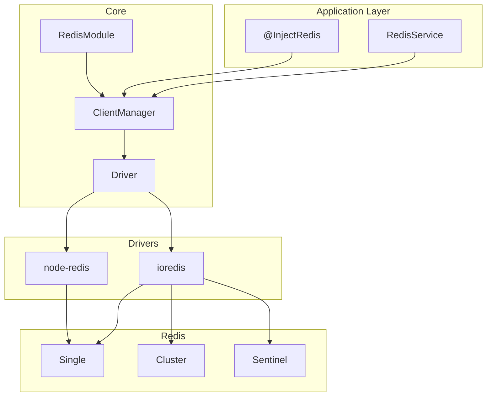

# Core Module

The foundation of NestJS RedisX providing Redis client management with driver abstraction.

## What is Core?

`@nestjs-redisx/core` is the foundation package that provides:

- **RedisModule** — NestJS module for Redis integration
- **RedisService** — High-level Redis operations wrapper
- **Driver Abstraction** — Switch between ioredis and node-redis
- **Multi-Client Support** — Manage multiple Redis connections
- **Connection Types** — Single, Cluster, and Sentinel configurations
- **Health Monitoring** — Automatic reconnection and health checks
- **Plugin System** — Extensible architecture for plugins

## Installation

::: code-group

```bash [ioredis]
npm install @nestjs-redisx/core ioredis
```

```bash [node-redis]
npm install @nestjs-redisx/core redis
```

:::

## Quick Start

<<< @/apps/demo/src/core/basic.setup.ts{typescript}

Use in services:

<<< @/apps/demo/src/core/basic-usage.usage.ts{typescript}

## Architecture



## Key Features

| Feature | Description |
|---------|-------------|
| Global Module | Import once, use everywhere |
| Lazy Connection | Connects on first use |
| Auto Reconnection | Exponential backoff with jitter |
| Health Checks | Monitor connection status |
| Multiple Clients | Named connections for different purposes |
| Driver Agnostic | Switch drivers without code changes |
| Type Safe | Full TypeScript support |

## Module Configuration

### Synchronous

```typescript
RedisModule.forRoot({
  clients: {
    host: 'localhost',
    port: 6379,
    password: 'secret',
  },
})
```

### Asynchronous

```typescript
RedisModule.forRootAsync({
  useFactory: (config: ConfigService) => ({
    clients: {
      host: config.get('REDIS_HOST'),
      port: config.get('REDIS_PORT'),
    },
  }),
  inject: [ConfigService],
})
```

### With Plugins

```typescript
import { CachePlugin } from '@nestjs-redisx/cache';
import { LocksPlugin } from '@nestjs-redisx/locks';

RedisModule.forRoot({
  clients: { host: 'localhost', port: 6379 },
  plugins: [
    new CachePlugin(),
    new LocksPlugin(),
  ],
})
```

## Connection Types

### Single Instance

```typescript
{
  clients: {
    type: 'single',  // Optional, default
    host: 'localhost',
    port: 6379,
  }
}
```

### Redis Cluster

```typescript
{
  clients: {
    type: 'cluster',
    nodes: [
      { host: 'node1', port: 6379 },
      { host: 'node2', port: 6379 },
      { host: 'node3', port: 6379 },
    ],
  }
}
```

### Redis Sentinel

```typescript
{
  clients: {
    type: 'sentinel',
    sentinels: [
      { host: 'sentinel1', port: 26379 },
      { host: 'sentinel2', port: 26379 },
    ],
    name: 'mymaster',
  }
}
```

## Documentation

- [Configuration](./configuration) — Complete configuration reference
- [RedisService](./redis-service) — Service API documentation
- [Multiple Clients](./multiple-clients) — Named client management
- [Connection Types](./connection-types) — Single, Cluster, Sentinel
- [Health Monitoring](./health-monitoring) — Health checks and reconnection
- [Decorators](./decorators) — @InjectRedis usage
- [Driver Abstraction](./driver-abstraction) — ioredis vs node-redis
- [Plugin System](./plugin-system) — Plugin architecture with lifecycle hooks
- [Error Handling](./error-handling) — Structured error system with error codes
- [Troubleshooting](./troubleshooting) — Common issues and solutions
