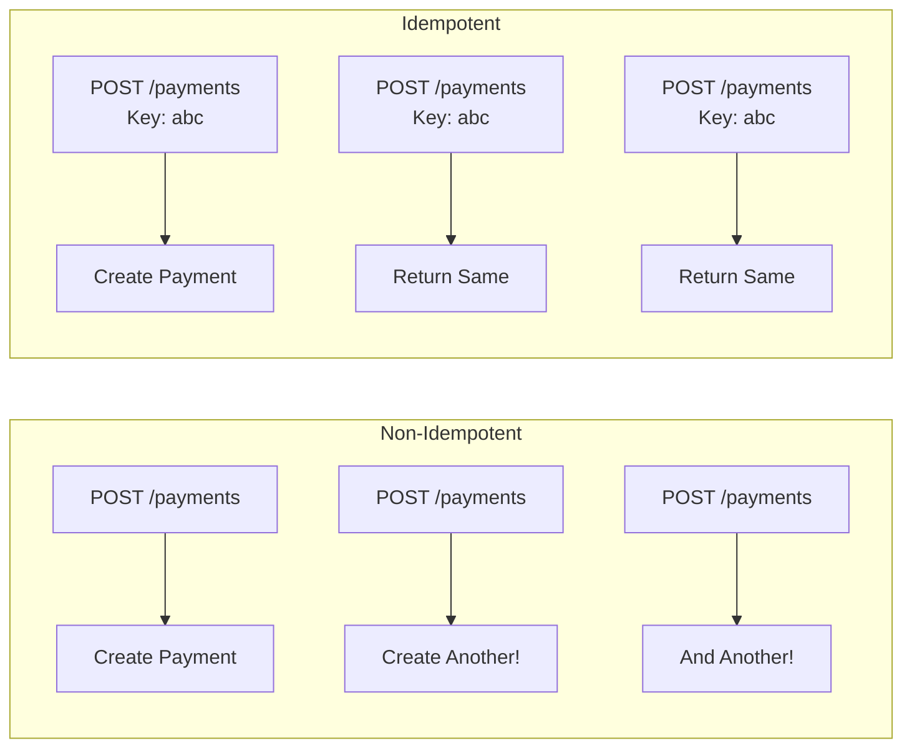
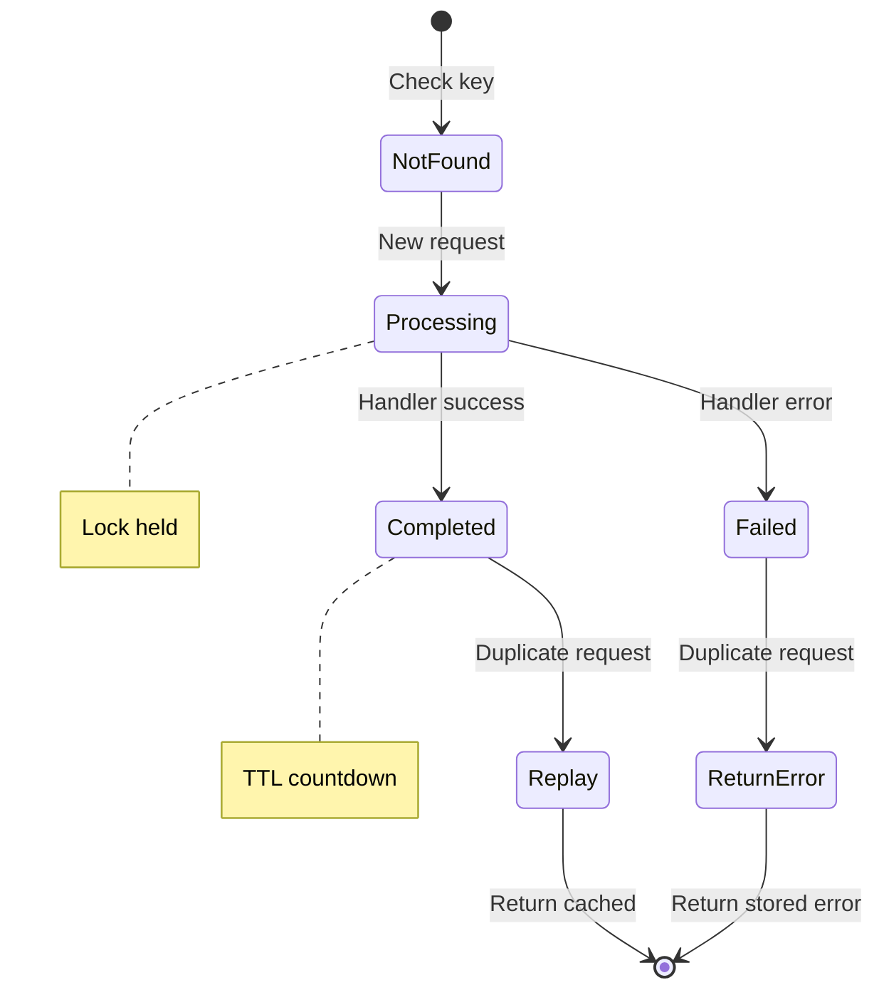
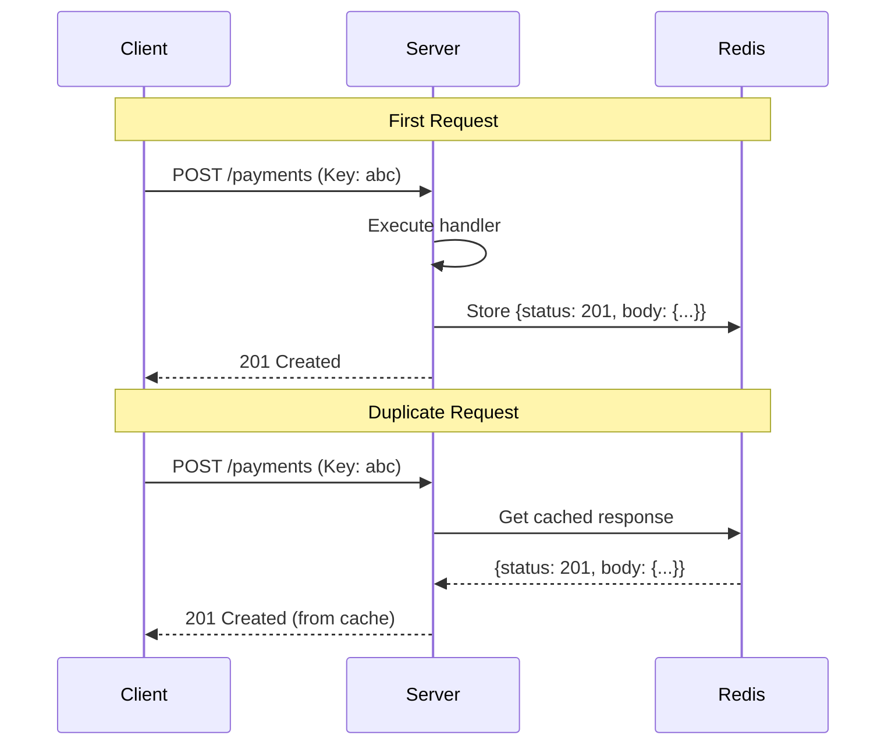
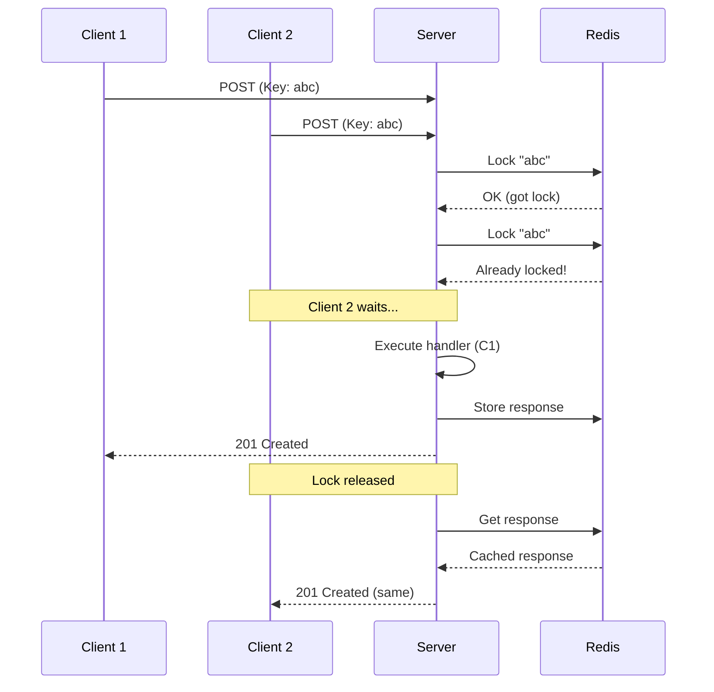

# Core Concepts

Understand how idempotency ensures exactly-once execution.

## What is Idempotency?

An operation is **idempotent** if executing it multiple times produces the same result as executing it once.



## Idempotency Key

A unique identifier sent by the client to identify a specific operation.

### Key Format

```
Idempotency-Key: <unique-identifier>
```

### Good Key Examples

```bash
# UUID v4 (recommended)
Idempotency-Key: 550e8400-e29b-41d4-a716-446655440000

# Prefixed UUID
Idempotency-Key: payment-550e8400-e29b-41d4

# User + Operation specific
Idempotency-Key: user-123-order-456-checkout
```

### Bad Key Examples

```bash
# Predictable/Sequential
Idempotency-Key: 1
Idempotency-Key: 2

# Timestamp only
Idempotency-Key: 1706123456789

# Too generic
Idempotency-Key: payment
```

## Request Fingerprint

A hash of request content to detect misuse of idempotency keys.

```mermaid
graph LR
    subgraph "Request"
        M[Method: POST]
        P[Path: /payments]
        B[Body: {amount: 100}]
    end

    M --> H[SHA256]
    P --> H
    B --> H

    H --> F[Fingerprint:<br/>a1b2c3d4...]
```

### Why Fingerprinting?

Prevents accidental key reuse with different data:

```
Request 1:
  Key: abc-123
  Body: {amount: 100}
  -> Fingerprint: xyz789
  -> Processed

Request 2 (Same key, different body!):
  Key: abc-123
  Body: {amount: 200}
  -> Fingerprint: def456
  -> Mismatch Error!
```

## Record Lifecycle



## Record States

| State | Description | Response to Duplicate |
|-------|-------------|----------------------|
| `processing` | First request executing | Wait for completion |
| `completed` | Success, response cached | Return cached response |
| `failed` | Error occurred | Return stored error |

## Redis Data Model

```
Key: idempotency:{idempotency-key}
Value: {
  key: "abc-123",
  fingerprint: "sha256...",
  status: "completed",
  statusCode: 201,
  response: "{\"id\":456}",
  headers: "{\"Location\":\"/payments/456\"}",
  startedAt: 1706123456000,
  completedAt: 1706123457000
}
TTL: 86400 (24 hours)
```

## Response Replay

When a duplicate request arrives, the cached response is replayed:



### What Gets Replayed

| Component | Replayed | Notes |
|-----------|----------|-------|
| Status code | Yes | 201, 200, etc. |
| Response body | Yes | JSON serialized |
| Specified headers | Yes | If configured |
| Cookies | No | Not cached |
| Timing | No | Immediate |

## Concurrent Requests

When two requests with the same key arrive simultaneously:



## TTL and Expiration

```
Request at T=0
|
+-- Processing (lock held)
|   +-- Max: lockTimeout (30s)
|
+-- Completed at T=1s
|   +-- Response cached
|
+-- TTL expires at T+86400s
    +-- Record deleted
    +-- Key can be reused
```

::: warning Important
After TTL expires, the same idempotency key can be used for a NEW operation. Choose TTL wisely.
:::

## Next Steps

- [Configuration](./configuration) — Full configuration reference
- [Fingerprinting](./fingerprinting) — Deep dive into fingerprints
