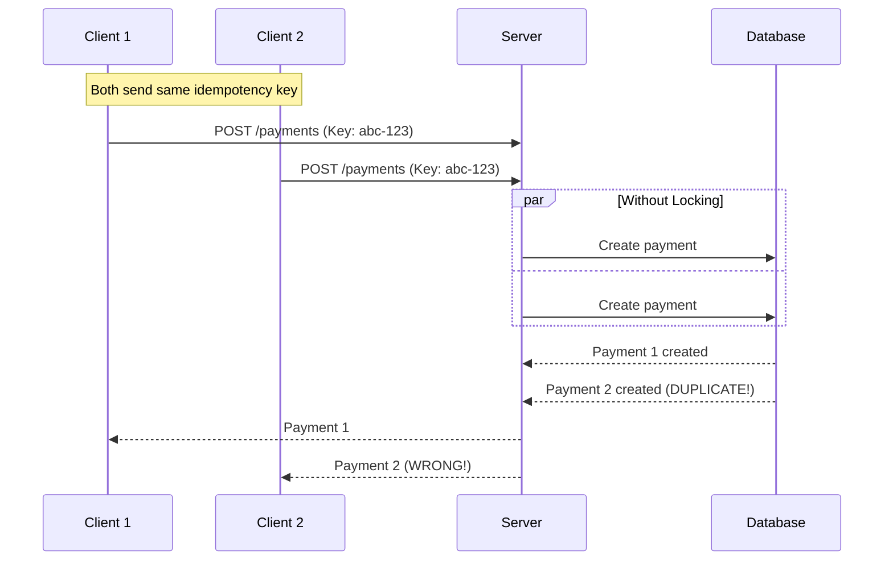
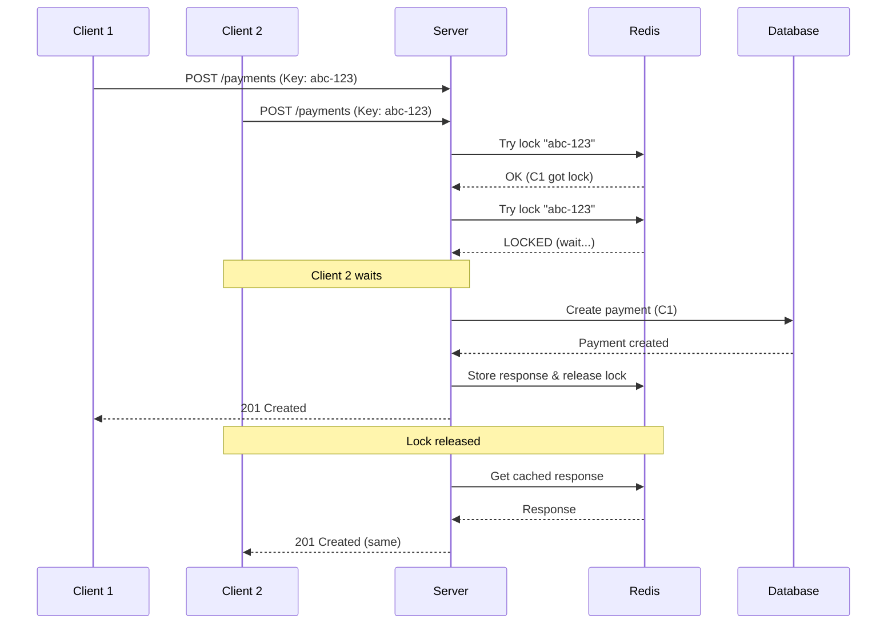

# Concurrent Requests

Handle multiple requests with the same idempotency key arriving simultaneously.

## The Problem



## The Solution



## Lock Mechanism

### Redis Implementation

```lua
-- Lua script for acquiring lock
local key = KEYS[1]
local token = ARGV[1]
local ttl = tonumber(ARGV[2])

-- Try to set lock
if redis.call("SET", key, token, "NX", "PX", ttl) then
  return 1  -- Lock acquired
else
  return 0  -- Already locked
end
```

### Lock States

| State | Description | Action for New Request |
|-------|-------------|----------------------|
| Not Locked | No request processing | Acquire lock, process |
| Locked | First request processing | Wait for completion |
| Released | Processing complete | Return cached response |

## Wait Mechanism

### Polling Strategy

The wait mechanism is handled internally by `checkAndLock()`. When a second request arrives and the key is locked (processing), `checkAndLock()` polls Redis until the first request completes:

```typescript
// Simplified internal logic (not a public API):
async function waitForCompletion(key: string, timeout: number): Promise<void> {
  const interval = 100;   // 100ms
  const start = Date.now();

  while (Date.now() - start < timeout) {
    const record = await this.store.get(key);

    if (record.status === 'completed' || record.status === 'failed') {
      return;  // Done!
    }

    // Still processing, wait and try again
    await sleep(interval);
  }

  throw new IdempotencyTimeoutError(key);
}
```

::: info
You do not call `waitForCompletion()` directly — `checkAndLock()` handles it automatically.
:::

### Timeline

```
t=0ms:    Client 1 arrives → Lock acquired
t=10ms:   Client 2 arrives → Wait...
t=100ms:  Client 2 checks → Still processing
t=200ms:  Client 2 checks → Still processing
t=500ms:  Client 1 completes → Lock released
t=600ms:  Client 2 checks → Completed! Return cached
```

## Configuration

### Lock Timeout

Maximum time to hold lock:

```typescript
new IdempotencyPlugin({
  lockTimeout: 30000,  // 30 seconds
})
```

```
Request starts: t=0
Lock acquired: t=0
Lock expires: t=30000 (if not released)
```

::: warning Choose Wisely
If lockTimeout is too short, legitimate operations may fail. If too long, concurrent requests wait unnecessarily.
:::

### Wait Timeout

Maximum time to wait for concurrent request:

```typescript
new IdempotencyPlugin({
  waitTimeout: 60000,  // 60 seconds
})
```

**Relationship:**

```
waitTimeout should be >= lockTimeout + safety_margin

Example:
lockTimeout = 30000ms
waitTimeout = 60000ms (2x for safety)
```

## Error Handling

### Timeout Error

```typescript
import { IdempotencyTimeoutError } from '@nestjs-redisx/idempotency';

try {
  await service.createPayment(key, dto);
} catch (error) {
  if (error instanceof IdempotencyTimeoutError) {
    // Concurrent request took too long
    return {
      error: 'Request timeout',
      message: 'Operation is still processing, try again later',
    };
  }
}
```

### Custom Timeout Handler

```typescript
@Catch(IdempotencyTimeoutError)
export class TimeoutFilter implements ExceptionFilter {
  catch(exception: IdempotencyTimeoutError, host: ArgumentsHost) {
    const response = host.switchToHttp().getResponse();

    response.status(408).json({
      statusCode: 408,
      error: 'Request Timeout',
      message: 'The original request is still processing',
      retryAfter: 30,
      idempotencyKey: exception.idempotencyKey,
    });
  }
}
```

## Race Condition Prevention

### Atomic Operations

```lua
-- Atomic check-and-lock
local key = KEYS[1]
local token = ARGV[1]
local fingerprint = ARGV[2]

-- Check if exists
local existing = redis.call("GET", key)

if existing then
  local data = cjson.decode(existing)

  -- Validate fingerprint
  if data.fingerprint ~= fingerprint then
    return {-1, "fingerprint_mismatch"}
  end

  return {0, existing}  -- Return existing
end

-- Doesn't exist, acquire lock
local success = redis.call("SET", key, cjson.encode({
  status = "processing",
  fingerprint = fingerprint,
  startedAt = redis.call("TIME")[1]
}), "NX", "PX", 30000)

if success then
  return {1, nil}  -- Lock acquired
else
  return {0, nil}  -- Someone else got lock
end
```

### Test Scenario

```typescript
describe('Concurrent requests', () => {
  it('should handle simultaneous requests', async () => {
    const key = 'payment-123';
    const dto = { amount: 100 };

    // Send 10 requests simultaneously
    const requests = Array.from({ length: 10 }, () =>
      service.createPayment(key, dto)
    );

    const results = await Promise.all(requests);

    // All should get same result
    const uniquePayments = new Set(results.map(r => r.id));
    expect(uniquePayments.size).toBe(1);

    // Verify only one payment created in database
    const payments = await db.payments.find({ idempotencyKey: key });
    expect(payments.length).toBe(1);
  });
});
```

## Best Practices

### Do

```typescript
// ✅ Set appropriate timeouts
new IdempotencyPlugin({
  lockTimeout: 30000,   // 30s
  waitTimeout: 60000,   // 60s (2x lock)
})

// ✅ Handle timeout errors gracefully
@Catch(IdempotencyTimeoutError)
export class TimeoutHandler {
  catch(error, host) {
    // Return helpful message
  }
}

// ✅ Log concurrent requests for monitoring
if (record.status === 'processing') {
  logger.warn(`Concurrent request for key: ${key}`);
}
```

### Don't

```typescript
// ❌ waitTimeout < lockTimeout
new IdempotencyPlugin({
  lockTimeout: 60000,
  waitTimeout: 30000,  // Too short!
})

// ❌ Ignore timeout errors
try {
  await service.create(key, dto);
} catch {
  // Swallowing error - bad!
}

// ❌ Very short lockTimeout
new IdempotencyPlugin({
  lockTimeout: 1000,  // 1s - too short for payments!
})
```

## Monitoring

### Metrics

When `MetricsPlugin` is registered, concurrent requests are tracked automatically:

```yaml
# Replay rate (includes concurrent replays)
rate(redisx_idempotency_requests_total{status="replay"}[5m])

# Processing duration (includes wait time for concurrent requests)
histogram_quantile(0.95, rate(redisx_idempotency_duration_seconds_bucket[5m]))
```

### Logging

```typescript
if (record.status === 'processing') {
  logger.info('Concurrent request detected', {
    key,
    waitTimeout,
    startedAt: record.startedAt,
    elapsed: Date.now() - record.startedAt,
  });
}
```

## Next Steps

- [Configuration](./configuration) — Timeout settings
- [Troubleshooting](./troubleshooting) — Debug concurrency issues
