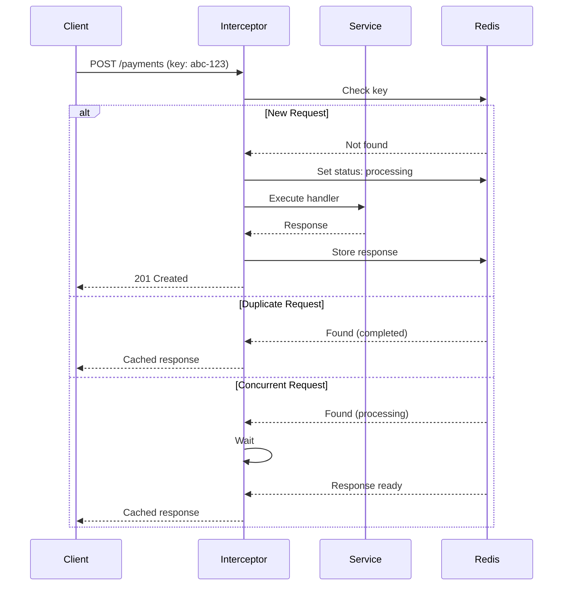
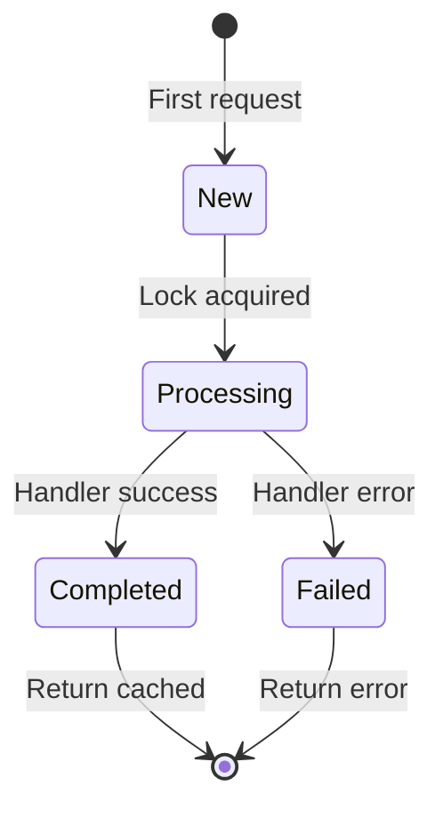

# Idempotency Plugin

Request deduplication solution that ensures operations execute exactly once, even when clients retry requests due to network issues or timeouts.

## Overview

The Idempotency Plugin provides idempotency key handling with request fingerprinting, response caching, and concurrent request management. Useful for payment processing, order creation, and any mutation that should not execute multiple times.

| Challenge | Without Idempotency | With Idempotency Plugin |
|-----------|---------------------|------------------------|
| Network Retry | Duplicate payment processed | Original response returned |
| Client Timeout | Unknown operation state | Safe to retry |
| Double Click | Multiple orders created | Single order |

## Key Features

- **Idempotency Key Handling** — Header validation and processing
- **Request Fingerprinting** — Detect mismatched requests with same key
- **Response Replay** — Return cached response for duplicate requests
- **Concurrent Request Handling** — Second request waits for first to complete
- **Configurable TTL** — Control how long responses are cached
- **Header Preservation** — Original response headers included in replay

## Installation

::: code-group

```bash [ioredis]
npm install @nestjs-redisx/core @nestjs-redisx/idempotency ioredis
```

```bash [node-redis]
npm install @nestjs-redisx/core @nestjs-redisx/idempotency redis
```

:::

## Basic Configuration

<<< @/apps/demo/src/plugins/idempotency/basic-config.setup.ts{typescript}

## Usage with Decorator

<<< @/apps/demo/src/plugins/idempotency/decorator-basic.usage.ts{typescript}

## Client Integration

```bash
# Initial request
curl -X POST https://api.example.com/payments \
  -H "Idempotency-Key: pay_550e8400-e29b-41d4" \
  -H "Content-Type: application/json" \
  -d '{"amount": 10000, "currency": "USD"}'

# Response: {"id": "pay_123", "status": "completed"}

# Retry with same key (safe after timeout or error)
curl -X POST https://api.example.com/payments \
  -H "Idempotency-Key: pay_550e8400-e29b-41d4" \
  -d '{"amount": 10000, "currency": "USD"}'

# Returns cached response: {"id": "pay_123", "status": "completed"}
```

## Request Flow



## Request States



## Documentation

| Topic | Description |
|-------|-------------|
| [Core Concepts](./concepts) | Understanding idempotency |
| [Configuration](./configuration) | Configuration reference |
| [@Idempotent Decorator](./decorator) | Route-level idempotency |
| [Service API](./service-api) | Programmatic idempotency |
| [Fingerprinting](./fingerprinting) | Request validation |
| [Concurrent Requests](./concurrent-requests) | Handling parallel requests |
| [Header Caching](./headers) | Response header preservation |
| [Client Guide](./client-guide) | Integration guidelines |
| [Monitoring](./monitoring) | Metrics and observability |
| [Testing](./testing) | Testing idempotent endpoints |
| [Recipes](./recipes) | Implementation examples |
| [Troubleshooting](./troubleshooting) | Debugging common issues |
