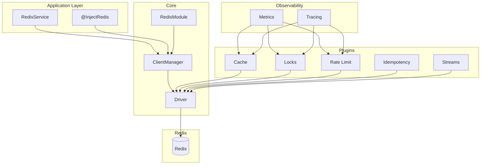

# Reference

Complete API reference for NestJS RedisX core module and plugins.

## Core Module

`@nestjs-redisx/core` is the foundation package that provides:

- **RedisModule** — NestJS module for Redis integration
- **RedisService** — High-level Redis operations wrapper
- **Driver Abstraction** — Switch between ioredis and node-redis
- **Multi-Client Support** — Manage multiple Redis connections
- **Connection Types** — Single, Cluster, and Sentinel configurations
- **Health Monitoring** — Automatic reconnection and health checks
- **Plugin System** — Extensible architecture for plugins

### Installation

::: code-group

```bash [ioredis (default)]
npm install @nestjs-redisx/core ioredis
```

```bash [node-redis]
npm install @nestjs-redisx/core redis
```

:::

### Quick Start

```typescript
import { Module } from '@nestjs/common';
import { RedisModule } from '@nestjs-redisx/core';

@Module({
  imports: [
    RedisModule.forRoot({
      clients: {
        host: 'localhost',
        port: 6379,
      },
    }),
  ],
})
export class AppModule {}
```

### Core Documentation

| Section | Description |
|---------|-------------|
| [Configuration](./core/configuration) | Complete configuration reference |
| [RedisService](./core/redis-service) | Service API documentation |
| [Multiple Clients](./core/multiple-clients) | Named client management |
| [Connection Types](./core/connection-types) | Single, Cluster, Sentinel |
| [Health Monitoring](./core/health-monitoring) | Health checks and reconnection |
| [Decorators](./core/decorators) | @InjectRedis usage |
| [Driver Abstraction](./core/driver-abstraction) | ioredis vs node-redis |
| [Troubleshooting](./core/troubleshooting) | Common issues and solutions |

## Plugins

Self-contained feature modules for common Redis use cases.

| Plugin | Description |
|--------|-------------|
| [Cache](./cache/) | Two-tier caching with L1 memory and L2 Redis |
| [Locks](./locks/) | Distributed locking with auto-renewal |
| [Rate Limit](./rate-limit/) | Multiple algorithms for API protection |
| [Idempotency](./idempotency/) | Request deduplication with response replay |
| [Streams](./streams/) | Redis Streams with consumer groups |
| [Metrics](./metrics/) | Prometheus metrics export |
| [Tracing](./tracing/) | OpenTelemetry distributed tracing |

## Architecture


