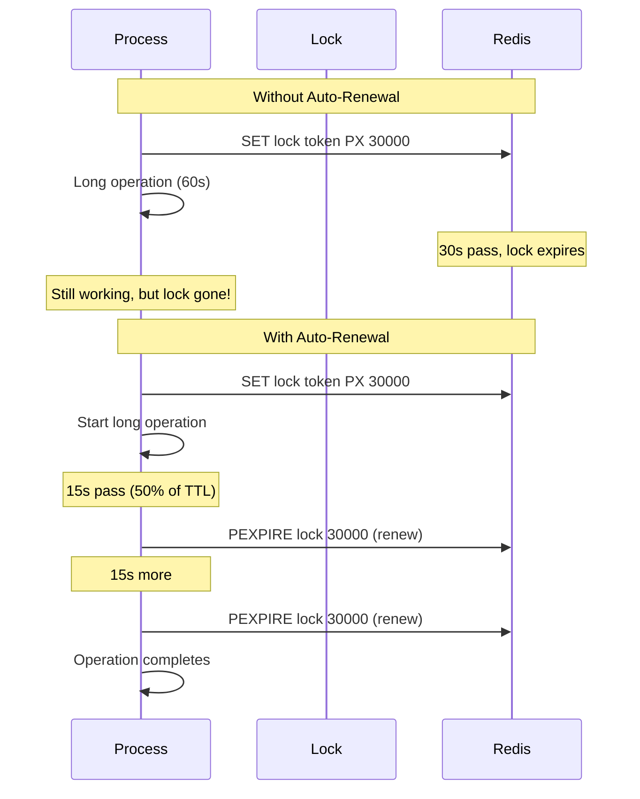

# Auto-Renewal

Prevent lock expiration during long-running operations.

## Why Auto-Renewal?



## Configuration

```typescript
new LocksPlugin({
  autoRenew: {
    enabled: true,          // Enable auto-renewal
    intervalFraction: 0.5,  // Renew at 50% of TTL
  },
})
```

## How It Works

When auto-renewal is enabled:

1. Lock acquired with TTL (e.g., 30s)
2. Timer starts: `interval = TTL * intervalFraction`
3. At 15s (50%), lock renewed to 30s again
4. Repeats until operation completes
5. Lock released, timer stopped

```
TTL = 30000ms, intervalFraction = 0.5

Timeline:
0s      15s     30s     45s     60s
|-------|-------|-------|-------|
Lock    Renew   Renew   Renew   Release
30s     +30s    +30s    +30s    
```

## Usage

### With Decorator

```typescript
@WithLock({ 
  key: 'export:{0}', 
  ttl: 60000,
  autoRenew: true,  // Enable for this lock
})
async exportLargeReport(reportId: string) {
  // This may take several minutes
  // Lock will auto-renew every 30 seconds
}
```

### With Service API

```typescript
const lock = await this.lockService.acquire('long:task', {
  ttl: 30000,
  autoRenew: true,
});

try {
  await this.longRunningOperation();
} finally {
  await lock.release();  // Stops auto-renewal
}
```

## Best Practices

### When to Use

| Operation | Duration | Auto-Renew? |
|-----------|----------|-------------|
| Quick DB update | < 5s | No |
| API call | 5-30s | Maybe |
| File upload | 30-300s | Yes |
| Report generation | > 1min | Yes (required) |
| Data export | > 5min | Yes (required) |

### Recommended Settings

```typescript
// Short operations - no renewal
{
  ttl: 10000,
  autoRenew: false,
}

// Medium operations - renewal for safety
{
  ttl: 30000,
  autoRenew: true,
  // intervalFraction is configured globally in LocksPlugin, not per-lock
}

// Long operations - aggressive renewal
{
  ttl: 60000,
  autoRenew: true,
}

// Configure intervalFraction globally:
new LocksPlugin({
  autoRenew: {
    intervalFraction: 0.3,  // Renew at 30% of TTL (default: 0.5)
  },
})
```

## Renewal Failure

If renewal fails (e.g., Redis goes down), the auto-renew timer stops silently
and the lock expires naturally in Redis. The running operation is **not** interrupted.

::: warning
After the lock expires, another process may acquire it — potentially causing
concurrent access. For critical operations, combine locks with idempotency.
:::

To detect if the lock was lost mid-operation:

```typescript
const lock = await this.lockService.acquire('critical:key', {
  ttl: 30000,
  autoRenew: true,
});

try {
  await this.step1();

  // Check if we still hold the lock before continuing
  if (!(await lock.isHeld())) {
    throw new Error('Lock lost during operation — aborting');
  }

  await this.step2();
} finally {
  await lock.release();
}
```

## Next Steps

- [Retry Strategies](./retry-strategies) — Retry configuration
- [Patterns](./patterns) — Common lock patterns
