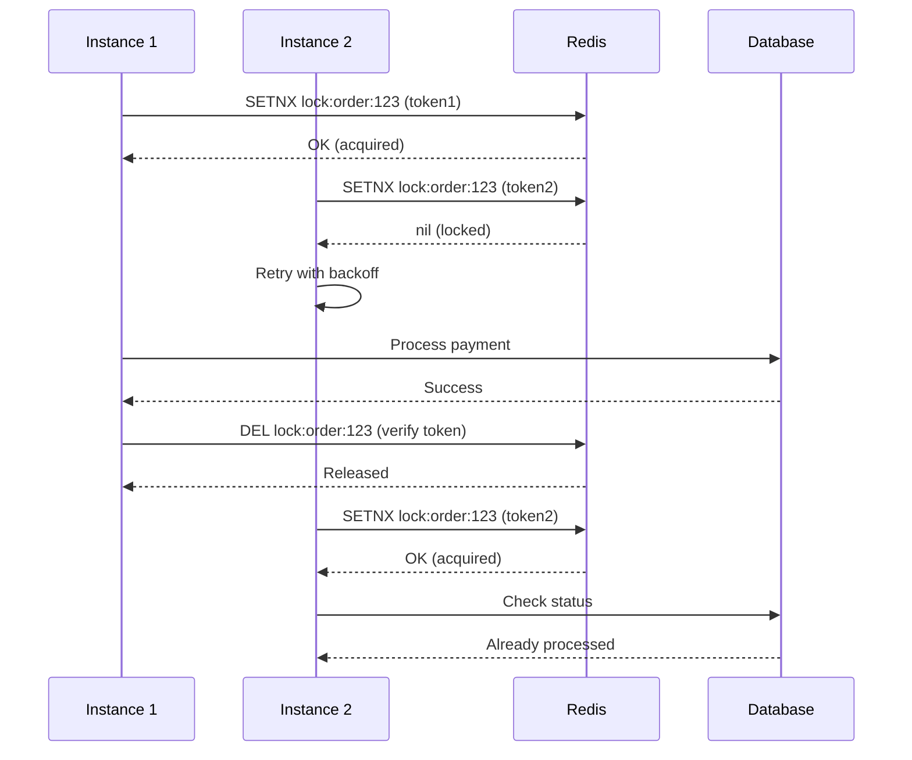

# Locks Plugin

Distributed locking solution for coordinating access to shared resources across multiple application instances.

## Overview

The Locks Plugin provides Redis-based distributed locking with automatic renewal, ownership validation, and configurable retry strategies. Useful for preventing race conditions in distributed systems.

| Challenge | Without Locks | With Locks Plugin |
|-----------|---------------|-------------------|
| Double Payment | Multiple instances process same payment | Single instance processes, others skip |
| Race Conditions | Concurrent updates corrupt data | Sequential, atomic updates |
| Job Duplication | Multiple workers execute same job | One worker per job |
| Inventory Oversell | 10 items available, 15 sold | Inventory tracking |

## Key Features

- **Redis-Based Locking** — Atomic lock acquisition using Lua scripts
- **Automatic Renewal** — Configurable TTL extension for long-running operations
- **Ownership Validation** — Unique tokens prevent accidental release by other processes
- **Retry Strategies** — Exponential backoff with configurable multiplier and delay caps
- **Graceful Shutdown** — Automatic lock release on application termination
- **Decorator API** — `@WithLock` decorator for declarative locking

## Installation

::: code-group

```bash [ioredis]
npm install @nestjs-redisx/core @nestjs-redisx/locks ioredis
```

```bash [node-redis]
npm install @nestjs-redisx/core @nestjs-redisx/locks redis
```

:::

## Basic Configuration

<<< @/apps/demo/src/plugins/locks/basic-config.setup.ts{typescript}

## Usage with Decorator

<<< @/apps/demo/src/plugins/locks/decorator-basic.usage.ts{typescript}

## Usage with Service API

<<< @/apps/demo/src/plugins/locks/service-basic.usage.ts{typescript}

## Lock Flow



## Common Use Cases

| Scenario | Implementation |
|----------|----------------|
| Payment Processing | Lock per order ID to prevent double charges |
| Inventory Management | Lock per SKU during stock updates |
| Job Processing | Lock per job ID for at-most-once execution |
| Leader Election | Single lock for scheduler or cron jobs |
| Sequential Operations | Lock per resource for ordered operations |

## Documentation

| Topic | Description |
|-------|-------------|
| [Core Concepts](./concepts) | Understanding distributed locking |
| [Configuration](./configuration) | Configuration reference |
| [@WithLock Decorator](./decorator) | Declarative locking |
| [Service API](./service-api) | Programmatic lock operations |
| [Auto-Renewal](./auto-renewal) | TTL extension for long operations |
| [Retry Strategies](./retry-strategies) | Handling lock contention |
| [Patterns](./patterns) | Common locking patterns |
| [Monitoring](./monitoring) | Metrics and observability |
| [Testing](./testing) | Testing locked services |
| [Recipes](./recipes) | Implementation examples |
| [Troubleshooting](./troubleshooting) | Debugging common issues |
