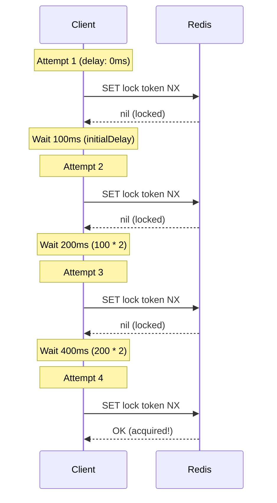

# Retry Strategies

Configure how locks retry when acquisition fails.

## Exponential Backoff



## Configuration

```typescript
new LocksPlugin({
  retry: {
    maxRetries: 3,        // Max attempts
    initialDelay: 100,    // First retry delay (ms)
    maxDelay: 3000,       // Cap delay (ms)
    multiplier: 2,        // Exponential multiplier
  },
})
```

## Retry Calculation

```
delay(attempt) = min(initialDelay * multiplier^attempt, maxDelay)

Example (initialDelay=100, multiplier=2, maxDelay=3000):
Attempt 1: 100ms
Attempt 2: 200ms
Attempt 3: 400ms
Attempt 4: 800ms
Attempt 5: 1600ms
Attempt 6: 3000ms (capped)
```

## Per-Lock Override (Service API)

Override global retry settings per-operation using the service API:

```typescript
const lock = await this.lockService.acquire('high:contention:key', {
  retry: {
    maxRetries: 10,      // More retries than global default
    initialDelay: 50,    // Faster first retry
  },
});

try {
  await this.process();
} finally {
  await lock.release();
}
```

Note: `maxDelay` and `multiplier` can only be set at the plugin level.
The `@WithLock` decorator always uses global retry settings.

## Use Cases

### High Contention

```typescript
retry: {
  maxRetries: 10,
  initialDelay: 50,
  maxDelay: 2000,
  multiplier: 1.5,  // Slower growth
}
```

### Low Contention

```typescript
retry: {
  maxRetries: 2,
  initialDelay: 200,
  maxDelay: 5000,
  multiplier: 3,  // Faster growth
}
```

### No Retry (Fail Fast)

```typescript
retry: {
  maxRetries: 0,  // No retries
}
```

## Best Practices

### Do

```typescript
// Reasonable retry count
retry: { maxRetries: 3-5 }

// Start with small delay
retry: { initialDelay: 50-200 }

// Cap max delay
retry: { maxDelay: 2000-5000 }
```

### Don't

```typescript
// Too many retries
retry: { maxRetries: 100 }

// Too long initial delay
retry: { initialDelay: 5000 }

// No max delay cap
retry: { maxDelay: Infinity }
```

## Next Steps

- [Patterns](./patterns) — Common lock patterns
- [Monitoring](./monitoring) — Track lock metrics
