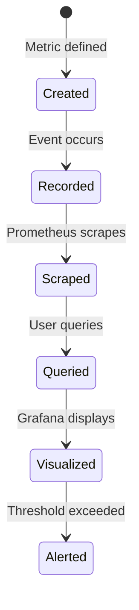

# Core Concepts

Understand Prometheus metrics fundamentals.

## Metric Types

### Counter

A **counter** is a cumulative metric that only increases.

**Use for:** Counting events (requests, errors, operations)

```typescript
// Example: Track cache hits
metrics.incrementCounter('redisx_cache_hits_total', { layer: 'l1' });

// Value over time:
// t=0:  0
// t=1:  5
// t=2:  12
// t=3:  18  ← Always increasing
```

**In Prometheus:**

```yaml
# Total cache hits
redisx_cache_hits_total{layer="l1"}

# Rate per second (more useful)
rate(redisx_cache_hits_total{layer="l1"}[5m])
```

### Gauge

A **gauge** is a metric that can go up or down.

**Use for:** Current values (active connections, queue size, memory usage)

```typescript
// Example: Track active locks
activeLocks.set(5);  // Set to 5
activeLocks.inc();   // Increase to 6
activeLocks.dec();   // Decrease to 5

// Value over time:
// t=0:  0
// t=1:  5
// t=2:  3  ← Can decrease
// t=3:  7  ← Can increase
```

**In Prometheus:**

```yaml
# Current active locks
redisx_locks_active

# Average over time
avg_over_time(redisx_locks_active[5m])
```

### Histogram

A **histogram** samples observations and counts them in buckets.

**Use for:** Measuring distributions (latency, request sizes)

```typescript
// Example: Track command latency
const timer = commandDuration.startTimer({ command: 'GET' });
// ... execute command ...
timer();  // Records duration
```

**Buckets:**

```
le="0.001": 1523  ← 1523 requests < 1ms
le="0.005": 2891  ← 2891 requests < 5ms
le="0.01":  3102  ← 3102 requests < 10ms
+Inf:       3102  ← Total requests
```

**In Prometheus:**

```yaml
# P95 latency
histogram_quantile(0.95,
  rate(myapp_redis_command_duration_seconds_bucket[5m])
)

# P99 latency
histogram_quantile(0.99,
  rate(myapp_redis_command_duration_seconds_bucket[5m])
)

# Average latency
rate(myapp_redis_command_duration_seconds_sum[5m])
/
rate(myapp_redis_command_duration_seconds_count[5m])
```

### Summary

A **summary** is similar to histogram but calculates quantiles on the client side.

**Use for:** Pre-calculated percentiles (less common, prefer histograms)

## Labels

Labels add dimensions to metrics.

### Good Labels

```typescript
// ✅ Good - Low cardinality
metrics.incrementCounter('cache_hits_total', {
  layer: 'l1',             // Limited values: l1, l2
});

// ✅ Good - Bounded values
metrics.incrementCounter('lock_acquisitions_total', {
  status: 'success',       // Limited values: success, failed
});
```

### Bad Labels

```typescript
// ❌ Bad - High cardinality
metrics.incrementCounter('cache_hits_total', {
  userId: '12345',         // Millions of unique values!
  timestamp: Date.now().toString(),   // Infinite values!
});

// ❌ Bad - Unbounded
metrics.incrementCounter('lock_acquisitions_total', {
  lockKey: randomUUID(),   // Every lock is unique!
});
```

### Label Best Practices

**1. Use low-cardinality labels:**

```typescript
// ❌ Bad - Too many unique values
{ endpoint: '/api/users/12345/profile' }

// ✅ Good - Grouped by pattern
{ endpoint: '/api/users/:id/profile' }
```

**2. Limit number of labels:**

```typescript
// ❌ Bad - Too many labels
{
  service, region, datacenter,
  rack, server, pod, container
}

// ✅ Good - Essential labels only
{ service, region, env }
```

**3. Choose meaningful names:**

```typescript
// ❌ Bad - Unclear
{ t: 'u', o: 'g' }

// ✅ Good - Self-documenting
{ type: 'user', operation: 'get' }
```

## Cardinality

**Cardinality** = Number of unique time series

```typescript
// Metric with 2 labels:
// - namespace: 3 values (users, products, orders)
// - operation: 4 values (get, set, delete, exists)
// Cardinality = 3 × 4 = 12 time series
```

### High Cardinality Problems

**Symptoms:**
- High memory usage in Prometheus
- Slow queries
- OOM errors

**Causes:**

```typescript
// ❌ This creates millions of time series!
httpRequests.inc({
  userId: req.user.id,      // 1M users
  requestId: req.id,        // Infinite
  timestamp: Date.now(),    // Infinite
});
// Cardinality = ∞
```

**Solutions:**

```typescript
// ✅ Use aggregated labels
httpRequests.inc({
  endpoint: normalizeEndpoint(req.path),  // ~100 endpoints
  method: req.method,                     // 9 methods
  status: Math.floor(res.status / 100),   // 5 categories (2xx, 3xx, etc)
});
// Cardinality = 100 × 9 × 5 = 4,500 ✓
```

## Naming Conventions

### Metric Names

```typescript
// Pattern: <namespace>_<subsystem>_<name>_<unit>

// ✅ Good examples
redisx_command_duration_seconds
redisx_cache_hits_total
redisx_locks_active

// ❌ Bad examples
redis_time              // Missing unit
CacheHits               // Not snake_case
myapp_hits              // Missing subsystem
```

### Label Names

```typescript
// ✅ Good - Snake case, descriptive
{
  http_method: 'GET',
  status_code: '200',
  cache_tier: 'l1',
}

// ❌ Bad - Inconsistent, unclear
{
  Method: 'GET',         // PascalCase
  code: '200',           // Too short
  tier1: 'yes',          // tier1 what?
}
```

## Metric Lifecycle



## Best Practices

### 1. Choose the Right Type

| Scenario | Metric Type | Example |
|----------|-------------|---------|
| Count events | Counter | `cache_hits_total` |
| Current value | Gauge | `active_connections` |
| Latency/duration | Histogram | `command_duration_seconds` |
| Size distribution | Histogram | `message_size_bytes` |

### 2. Use Consistent Units

```typescript
// ✅ Good - Use base units
command_duration_seconds  // Not milliseconds
memory_bytes             // Not megabytes
temperature_celsius      // Not fahrenheit

// ✅ Good - Add suffix
_total    // Counter
_seconds  // Duration
_bytes    // Size
_ratio    // 0-1 value (e.g., hit rate)
```

### 3. Keep Labels Bounded

```typescript
// ✅ Good
const allowedLayers = ['l1', 'l2'];
if (allowedLayers.includes(layer)) {
  metrics.incrementCounter('cache_hits_total', { layer });
}

// ❌ Bad - Unbounded
metrics.incrementCounter('cache_hits_total', { key: userInput });  // Any value!
```

### 4. Use Histograms for Latency

```typescript
// ✅ Good - Can calculate percentiles
const timer = commandDuration.startTimer();
await executeCommand();
timer();

// ❌ Bad - Lose distribution info
const start = Date.now();
await executeCommand();
avgLatency.set(Date.now() - start);
```

### 5. Avoid High Cardinality

```typescript
// Rule of thumb:
// Total cardinality < 10,000 per metric = ✅ Good
// Total cardinality > 100,000 per metric = ⚠️  Warning
// Total cardinality > 1,000,000 per metric = ❌ Bad
```

## Query Examples

### Rate

```yaml
# Requests per second
rate(http_requests_total[5m])
```

### Percentiles

```yaml
# P95 latency
histogram_quantile(0.95,
  rate(http_request_duration_seconds_bucket[5m])
)
```

### Error Rate

```yaml
# Error percentage
sum(rate(http_requests_total{status=~"5.."}[5m]))
/
sum(rate(http_requests_total[5m]))
* 100
```

### Aggregation

```yaml
# Total across all instances
sum(redis_connections_active)

# Average per instance
avg(redis_connections_active)

# Max across instances
max(redis_connections_active)
```

## Next Steps

- [Configuration](./configuration) — Configure metrics
- [Prometheus](./prometheus) — Set up Prometheus
- [Custom Metrics](./custom-metrics) — Create your own metrics
