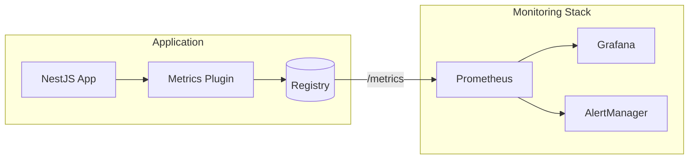

# Metrics Plugin

Prometheus-compatible metrics for monitoring Redis operations, cache performance, and plugin health.

## Overview

The Metrics Plugin provides observability into your Redis operations with Prometheus-format metrics.

| Question | Without Metrics | With Metrics Plugin |
|----------|-----------------|---------------------|
| Is Redis slow? | Unknown | p99 latency visible |
| Cache hit rate? | Unknown | Hit rate visible |
| Lock contention? | Guesswork | Metrics available |
| Error rate? | Check logs | Error counters |

## Key Features

- **Prometheus Format** — Standard metrics format compatible with Prometheus-based systems
- **Automatic Instrumentation** — Plugins emit metrics when enabled
- **Built-in Endpoint** — HTTP endpoint for Prometheus scraping
- **Custom Metrics** — API for adding application-specific metrics
- **Grafana Dashboards** — Example dashboards for visualizations
- **Alert Templates** — Example AlertManager configurations

## Installation

::: code-group

```bash [ioredis]
npm install @nestjs-redisx/core @nestjs-redisx/metrics ioredis
```

```bash [node-redis]
npm install @nestjs-redisx/core @nestjs-redisx/metrics redis
```

:::

## Basic Configuration

<<< @/apps/demo/src/plugins/metrics/basic-config.setup.ts{typescript}

## Viewing Metrics

```bash
curl http://localhost:3000/metrics
```

```yaml
# HELP redisx_cache_hits_total Total cache hits
# TYPE redisx_cache_hits_total counter
redisx_cache_hits_total{layer="l1"} 15234

# HELP redisx_cache_misses_total Total cache misses
# TYPE redisx_cache_misses_total counter
redisx_cache_misses_total{layer="l1"} 892

# HELP redisx_command_duration_seconds Redis command latency in seconds
# TYPE redisx_command_duration_seconds histogram
redisx_command_duration_seconds_bucket{command="GET",client="default",le="0.001"} 1523
redisx_command_duration_seconds_bucket{command="GET",client="default",le="0.005"} 2891
```

## Available Metrics

### Command Metrics

| Metric | Type | Labels | Description |
|--------|------|--------|-------------|
| `commands_total` | Counter | command, client, status | Total Redis commands |
| `command_duration_seconds` | Histogram | command, client | Command latency |
| `connections_active` | Gauge | client | Active connections |
| `errors_total` | Counter | client, error_type | Total errors |

### Cache Metrics

| Metric | Type | Labels | Description |
|--------|------|--------|-------------|
| `cache_hits_total` | Counter | layer | Cache hits |
| `cache_misses_total` | Counter | layer | Cache misses |
| `cache_hit_ratio` | Gauge | layer | Hit ratio (0-1) |
| `cache_size` | Gauge | layer | Current cache size |
| `cache_stampede_prevented_total` | Counter | — | Stampede preventions |

### Lock Metrics

| Metric | Type | Labels | Description |
|--------|------|--------|-------------|
| `lock_acquisitions_total` | Counter | status | Lock attempts |
| `lock_wait_duration_seconds` | Histogram | — | Wait time |
| `lock_hold_duration_seconds` | Histogram | — | Hold time |
| `locks_active` | Gauge | — | Active lock count |

### Rate Limit Metrics

| Metric | Type | Labels | Description |
|--------|------|--------|-------------|
| `ratelimit_requests_total` | Counter | status | Rate limit requests |

### Stream Metrics

| Metric | Type | Labels | Description |
|--------|------|--------|-------------|
| `stream_messages_published_total` | Counter | stream | Messages published |
| `stream_messages_consumed_total` | Counter | stream, group, status | Messages consumed |
| `stream_publish_duration_seconds` | Histogram | stream | Publish latency |
| `stream_publish_errors_total` | Counter | stream | Publish errors |
| `stream_processing_duration_seconds` | Histogram | stream, group | Processing duration |

### Idempotency Metrics

| Metric | Type | Labels | Description |
|--------|------|--------|-------------|
| `idempotency_requests_total` | Counter | status | Idempotency requests |
| `idempotency_duration_seconds` | Histogram | — | Check duration |

## Architecture



## Documentation

| Topic | Description |
|-------|-------------|
| [Core Concepts](./concepts) | Understanding metrics collection |
| [Configuration](./configuration) | Configuration reference |
| [Prometheus](./prometheus) | Prometheus integration |
| [Grafana Dashboards](./grafana) | Example visualizations |
| [Plugin Metrics](./plugin-metrics) | Metrics from each plugin |
| [Custom Metrics](./custom-metrics) | Adding application metrics |
| [Alerting](./alerting) | AlertManager configuration |
| [Troubleshooting](./troubleshooting) | Debugging common issues |
