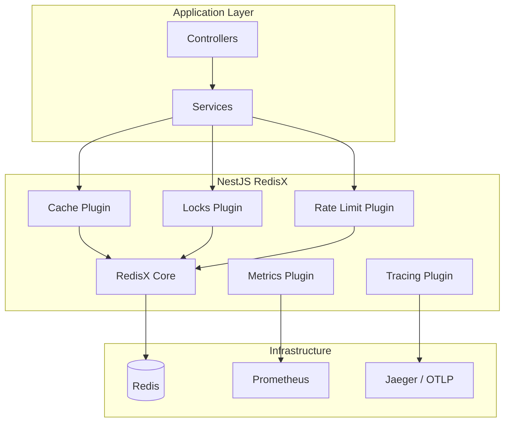

# Plugins Overview

NestJS RedisX provides a suite of Redis plugins for common use cases. Each plugin is **self-contained** and can be used independently or combined together.

## Available Plugins

### Cache Plugin

**Two-tier caching with L1 (memory) and L2 (Redis)**

```typescript
new CachePlugin({
  l1: { maxSize: 1000, ttl: 60 },
  l2: { defaultTtl: 3600 },
})
```

**Key Features:**
- In-memory (L1) + Redis (L2) two-tier architecture
- Stampede protection to prevent cache avalanche
- Stale-While-Revalidate for improved latency
- Tag-based invalidation for grouped cache management
- Event-driven invalidation via pub/sub
- Multi-tenant support with configurable `varyBy`

[Learn more](../cache/)

---

### Locks Plugin

**Distributed locking with automatic management**

```typescript
new LocksPlugin({
  defaultTtl: 30000,
  autoRenew: { enabled: true },
})
```

**Key Features:**
- Redis-based distributed locking
- Automatic TTL extension for long-running operations
- Lock ownership validation and safe release
- Configurable timeout and retry strategies
- Declarative API with `@WithLock` decorator

**Common Use Cases:**
- Preventing duplicate job execution in distributed systems
- Coordinating distributed cron jobs across instances
- Ensuring single-writer semantics for critical resources

[Learn more](../locks/)

---

### Rate Limit Plugin

**Flexible rate limiting with multiple algorithms**

```typescript
new RateLimitPlugin({
  defaultPoints: 100,
  defaultDuration: 60,
  defaultAlgorithm: 'sliding-window',
})
```

**Key Features:**
- Fixed window algorithm for simple use cases
- Sliding window algorithm for smooth rate limiting
- Token bucket algorithm for burst handling
- Flexible key strategies (per-user, per-IP, custom)
- Configurable responses and headers
- Route-specific and global limits

**Common Use Cases:**
- API rate limiting for external consumers
- Login attempt throttling for security
- Resource quota enforcement

[Learn more](../rate-limit/)

---

### Idempotency Plugin

**Request deduplication with response replay**

```typescript
new IdempotencyPlugin({
  defaultTtl: 3600000,
  validateFingerprint: true,
})
```

**Key Features:**
- Idempotency key validation
- Request fingerprinting (method, path, body hash)
- Automatic response replay for duplicate requests
- Configurable TTL per operation
- Concurrent request handling with locking

**Common Use Cases:**
- Payment processing to prevent double charges
- Order creation in e-commerce systems
- Webhook delivery with retry logic

[Learn more](../idempotency/)

---

### Streams Plugin

**Redis Streams with consumer groups**

```typescript
new StreamsPlugin({
  consumer: {
    batchSize: 10,
    blockTimeout: 5000,
  },
})
```

**Key Features:**
- Full Redis Streams API support
- Consumer groups for distributed processing
- Automatic retry with exponential backoff
- Dead Letter Queue (DLQ) for failed messages
- Configurable batch processing
- Declarative consumers with `@StreamConsumer`

**Common Use Cases:**
- Event-driven microservices architecture
- Background job and task processing
- Real-time data pipelines

[Learn more](../streams/)

---

### Metrics Plugin

**Prometheus metrics and monitoring**

```typescript
new MetricsPlugin({
  enabled: true,
  endpoint: '/metrics',
})
```

**Key Features:**
- Prometheus-compatible metrics format
- Operation counters (hits, misses, acquisitions)
- Latency histograms with configurable buckets
- Automatic labeling by operation and status
- Built-in HTTP endpoint for scraping

**Exposed Metrics:**
- `redisx_cache_hits_total` / `redisx_cache_misses_total`
- `redisx_lock_acquisitions_total` / `redisx_lock_releases_total`
- `redisx_rate_limit_allowed_total` / `redisx_rate_limit_rejected_total`
- `redisx_operation_duration_seconds` (histogram)

[Learn more](../metrics/)

---

### Tracing Plugin

**OpenTelemetry distributed tracing**

```typescript
new TracingPlugin({
  enabled: true,
  serviceName: 'my-service',
})
```

**Key Features:**
- OpenTelemetry SDK integration
- Automatic span creation for all operations
- Attribute tagging (keys, TTLs, results)
- Distributed trace context propagation
- Compatible with Jaeger, Zipkin, Datadog, Honeycomb

**Traced Operations:**
- Cache get/set/delete with key and result info
- Lock acquire/release with timing and ownership
- Rate limit checks with remaining quota
- Stream publish/consume with message details

[Learn more](../tracing/)

---

## Plugin Status

| Plugin | Version | Status |
|--------|---------|--------|
| Cache | 0.1.0 | Stable |
| Locks | 0.1.0 | Stable |
| Rate Limit | 0.1.0 | Stable |
| Idempotency | 0.1.0 | Stable |
| Streams | 0.1.0 | Stable |
| Metrics | 0.1.0 | Stable |
| Tracing | 0.1.0 | Stable |

## Combining Plugins

All plugins can work together. The Metrics and Tracing plugins automatically instrument other plugins when enabled:

```typescript
@Module({
  imports: [
    RedisModule.forRoot({
      clients: {
        host: process.env.REDIS_HOST,
        port: parseInt(process.env.REDIS_PORT, 10),
      },
      plugins: [
        new CachePlugin({ /* ... */ }),
        new LocksPlugin({ /* ... */ }),
        new RateLimitPlugin({ /* ... */ }),
        new MetricsPlugin({ enabled: true }),
        new TracingPlugin({ enabled: true }),
      ],
    }),
  ],
})
export class AppModule {}
```

::: tip Modular Design
Each plugin is self-contained. You only pay for what you use — unused plugins are not loaded.
:::

## Architecture Overview



## Next Steps

- [Core Module](../core/) — RedisModule, RedisService, and connection management
- [Cache Plugin](../cache/) — Caching documentation
- [Locks Plugin](../locks/) — Distributed locking patterns
- [Rate Limit Plugin](../rate-limit/) — API protection strategies
- [Installation Guide](/en/guide/installation) — Get started
