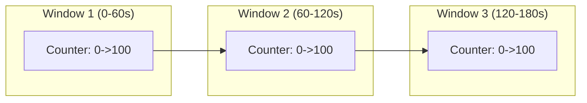
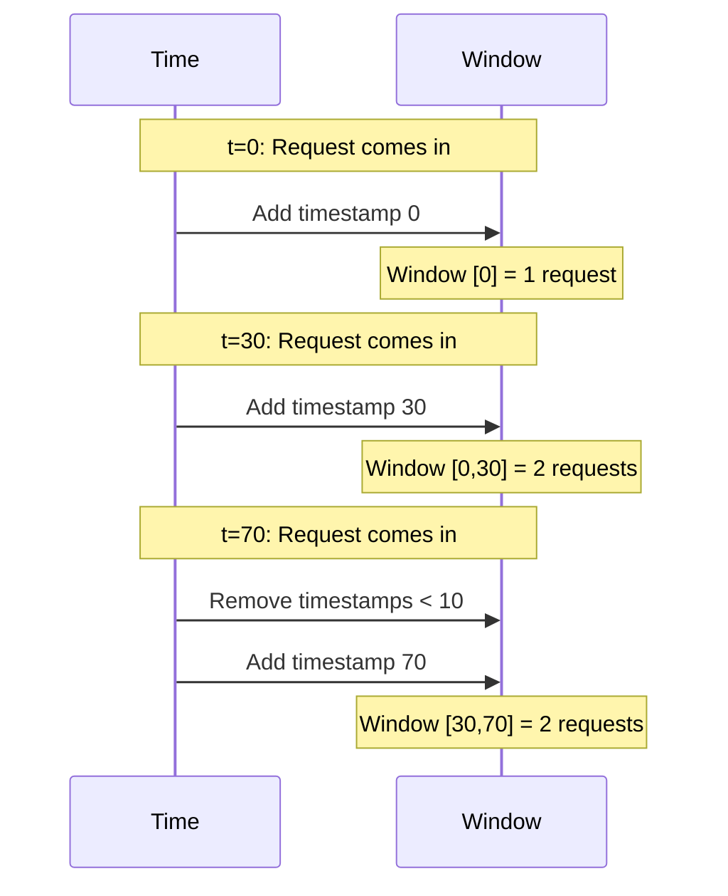
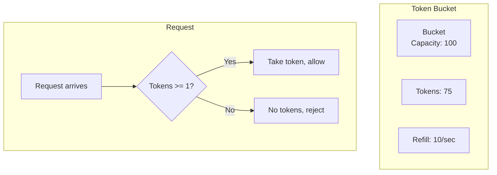
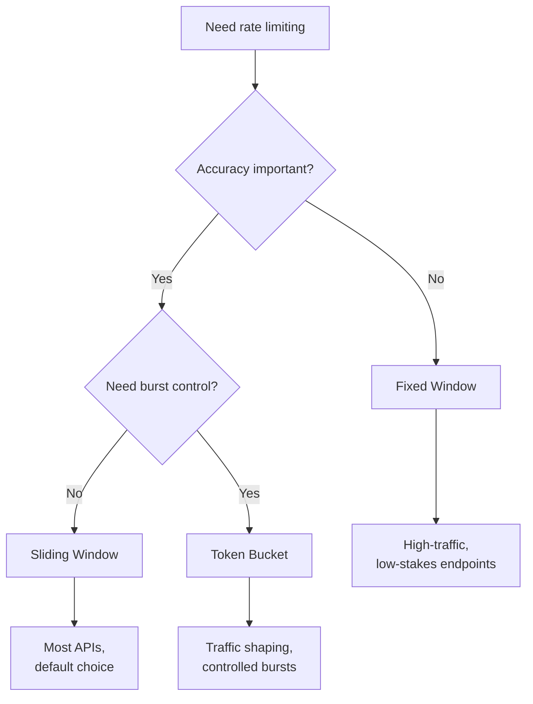

# Rate Limiting Algorithms

Choose the right algorithm for your use case.

## Overview

| Algorithm | Memory | Accuracy | Burst | Best For |
|-----------|--------|----------|-------|----------|
| Fixed Window | Lowest | Low | At edges | Simple cases |
| Sliding Window | Medium | High | No | Most APIs |
| Token Bucket | Low | High | Controlled | Traffic shaping |

## Fixed Window

Counts requests in fixed time buckets.

### How It Works



### Redis Implementation

```lua
-- KEYS[1] = rate limit key
-- ARGV[1] = max points
-- ARGV[2] = window duration (seconds)

local current = redis.call('INCR', KEYS[1])

if current == 1 then
  redis.call('EXPIRE', KEYS[1], ARGV[2])
end

if current > tonumber(ARGV[1]) then
  return {0, 0, redis.call('TTL', KEYS[1]), current}  -- Rejected
else
  return {1, ARGV[1] - current, redis.call('TTL', KEYS[1]), current}  -- Allowed
end
```

### Pros & Cons

| Pros | Cons |
|------|------|
| Very simple | Burst at window edges |
| Lowest memory (1 counter) | Inaccurate near boundaries |
| Fast | Can allow 2x limit |

### The Boundary Problem

```
Limit: 100 requests per minute

Time:     55s         60s         65s
          |           |           |
          +---100 req-+---100 req-+
                      ^
              Window boundary

Result: 200 requests in 10 seconds!
```

### When to Use

- High-traffic endpoints where precision doesn't matter
- Simple rate limiting requirements
- When memory is extremely limited

### Configuration

```typescript
@RateLimit({
  algorithm: 'fixed-window',
  points: 100,
  duration: 60,
})
```

## Sliding Window

Tracks requests in a rolling time window.

### How It Works



### Redis Implementation

```lua
-- Uses sorted set with timestamps

local key = KEYS[1]
local max_points = tonumber(ARGV[1])
local duration = tonumber(ARGV[2]) * 1000
local now = tonumber(ARGV[3])
local request_id = ARGV[4]

local window_start = now - duration

-- Remove old entries
redis.call('ZREMRANGEBYSCORE', key, '-inf', window_start)

-- Count current
local current = redis.call('ZCARD', key)

if current < max_points then
  -- Add new request
  redis.call('ZADD', key, now, request_id)
  redis.call('PEXPIRE', key, duration)
  return {1, max_points - current - 1, ...}
else
  return {0, 0, ...}  -- Rejected
end
```

### Pros & Cons

| Pros | Cons |
|------|------|
| Accurate | Higher memory |
| No boundary issues | More Redis operations |
| Smooth limiting | Slightly slower |

### Memory Usage

```
Memory per key ~ N x (timestamp + id)
             ~ N x 24 bytes

For 1000 req/min: ~24KB per key
For 100 req/min: ~2.4KB per key
```

### When to Use

- Most API rate limiting scenarios
- When accuracy is important
- When you can afford slightly higher memory

### Configuration

```typescript
@RateLimit({
  algorithm: 'sliding-window',
  points: 100,
  duration: 60,
})
```

## Token Bucket

Tokens refill at constant rate, requests consume tokens.

### How It Works



### Token Refill

```
Time 0:   [####################] 100 tokens
          | 30 requests
Time 1:   [################    ] 70 tokens
          | +10 refill
Time 2:   [##################  ] 80 tokens
          | 90 requests (only 80 allowed!)
Time 3:   [                    ] 0 tokens
          | +10 refill
Time 4:   [##                  ] 10 tokens
```

### Redis Implementation

```lua
local capacity = tonumber(ARGV[1])
local refill_rate = tonumber(ARGV[2])
local now = tonumber(ARGV[3])

-- Get current state
local bucket = redis.call('HMGET', key, 'tokens', 'last_refill')
local tokens = tonumber(bucket[1]) or capacity
local last_refill = tonumber(bucket[2]) or now

-- Calculate refill
local elapsed = (now - last_refill) / 1000
local refill = elapsed * refill_rate
tokens = math.min(capacity, tokens + refill)

-- Try to consume
if tokens >= 1 then
  tokens = tokens - 1
  redis.call('HMSET', key, 'tokens', tokens, 'last_refill', now)
  return {1, tokens, ...}  -- Allowed
else
  return {0, 0, ...}  -- Rejected
end
```

### Pros & Cons

| Pros | Cons |
|------|------|
| Smooth rate | More complex |
| Allows controlled burst | Needs refill rate tuning |
| Natural traffic shaping | |

### Burst vs Sustained Rate

```typescript
// Allow burst of 100, sustained 10/sec
@RateLimit({
  algorithm: 'token-bucket',
  points: 100,        // Bucket capacity (burst)
  refillRate: 10,     // Sustained rate
})

// Timeline:
// t=0:  100 tokens available (full bucket)
// t=0:  80 requests -> 20 tokens left
// t=1:  +10 tokens -> 30 tokens
// t=2:  +10 tokens -> 40 tokens
// ...
```

### When to Use

- API rate limiting with burst allowance
- Traffic shaping
- When you need smooth rate over time
- WebSocket connections

### Configuration

```typescript
@RateLimit({
  algorithm: 'token-bucket',
  points: 100,       // Capacity
  refillRate: 10,    // Tokens per second
})
```

## Choosing an Algorithm



### Quick Decision Matrix

| Requirement | Algorithm |
|-------------|-----------|
| Simple, low memory | Fixed Window |
| Accurate, no bursts | Sliding Window |
| Allow initial burst | Token Bucket |
| Traffic shaping | Token Bucket |
| Default / unsure | Sliding Window |

## Next Steps

- [Key Extraction](./key-extraction) — Identify clients
- [Headers](./headers) — Response headers
