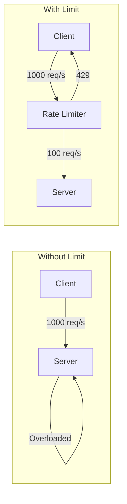
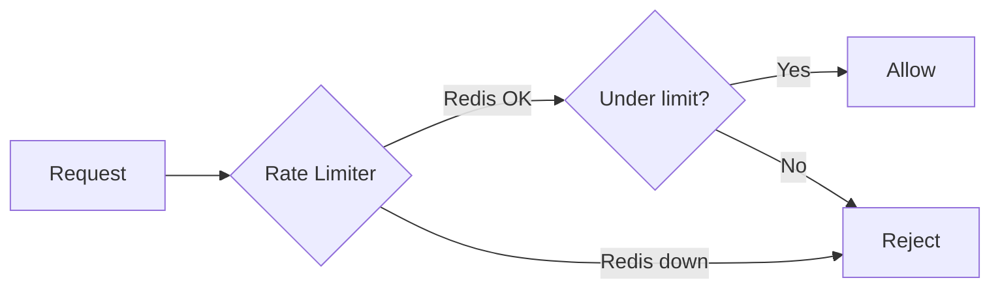
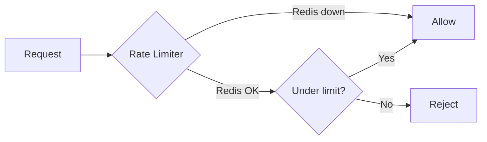
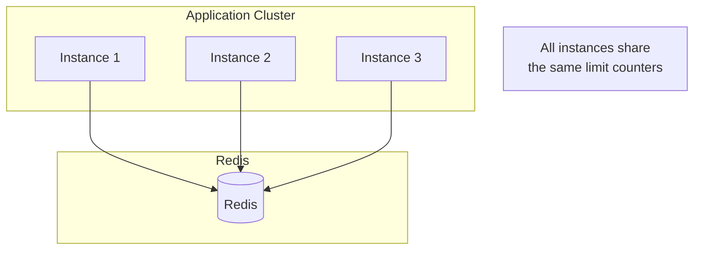

# Core Concepts

Understand rate limiting fundamentals.

## What is Rate Limiting?

Rate limiting restricts how many requests a client can make in a time period.



## Key Components

### 1. Rate Limit Key

Identifies WHO is being rate limited:

```
192.168.1.1          # By IP (default extractor)
user:123             # By user ID
apikey:sk_live_xxx   # By API key
tenant:acme          # By tenant (custom extractor)
global               # Everyone combined (static key)
```

::: tip
The full Redis key is built as `{keyPrefix}{algorithm}:{key}`. With defaults: `rl:sliding-window:user:123`.
:::

### 2. Window

Time period for counting requests:

| Window | Use Case |
|--------|----------|
| 1 second | Burst protection |
| 1 minute | Standard API limits |
| 1 hour | Quota management |
| 1 day | Usage caps |

### 3. Limit (Points)

Maximum requests allowed per window:

```typescript
@RateLimit({
  points: 100,    // 100 requests
  duration: 60,   // per 60 seconds
})
```

## Rate vs Quota

| Concept | Purpose | Time Scale | Reset |
|---------|---------|------------|-------|
| **Rate Limit** | Protect server | Seconds/minutes | Rolling |
| **Quota** | Control usage | Hours/days | Fixed |

```typescript
// Rate limit: server protection
@RateLimit({ points: 100, duration: 60 })  // 100/min

// Quota: usage control (use different duration)
@RateLimit({ points: 10000, duration: 86400 })  // 10K/day
```

## Window Types

### Fixed Window

Requests counted in fixed time buckets:

```
Time:   0s      60s     120s    180s
        |-------|-------|-------|
        | 100   | 100   | 100   |
        | max   | max   | max   |
```

**Problem:** Burst at window edges

```
Time:   55s     60s     65s
        |   |   |   |   |
        +--100--+ +--100--+
           |       |
           +--200 in 10 seconds!
```

### Sliding Window

Counts requests in any rolling window:

```
Any 60-second window must have <= 100 requests

Time:   0s      30s     60s     90s
        |-------|-------|-------|
        +---------------+ <- 100 max
                +---------------+ <- 100 max
```

### Token Bucket

Tokens refill at constant rate:

```
Bucket: 100 capacity, 10 tokens/sec refill

Time 0:  [100 tokens]
         | 50 requests
Time 1:  [50 tokens]
         | +10 refill
Time 2:  [60 tokens]
         | 80 requests -> only 60 allowed
Time 3:  [0 tokens] -> must wait for refill
```

## Fail Policies

### Fail-Closed (Default)

Reject requests when Redis is unavailable:



**Use when:** Security is critical

### Fail-Open

Allow requests when Redis is unavailable:



**Use when:** Availability is critical

## HTTP Response Codes

| Code | Meaning | When |
|------|---------|------|
| `200` | Success | Under limit |
| `429` | Too Many Requests | Limit exceeded |
| `503` | Service Unavailable | Redis down (fail-closed) |

## Rate Limit Headers

Standard headers for client awareness:

```http
X-RateLimit-Limit: 100       # Maximum requests
X-RateLimit-Remaining: 75    # Requests left
X-RateLimit-Reset: 1706123456 # Unix timestamp of reset
Retry-After: 45              # Seconds to wait (on 429)
```

## Client Handling

### Good Client Behavior

```typescript
// Check headers before hitting limit
const response = await fetch('/api/data');
const remaining = response.headers.get('X-RateLimit-Remaining');

if (parseInt(remaining) < 10) {
  console.warn('Approaching rate limit');
  // Slow down requests
}
```

### On 429 Response

```typescript
if (response.status === 429) {
  const retryAfter = response.headers.get('Retry-After');
  await sleep(parseInt(retryAfter) * 1000);
  // Retry request
}
```

## Distributed Rate Limiting

Single Redis instance ensures consistency across all app instances:



## Next Steps

- [Algorithms](./algorithms) — Deep dive into each algorithm
- [Configuration](./configuration) — Full configuration reference
