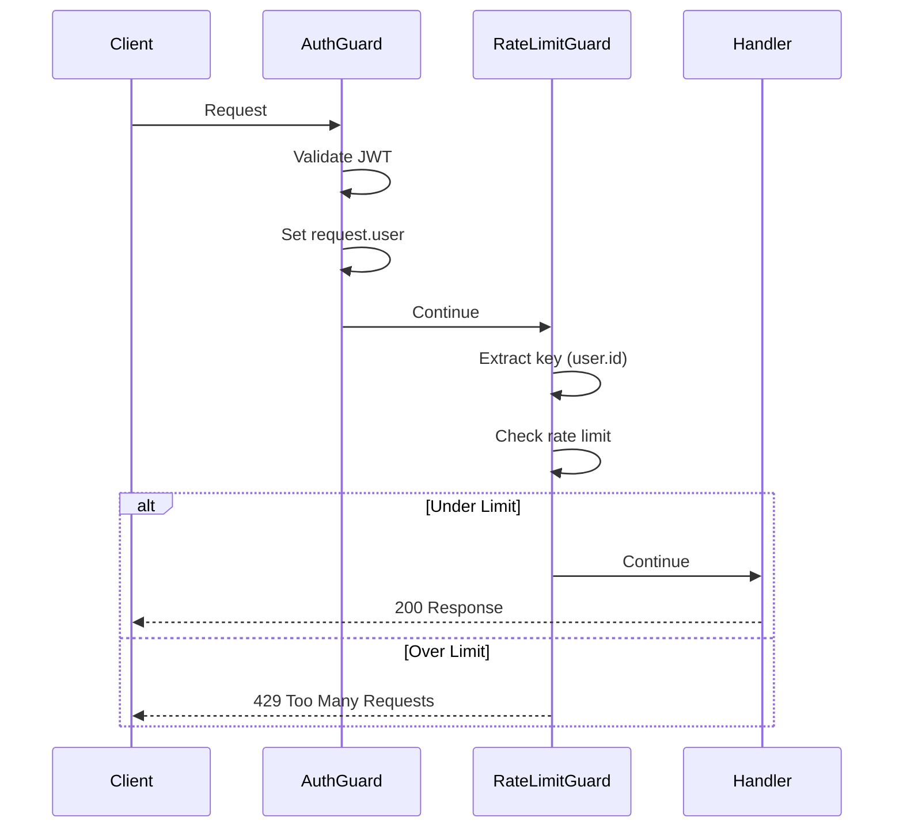

# RateLimitGuard

Use RateLimitGuard for fine-grained control.

## Manual Guard Application

```typescript
import { Controller, Get, UseGuards } from '@nestjs/common';
import { RateLimitGuard } from '@nestjs-redisx/rate-limit';

@Controller('api')
@UseGuards(RateLimitGuard)
export class ApiController {
  @Get('data')
  getData() {
    return { data: 'value' };
  }
}
```

## Guard Ordering

Guards execute in the order they are specified. Rate limit should typically run AFTER authentication:

```typescript
import { AuthGuard } from '@nestjs/passport';
import { RateLimitGuard } from '@nestjs-redisx/rate-limit';

@Controller('api')
@UseGuards(AuthGuard('jwt'), RateLimitGuard)
@RateLimit({ key: 'user', points: 100, duration: 60 })
export class ApiController {
  @Get('protected')
  getProtectedData() {
    // Rate limit uses request.user.id set by AuthGuard
    return { protected: true };
  }
}
```

### Execution Order



## Global Guard

Apply to all endpoints via module (required for DI):

<<< @/apps/demo/src/plugins/rate-limit/guard-global.setup.ts{typescript}

::: warning
Do not use `app.useGlobalGuards(new RateLimitGuard())` — the guard requires DI
(RateLimitService, Reflector, module options). Use `APP_GUARD` with `useClass` instead.
:::

## Skipping Rate Limits

### Without Global Guard

When using `@RateLimit` per-endpoint, simply don't apply the decorator to endpoints that should be unlimited:

```typescript
@Controller('api')
export class ApiController {
  @Get('limited')
  @RateLimit({ points: 10, duration: 60 })
  limited() {
    return { limited: true };
  }

  @Get('unlimited')
  // No @RateLimit — no guard attached, no rate limiting
  unlimited() {
    return { unlimited: true };
  }
}
```

### With Global Guard

When using `APP_GUARD`, the guard runs on all endpoints. Use the `skip` option to bypass specific routes:

```typescript
@Controller('api')
export class ApiController {
  @Get('limited')
  @RateLimit({ points: 10, duration: 60 })
  limited() {
    return { limited: true };
  }

  @Get('unlimited')
  @RateLimit({ skip: () => true })
  unlimited() {
    return { unlimited: true };
  }
}
```

### Skip by Condition

Use `skip` for conditional bypassing (e.g., admin users):

```typescript
@Get('data')
@RateLimit({
  points: 10,
  duration: 60,
  skip: (ctx) => {
    const req = ctx.switchToHttp().getRequest();
    return req.user?.role === 'admin';
  },
})
getData() {
  return { data: 'value' };
}
```

## Guard Context

Access execution context within guard:

```typescript
import { Injectable, ExecutionContext, CanActivate } from '@nestjs/common';
import { Reflector } from '@nestjs/core';

@Injectable()
export class CustomRateLimitGuard implements CanActivate {
  constructor(private reflector: Reflector) {}

  async canActivate(context: ExecutionContext): Promise<boolean> {
    const request = context.switchToHttp().getRequest();

    // Skip for admins
    if (request.user?.role === 'admin') {
      return true;
    }

    // Custom rate limit logic
    const key = `user:${request.user?.id || request.ip}`;
    // Check rate limit...

    return true;
  }
}
```

## GraphQL Support

Rate limit GraphQL resolvers (works because GraphQL over HTTP uses HTTP context):

```typescript
import { Resolver, Query, UseGuards } from '@nestjs/graphql';
import { RateLimitGuard } from '@nestjs-redisx/rate-limit';

@Resolver()
@UseGuards(RateLimitGuard)
export class UserResolver {
  @Query(() => [User])
  @RateLimit({ points: 100, duration: 60 })
  async users() {
    return this.userService.findAll();
  }
}
```

## WebSocket Support

::: warning
The built-in `RateLimitGuard` uses `context.switchToHttp()` for both key extraction and setting response headers. For WebSocket contexts, you must:
1. Provide a custom `key` function that handles the WebSocket execution context
2. Set `includeHeaders: false` in `RateLimitPlugin` options (since WebSocket has no HTTP response headers)
:::

```typescript
// Plugin config — disable HTTP headers for WebSocket
new RateLimitPlugin({
  includeHeaders: false, // Required for non-HTTP contexts
})
```

```typescript
import { WebSocketGateway, SubscribeMessage } from '@nestjs/websockets';
import { UseGuards } from '@nestjs/common';
import { RateLimitGuard, RateLimit } from '@nestjs-redisx/rate-limit';

@WebSocketGateway()
@UseGuards(RateLimitGuard)
export class ChatGateway {
  @SubscribeMessage('message')
  @RateLimit({
    points: 10,
    duration: 60,
    key: (ctx) => {
      const client = ctx.switchToWs().getClient();
      return `ws:${client.id}`;
    },
  })
  handleMessage(client: any, payload: any) {
    return { event: 'message', data: payload };
  }
}
```

## Microservices Support

::: warning
For microservice contexts, you must:
1. Provide a custom `key` function — the built-in key extractors (`ip`, `user`, `apiKey`) rely on HTTP request objects
2. Set `includeHeaders: false` in `RateLimitPlugin` options (since RPC contexts have no HTTP response headers)
:::

```typescript
// Plugin config — disable HTTP headers for microservice contexts
new RateLimitPlugin({
  includeHeaders: false, // Required for non-HTTP contexts
})
```

```typescript
import { Controller, UseGuards } from '@nestjs/common';
import { MessagePattern, Ctx, RmqContext } from '@nestjs/microservices';
import { RateLimitGuard, RateLimit } from '@nestjs-redisx/rate-limit';

@Controller()
@UseGuards(RateLimitGuard)
export class UserController {
  @MessagePattern({ cmd: 'get_user' })
  @RateLimit({
    points: 1000,
    duration: 60,
    key: (ctx) => {
      const data = ctx.switchToRpc().getData();
      return `rpc:${data.id || 'unknown'}`;
    },
  })
  async getUser(data: { id: string }) {
    return this.userService.findOne(data.id);
  }
}
```

## Next Steps

- [Service API](./service-api) — Programmatic API
- [Key Extraction](./key-extraction) — Custom keys
