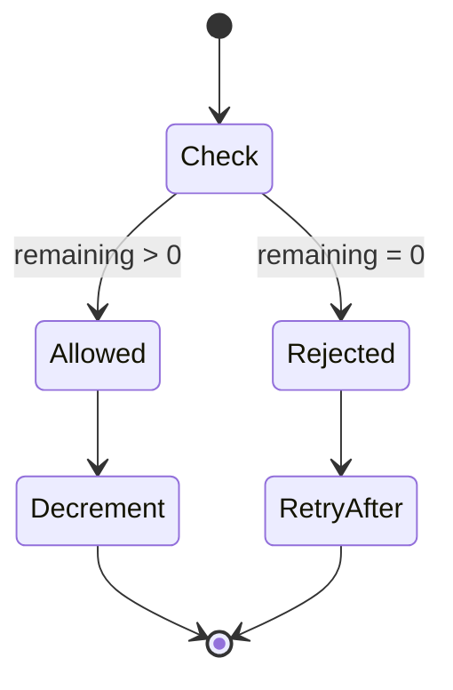

# Rate Limit Plugin

Rate limiting solution with fixed window, sliding window, and token bucket algorithms for protecting APIs and enforcing usage quotas.

## Overview

The Rate Limit Plugin provides distributed rate limiting backed by Redis, ensuring consistent enforcement across all application instances. Useful for API protection and resource quota management.

| Challenge | Without Rate Limiting | With Rate Limit Plugin |
|-----------|----------------------|------------------------|
| API Abuse | Infrastructure costs increase | Usage controlled per client |
| Unfair Usage | Single client monopolizes resources | Fair distribution enforced |
| Bot Scraping | Data harvested without limits | Automated requests throttled |

## Key Features

- **Multiple Algorithms** — Fixed window, sliding window, and token bucket strategies
- **Flexible Key Extraction** — Rate limit by IP, user ID, API key, or custom identifiers
- **Standard Headers** — `X-RateLimit-*` and `Retry-After` headers
- **Distributed State** — Consistent limits across all application instances via Redis
- **Configurable Responses** — Custom error messages and status codes
- **Skip Conditions** — Bypass rate limits for specific requests or users

## Installation

::: code-group

```bash [ioredis]
npm install @nestjs-redisx/core @nestjs-redisx/rate-limit ioredis
```

```bash [node-redis]
npm install @nestjs-redisx/core @nestjs-redisx/rate-limit redis
```

:::

## Basic Configuration

<<< @/apps/demo/src/plugins/rate-limit/basic-config.setup.ts{typescript}

## Usage with Decorator

```typescript
import { Controller, Get } from '@nestjs/common';
import { RateLimit } from '@nestjs-redisx/rate-limit';

@Controller('api')
export class ApiController {
  @Get('public')
  @RateLimit({ points: 10, duration: 60 })
  getPublicData() {
    // 10 requests per minute per IP
    return { data: 'public' };
  }

  @Get('authenticated')
  @RateLimit({ points: 1000, duration: 60, key: 'user' })
  getAuthenticatedData() {
    // 1000 requests per minute per user
    return { data: 'authenticated' };
  }
}
```

## Usage with Guard

```typescript
import { Controller } from '@nestjs/common';
import { RateLimit } from '@nestjs-redisx/rate-limit';

@Controller('api')
@RateLimit({ points: 100, duration: 60 })
export class ApiController {
  // All routes protected with 100 req/min
}
```

## Response Headers

Successful requests include rate limit information:

```http
HTTP/1.1 200 OK
X-RateLimit-Limit: 100
X-RateLimit-Remaining: 75
X-RateLimit-Reset: 1706123456
```

Rate-limited requests return appropriate status:

```http
HTTP/1.1 429 Too Many Requests
X-RateLimit-Limit: 100
X-RateLimit-Remaining: 0
X-RateLimit-Reset: 1706123456
Retry-After: 45
```

## Algorithm Comparison

| Algorithm | Description | Best For |
|-----------|-------------|----------|
| Fixed Window | Reset at fixed intervals | Simple use cases |
| Sliding Window | Rolling window calculation | Most API rate limiting |
| Token Bucket | Tokens replenish over time | Burst handling |



## Documentation

| Topic | Description |
|-------|-------------|
| [Core Concepts](./concepts) | Understanding rate limiting |
| [Configuration](./configuration) | Configuration reference |
| [@RateLimit Decorator](./decorator) | Route-level rate limiting |
| [RateLimitGuard](./guard) | Controller-level protection |
| [Service API](./service-api) | Programmatic rate checking |
| [Algorithms](./algorithms) | Algorithm comparison |
| [Key Extraction](./key-extraction) | Custom key strategies |
| [Response Headers](./headers) | Header configuration |
| [Monitoring](./monitoring) | Metrics and observability |
| [Testing](./testing) | Testing rate-limited endpoints |
| [Recipes](./recipes) | Implementation examples |
| [Troubleshooting](./troubleshooting) | Debugging common issues |
